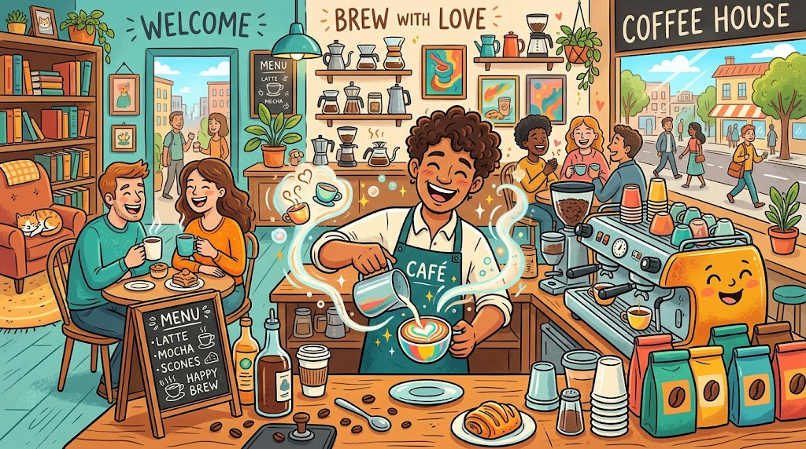
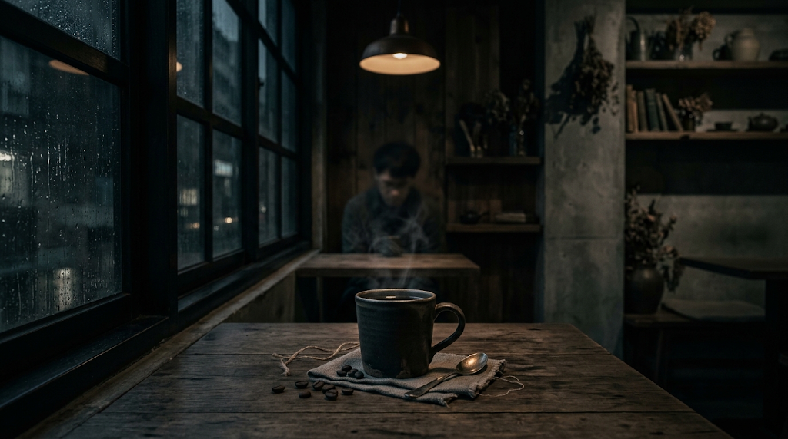
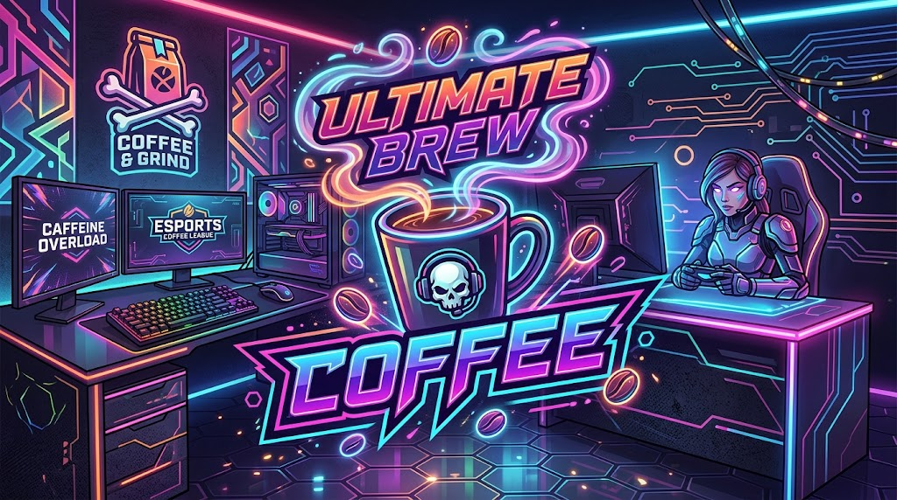
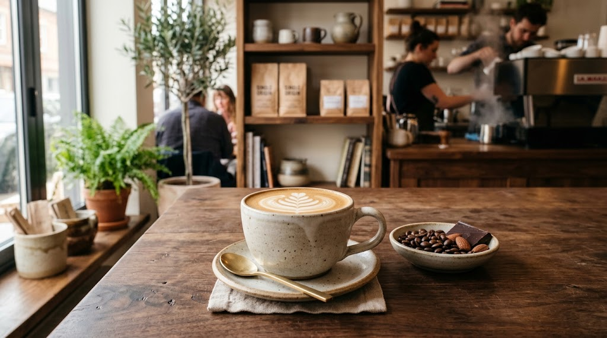
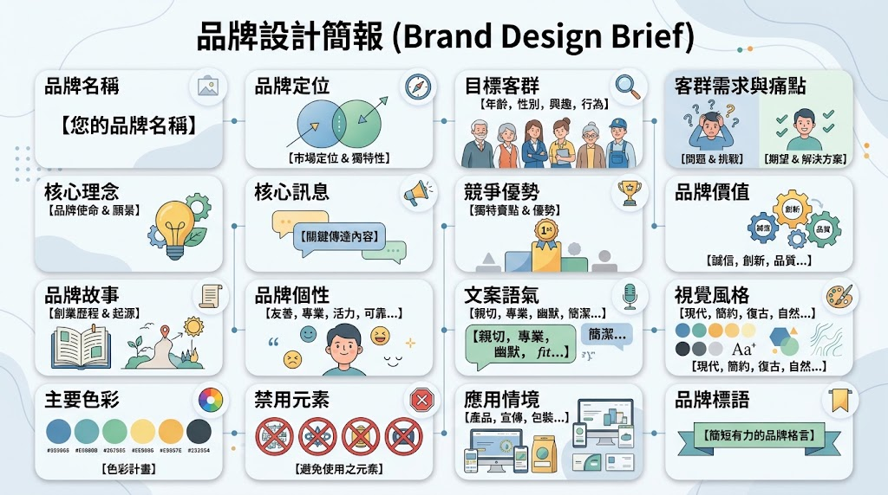

# 🎨 創作的起點：用 Gemini 建立創作藍圖

很多人第一次接觸 AI 都是這樣：

- 🎨 今天叫它畫圖。

- ✍️ 明天請它寫文章。

- 🖼️ 後天再做一個 Logo。

每次單獨看，結果可能都不錯。可是全部放在一起，卻不像同一個品牌，也不像同一件作品。

問題不一定出在工具，更常出在創作一開始沒有先想清楚。主題不停更換、文案語氣飄來飄去、圖片風格每次都不同，生成得再快，也只會累積一堆零散素材。

> 💡 好的創作，不是從工具開始，而是從清楚的思考開始。

- [YT：普通人第一次用 AI，最難的不是工具，是不知道怎麼開始](https://www.youtube.com/watch?v=s-Jug-4fv-A)

## 🔴 為什麼多數人做不出作品

AI 工具已經能快速產生文字、圖片、短片與音樂，卻不代表每個生成結果都能成為作品。

```text
🟡 這裡要先分清楚兩件事：
- 📄 內容：一張圖片、一段文字、一支短片。
- 🧩 作品：多個內容圍繞同一主題，以一致風格與清楚結構組成的完整成果。
```

因此，常見問題不是「做不出東西」，而是「做得出內容，卻無法累積成作品。」創作開始前，如果沒有釐清要做什麼、傳達什麼感覺、給誰看、怎麼組織，後面的每一次生成都像重新開機。

## 🔴 三個常見卡關點

1. 🎯 沒有主題：不知道自己要做什麼。
2. 🎨 沒有風格：產出無法保持一致。
3. 🧱 沒有結構：內容零散，難以延伸與完成。

| 要素               | 回答的問題                     | 缺少時會發生什麼             |
| ------------------ | ------------------------------ | ---------------------------- |
| 🎯 主題(Idea)      | 我要做什麼、給誰看、傳達什麼？ | 內容四散，每次都重新開始     |
| 🎨 風格(Direction) | 我要讓人感受到什麼？           | 圖文語言不一致，沒有辨識度   |
| 🧱 結構(Structure) | 我要如何組織與呈現？           | 內容零碎，無法延伸成完整作品 |

### 🎯 有主題：不知道自己要做什麼

在 AI 創作中，最常見也最根本的問題，不是技術不足，而是沒有主題。我們打開AI 工具時，可能會出現這些狀況：

- 🤔 想做作品，卻沒有明確方向。
- 🔄 不斷嘗試生成，每次都換不同主題。
- 👀 看了很多範例，仍不知道自己要做哪一種。

於是今天生成咖啡店圖片，明天做科技風插畫，後天寫旅遊文案。每一項內容本身都可能成立，卻彼此沒有連結，最後只剩一堆素材。

清楚的主題會決定三件事：

- 🎯 你要做什麼。
- 👥 你要給誰看。
- 💬 你要傳達什麼。

🟢 例如，將主題定為「高端咖啡品牌」，後面的方向會自然收斂：

- 📸 圖像走高質感、沉穩路線。
- ✍️ 文案語氣精練、專業。
- ☕ 店面、包裝與 Logo 都要呈現精品感。

> 💡 沒有主題，只能反覆嘗試；有了主題，才能開始累積。

### 🔵Problem. 主題決定哪三件事？

請嘗試說明一個清楚的創作主題需要回答哪 3 個核心問題。接著自行選擇一個主題，例如「環保生活品牌」、「校園活動」或「寵物用品品牌」，分別回答這三個問題。

### 🔵Problem. 從主題發展創作方向

假設你的 AI 創作主題是「高端咖啡品牌」，請規劃這個品牌的 圖像風格、文案語氣、Logo 或包裝設計方向。每一項都要描述具體特色，並說明它們如何呈現「高端」的主題。

### 🔵Problem. 把零散的想法收斂成主題

「咖啡、上班族、城市、放鬆、簡約風格、Instagram 貼文」。請將這些零散想法整理成 一句明確的創作主題，並說明作品要給誰看，以及希望傳達什麼訊息。

### 🎨 沒有風格：產出無法保持一致

即使已經有主題，作品仍可能散掉。例如，同一個咖啡品牌：

- 📸 第一張圖片走高質感攝影。
- 🖍️ 第二張變成活潑插畫。
- 🌈 第三張使用霓虹電競風。
- 🌑 第三張使用陰暗昏沉風。

<!-- 兩張 -->
<div style="display: flex; flex-wrap: wrap; gap: 20px;">
    
    
</div>

<div style="display: flex; flex-wrap: wrap; gap: 20px;">
    
    
</div>

> 💡 每個結果分開看都可能不差，放在一起卻像來自不同品牌。
> 🌐 當這些元素維持一致時，觀眾會感覺所有內容來自同一個世界觀。

風格不一致會造成什麼問題：

- 🧩 圖像與文案彼此不搭。
- 👥 同一系列內容看起來像不同人製作。
- 🧠 無法建立辨識度與記憶點。
- 🌫️ 品牌個性模糊，觀眾不知道該怎麼理解。

風格的作用不是加在作品表面的濾鏡，而是一套一致的創作語言，包括：

- 🎨 視覺調性：簡約、溫暖、未來感、文青感。
- ✍️ 文字語氣：專業、親切、詩意、銷售感。
- 💭 情緒氛圍：高端、放鬆、熱情、沉穩。

### 🔵Problem. 幫品牌建立風格設定

選擇一個品牌主題，例如「高端咖啡品牌」、「年輕運動品牌」或「療癒甜點店」，為它建立一套風格設定。請分別決定它的 視覺調性、文字語氣、情緒氛圍，並簡單說明選擇這些風格的原因。

### 🔵Problem. 建立 AI 創作的風格規範

假設你接下來要使用 AI 連續製作 5 則同一品牌的社群貼文。請先制定一份簡單的風格規範，至少包含 3 項必須保持一致的元素，並說明這些規範如何幫助作品建立辨識度與記憶點。

### 🧱 沒有結構：內容零散，難以發展

> 💡 主題回答「做什麼」，風格回答「怎麼呈現」，結構則回答「內容如何展開」。

不少人有主題也找到喜歡的風格，卻仍做不下去。他一下寫文案、一下做得意圖、一下又不知道還缺什麼。成果通常是片段式內容，很難完成。

沒有結構時常出現的狀況：

- ✍️ 文案不知道怎麼展開。
- 🖼️ 圖像不知道該強調什麼。
- 📚 整體內容沒有層次。
- 🔄 每一步都像重新開始。

```text
🟡建立基本架構：
- 🎯 主題。
- 💬 核心訊息。
- 🎨 視覺方向。
- ✍️ 文案層次。
- 📍 使用情境。
# 接下來不管產生圖片、貼文、書封、廣告或影片，都能沿用同一套邏輯。
```

靈感可以讓你開始，但結構才能讓你完成。例如，要設計一張品牌貼文，可以先建立：

> 1. 📰 主標題。
> 2. 📝 副標題。
> 3. 🖼️ 主視覺。
> 4. 💬 核心訊息。
> 5. 👉 行動引導(Call to Action，CTA)。

有了骨架，後續只是在每個位置填入合適內容，而不是從空白畫面硬想。

---

## 🔴 Gemini：你的創作大腦

不少人使用 AI 時，把注意力放在哪個模型最強、哪個功能最快。坦白說，真正影響作品的往往是前面的思考：

- 🎯 我要做什麼主題？
- 💬 我要傳達什麼訊息？
- 🎨 我要呈現什麼風格？
- 👥 這個內容要給誰看？

如果這些問題沒有先釐清，工具再強，也只會產生不穩定的結果。

Gemini 在這個流程中，不只是生成最終作品的工具，而是創作的大腦。它最擅長協助處理三件事：

1. 💡 發想(Idea)：解決「沒有主題」。當你不知道要做什麼時，Gemini 可以：
   - 🎯 提出主題方向。
   - 🧩 拆解內容可能性。
   - 🔍 找到創作切入點。
   - ⚖️ 比較不同概念的優缺點。
2. 🧱 結構(Structure)：解決「沒有結構」。當你有主題，卻不知道如何展開時，Gemini 可以：
   - 📝 建立文案架構。
   - 📚 拆解內容層次。
   - 🔢 組織資訊順序。
   - 🧩 將零散想法整理成可執行流程。
3. 🎨 方向(Direction)：解決「沒有風格」。當你開始創作，卻發現內容不一致時，Gemini 可以：
   - 🎭 定義高端、溫暖、活潑等風格。
   - ✍️ 建立專業、親切、銷售感等語氣。
   - 🌈 統一色彩、光線、構圖與整體氛圍。

不要只把 Gemini 當成「問題進去，答案出來」的機器。更有效的用法是把它當成一起思考的夥伴，透過對話「釐清想法、修正方向、強化內容、找出缺漏」。這是一段思考過程，不是一次輸出。Gemini 不是幫你完成作品，而是幫你把作品想清楚。

## 🔴 Design Brief：用 Gemini 規劃創作文案

真正進入圖像、設計與影片工具之前，先完成一份創作藍圖。這份藍圖就是 Design Brief。

Design Brief 是開始設計前使用的企劃文件，用來說清楚：

- 🎯 要做什麼。
- 👥 為誰而做。
- ❓ 想解決什麼問題。
- 💬 要傳達什麼訊息。
- 💭 希望觀眾感受到什麼。
- 📍 作品要用在哪裡。

它不是為了寫一份漂亮報告，而是讓後續所有人與 AI 工具都朝同一個方向工作。



### 💡 Idea：從主題開始

很多人的想法只停在：「我想做一個咖啡相關的內容。」這種主題太模糊，後面的創作很容易失去方向。可以先請 Gemini 協助整理：

```text
請幫我規劃一個咖啡品牌的創作方向，包含：
1. 品牌定位
2. 目標客群
3. 客群需求與痛點
4. 核心訊息
5. 品牌差異化
請提出 3 個不同方向，整理各自特色、優點與可能風險。先不要生成圖片。
```

```text
### 🟢 範例：Prompt Coffee
假設目標是設計一個咖啡品牌的視覺與內容。Gemini 整理後，可以得到：
🏷️ 品牌名稱：Prompt Coffee(提示咖啡)
🎯 品牌定位：啟動靈感的精準指令，專為深度工作者打造的腦力燃料。
👥 目標客群：追求極致效率與知識產出的創作者與科技人，包括軟體工程師、AI 應用創作者、數據分析師與重度文字工作者。
💻 生活型態：經常長時間在電腦前工作，需要維持高度專注；熟悉 Input 與 Output 的概念，習慣以系統化方式解決問題。
💬 核心訊息：精準輸入，完美輸出。(Quality Input, Brilliant Output.)
📣 主標語：給大腦的最佳提示詞。(The Best Prompt for Your Mind.)
📝 副標語：拒絕無效運算，用一杯好咖啡，進入你的專屬心流。
📖 品牌故事：在 AI 時代，一段精準 Prompt 能生成令人驚豔的內容；一杯精準烘焙的咖啡，也能啟動人的專注與靈感。
```

這時，模糊的「做一個咖啡品牌」已經變成可以執行的創作方向。

### 🔵Problem. 拯救期末大作戰：熬夜補習班定位企劃

你和朋友打算在大學城附近開一間「專為期末考週打造的夜間自習咖啡廳」，但大家只想著「賣咖啡給熬夜的人」，想法太過模糊，無法決定裝潢與菜單方向。

1. 請撰寫一段結構化提示詞（Prompt），要求 AI 提供 **3 種不同的自習咖啡廳定位方向**（例如：極致靜音專注型、抱佛腳分組討論型、心靈崩潰療癒型）。
2. 提示詞內必須嚴格要求包含五大要素：**品牌定位、目標客群、客群痛點、核心訊息、品牌差異化**。
3. 挑選其中一個方向，生成一份完整的「品牌雛形設定」（包含：品牌名稱、主副標語、品牌故事簡述）。

### 🔵Problem. 告別選擇障礙：週末「耍廢外送」虛擬廚房設計

現代人週末常陷入「到底要吃什麼」的世紀難題，你打算創立一家專攻外送平台的「專治選擇障礙便當店」，但只說「做好吃的便當」完全沒有吸引力。

1. 使用結構化發想框架，透過 AI 規劃 **3 種針對不同週末廢人客群的品牌企劃案**。
2. 每個企劃必須清楚列出：
   - 🛋️ 客群生活型態與痛點（例如：躺在沙發不想動、連選配菜都覺得心累）
   - 💎 品牌核心價值與差異化（例如：隨機盲盒菜單、按熱量與心情一鍵配餐）
3. 寫出一句能打中這群人的「洗腦主標語（Slogan）」與 100 字內的「品牌故事」。

### 🧱 Structure：建立文案結構

主題確定後，不要直接生成圖片。先建立內容結構。

```
### 🟢 以 Instagram 貼文為例，可以使用：
1. 📰 主標題：抓住注意力。
2. 📝 副標題：補充主標題，建立情境。
3. 💭 故事或痛點：讓受眾覺得「這在說我」。
4. 💎 產品特色：提出解決方案與差異。
5. 👉 行動引導(CTA)：讓讀者知道下一步。
```

### 🔵 Problem. 告別已讀不回：約會軟體「聊天急救包」貼文產出\*\*

很多人在交友軟體上總是只會回「安安、在幹嘛、吃飽沒」，導致話題光速結凍。你經營的戀愛顧問社群決定推出一篇「破冰神回覆」IG 教學貼文。

- 請依照「五大文案架構」完成這篇貼文內容：
  1. **主標題**：用強烈對比或幽默方式點出聊天尷尬（例如：別再傳「在幹嘛」！3 招讓對方秒回停不下來）。
  2. **副標題**：說明這篇貼文能幫讀者脫離哪種尷尬窘境。
  3. **故事或痛點**：重現一段讓人尷尬癌發作的真實對話截圖情境。
  4. **產品/內容特色**：分享 2 個立即可用的聊天技巧（如：從對方照片找背景彩蛋、開放式二選一問法）。
  5. **行動引導（CTA）**：呼籲讀者標記身邊最不會聊天的朋友，或收藏此篇貼文以備不時之需。

### 🔵 Problem. 拖延症患者自救指南：專治「期末抱佛腳」的筆記 App 推廣

期末考前一晚，總有人看著滿滿的共筆與講義崩潰。你想在 IG 上宣傳一款專門整理重點、快速生成複習卡片的「救急筆記工具」。

- 請套用 5 步驟結構撰寫推廣貼文：
  1. **主標題**：直擊拖延症與期末考焦慮的衝擊性標題。
  2. **副標題**：點出「今晚不睡，也能順利低空飛過」的情境設定。
  3. **故事或痛點**：描繪凌晨 3 點盯著第 1 章 PPT、後悔平時沒上課的絕望心情。
  4. **產品特色**：列出該工具如何用「3 分鐘濃縮重點、自動標註考點」來解決燃眉之急。
  5. **行動引導（CTA）**：引導讀者點擊主頁連結領取「期末考安全過關模板」，並在底下留言集氣「求歐趴」。

### 🔵 Problem. 擊退星期一症候群：辦公室「隱形摸魚神器」文案

每逢週一早上，上班族與實習生總是靈魂出竅、哈欠連連。你打算在 IG 上推廣一款「外觀像計算機，但其實是解壓小遊戲/舒壓零食」的創意辦公室小物。

- 請按照標準文案架構完成整篇貼文：
  1. **主標題**：以週一症候群（Monday Blues）為切入點的共鳴標題。
  2. **副標題**：營造辦公室生存、合法摸魚的情境氛圍。
  3. **故事或痛點**：描寫主管剛走過去、眼皮重到快掉下來卻還要裝忙的無奈日常。
  4. **產品特色**：說明這款小物如何兼具「低調偽裝」與「極致舒壓」的差異化特點。
  5. **行動引導（CTA）**：邀請大家在留言區留下「你最想在上班時做的事」，並提示限時免運代碼。

### 🎨 Direction：定義風格與情緒

有了主題與結構，還要定義作品看起來、讀起來是什麼感覺。可以把視覺風格拆成四個部分：

| 面向    | 可選方向                                             |
| ------- | ---------------------------------------------------- |
| 🎨 色彩 | 黑白、奶油色、莫蘭迪、霓虹、自然色、品牌色           |
| 💡 光線 | 自然光、逆光、電影光、工作室光、柔光、螢幕光         |
| 💭 氛圍 | 科技感、療癒、孤獨、商業、高端、極簡、童趣           |
| 📐 構圖 | Close-up、Wide Shot、Top View、Macro、Rule of Thirds |

```text
### 🟡 視覺風格 Prompt
請根據上述品牌 Design Brief，定義完整視覺風格，包含：
1. 主色、輔助色與強調色，附 HEX 色碼
2. 主要光線與色溫
3. 整體情緒與品牌氣質
4. 攝影或插畫風格
5. 常用構圖與鏡位
6. 背景材質與場景元素
7. 字體方向與版面留白
8. 應避免的色彩、元素與風格
請說明每項設定如何呼應品牌定位與目標客群。
```

### 🟢 Prompt Coffee 視覺方向範例

為了讓品牌能在長時間盯著程式碼的科技人眼中，顯得精緻又沉浸，可以定義為「沉浸式工作美學(Workspace Aesthetics)」。

```
### 🎨 色彩(Color Palette)：暗黑模式與語法高亮
- ⚫ 主色：曜石黑(Obsidian Black)。
- 🌑 輔色：深空灰(Space Gray)。
- 🔵 強調色：冷調藍紫色，如程式碼語法高亮。
```

```
### 💡 光線(Lighting)：螢幕漫射與精準光源
- 🌙 採用深夜工作環境的寫實光影。
- 💻 讓電腦螢幕冷色光打在鍵盤、桌面與咖啡杯側邊。
- ✨ 使用局部輪廓光，增加科技感與層次。
```

```
### 🌌 氛圍(Atmosphere)：絕對專注的心流邊界
- 🧠 畫面不表現疲累，而是處於解題與創作的沉浸狀態。
- ⌨️ 桌面可有無線鍵盤、機械鍵盤、程式畫面與手沖咖啡器具。
- ⚙️ 整體結合工程師思維與職人精神。
```

```
### 📐 畫面感(Composition／Visuals)：16:9 的寬螢幕張力**
- 🖥️ 使用 16:9 構圖，品牌元素不必全部置中。
- ☕ 前景聚焦冒著微小熱氣的黑咖啡。
- 💻 背景是失焦的雙螢幕畫面，隱約可看見 Python 程式碼。
- 🔍 可使用 Macro Shot 捕捉咖啡表面油脂反光或液體流動。
```

```text
### 📋 本節產出：Design Brief
品牌：Prompt Coffee
定位：高端科技咖啡品牌，為深度工作者打造腦力燃料。
客群：工程師、設計師、AI 創作者、數據分析師。
核心訊息：精準輸入，完美輸出。
品牌標語：Fuel Your Mind.
文案語氣：精準、理性、專業，帶少量程式語彙。
視覺色彩：曜石黑、深空灰、冷調藍紫。
光線：深夜螢幕冷光與局部輪廓光。
氛圍：專注、沉浸、高端、科技。
構圖：16:9、咖啡近景、程式碼螢幕散景。
```


### 🔵 Problem 拒絕社死：被抓包「薪水小偷」的社畜泡麵視覺企劃

你打算推出一款專為辦公室社畜設計的「無味微波乾拌麵」，主打在茶水間微波不會飄出香味、能在主管走過來時瞬間偽裝成普通水杯。為了讓這款產品在 IG 上引爆打工人的共鳴，你需要為它量身打造一套完整的視覺規範。

請依據「視覺風格四面向」與「Design Brief」架構，撰寫一份專屬的視覺設定指南，必須包含：

1. **色彩搭配**：設定主色（如：辦公室事務機灰）、輔色（辦公桌木紋色）與強調色（主管警報紅），並附上 16 進位色碼（HEX）。
2. **光線與色溫**：定義畫面是冷白辦公室日光燈、或是加班深夜的微弱螢幕漫射光。
3. **情緒氛圍**：呈現「心驚膽戰但游刃有餘」的摸魚快感，拒絕死氣沉沉。
4. **構圖與鏡頭**：規劃一張具備情境感的主視覺畫面（例如：Top View 俯拍滿是報表的混亂辦公桌，或是 Close-up 特寫無辜的泡麵杯包裝）。
5. **避雷指南**：明確列出 2 項絕對不可出現的視覺元素（如：熱氣騰騰的濃煙、奢華高級餐廳光澤）。

### 🔵 Problem. 崩潰租屋族救星：頂樓加蓋「心靈避難所」香氛視覺提案

在炎熱潮濕的頂樓加蓋小套房裡，下班回家常聞到霉味與悶熱空氣。你創立了一個平價香氛噴霧品牌「頂加解憂所」，想用「一噴秒變高級冷氣房」的清涼草本感拯救租屋族。

請透過結構化方式，為此品牌建立一套「視覺風格 Prompt」與「Design Brief」：

1. **色彩與材質**：挑選 3 款能傳遞「降溫、透氣、極簡」的莫蘭迪色系或冷調自然色（需附 HEX 碼），並指定背景材質（如：清水模、亞麻布、老舊磨石子地）。
2. **光影氛圍**：描述黃昏西曬的夕陽餘暉與小夜燈暖光的交錯層次，營造「雖然空間很小，但心靈很平靜」的療癒感。
3. **畫面構圖**：設計一組 16:9 或 4:5 的社群主圖鏡位，說明前景主體（噴霧瓶）、中景道具（電風扇、散落的漫畫）與背景散景的配置。
4. **品牌 Design Brief 總結**：以清單格式整理出品牌定位、核心受眾、視覺色彩、光線與氛圍的一句話總結。

### 🔵 Problem. 告別尷尬癌：I人專屬「安靜美甲工作室」視覺風格定調

很多內向者（MBTI 中的 I 型人）做指甲時最怕美甲師瘋狂搭話聊私事。你開了一家「全程零交談、放空專用」的美甲工作室，主打只用平板溝通、提供降噪耳機與舒服沙發。

請為這間「社恐友善美甲店」設計一套視覺風格系統，解決客群的心理抗拒：

1. **色彩計畫**：運用能讓人放鬆降噪的色彩（如：奶油米白、燕麥灰、低飽和鼠尾草綠），標明色碼並說明色彩心理學依據。
2. **光線設定**：捨棄刺眼的高亮度聚光燈，改採柔和的間接漫射光與自然柔光，請詳細描述光影落在手部與空間的質感。
3. **視覺元素與場景**：桌面應出現哪些關鍵道具？（例如：抗噪耳機、點餐平板、一杯溫熱的花草茶），營造「請勿打擾」的極致安心感。
4. **文字與版面節奏**：說明文案字體方向（如：極細黑體或日系明體）以及留白比例，強調呼吸感。

### 🔵 Problem. 宿醉復活水：熱炒店限定「解酒神器」的台味美學包裝

週五晚上在熱炒店喝到斷片，隔天還要早起赴約？你開發了一款名為「隔天依舊一條龍」的電解質草本解酒飲，打算在熱炒店與居酒屋推廣。

為了讓這款飲品在昏暗油膩的熱炒店裡一眼被看見，請撰寫一份視覺風格定義指南：

1. **色彩爆發**：採用搶眼的霓虹復古配色（例如：熱炒店綠色塑膠椅綠、霓虹招牌亮橘、夜市燈箱黃），列出 3 款高對比 HEX 色碼。
2. **光線與氛圍**：打造「深夜街道的電影感霓虹光」，讓紅綠霓虹光反射在冰涼冒著水滴的玻璃瓶身。
3. **鏡頭語言**：運用 Macro Shot（微距攝影）特寫開瓶瞬間噴發的氣泡與冰塊碰撞，搭配背景模糊的熱炒店紅色塑膠桌布。
4. **風格禁忌**：列出哪些風格會破壞「台味接地氣」的感覺（例如：過度文青日系的無印風、冷冰冰的科技商務風），並說明原因。
