# 建立個人與品牌視覺

在許多教學中，我們只要生成一張好看的圖片，就認為任務完成。但在品牌經營與內容創作中，單張圖通常有三個限制：

1. 無法形成記憶：讀者看到圖片，卻不知道是誰製作的。
2. 無法提升效率：每次都需要重新設計，不能在既有基礎上延伸。
3. 無法建立品牌：圖像彼此沒有關聯，不能形成一致風格。

常見原因：

- 每張圖的風格不同。
- 沒有固定色調或視覺元素。
- 無法建立連續性。
- 每次都從空白開始。

我們應該嘗試從「做出一張好看的圖 -> 建立可以持續使用的圖像系統 -> 累積成可長期使用的視覺資產」。這會讓短期成果轉變為：

- 可以被累積的長期資產。
- 可以在不同主題、場景與尺寸中延伸的系統。
- 能讓讀者一眼辨識來源的品牌印象。

## 🔴視覺資產

視覺資產（Visual Asset）是：可以被重複使用、延伸發展，並逐步累積價值的圖像系統。

它不只是一次性的內容，而具有：

- 持續使用的可能。
- 多場景應用的彈性。
- 長期累積的效果。

視覺資產的三個特徵：

1. 可重複使用。同一套視覺可應用於社群貼文、教學內容、行銷素材、簡報、網站。
1. 可延伸發展。可在原有基礎上變化：
   - 同一角色，不同場景。
   - 同一風格，不同主題。
   - 同一構圖，多版本輸出。
1. 可辨識。圖像具有一致性時，讀者會逐漸建立連結：


### 🟡品牌視覺的核心概念

品牌視覺不是單一風格，也不是某一張代表圖，而是讓所有圖像看起來屬於同一個來源。即使觀眾沒有看到名稱，也能產生「這應該是同一個人或品牌做的」的感受。

### 🟡品牌視覺的三個關鍵

1. 一致性（Consistency）。所有圖像在視覺上保持穩定，使不同圖片彼此有連結，例如：
   - 相似色調
   - 類似風格
   - 固定畫面語言
1. 辨識度（Identity）。圖像具有容易記住的特徵，例如：
   - 特定角色
   - 固定構圖
   - 特定視覺元素
1. 延展性（Scalability）。同一視覺可用在多個場景，例如：
   - 社群貼文
   - 書籍封面
   - 廣告素材
   - 簡報與網站

> 每次做一張不同的圖 → 建立一套可以重複出現的視覺系統。
> 當圖像具備一致性、辨識度與延展性，它就不只是創作，而開始發揮品牌力量。

### 🔵 Problem. 同一角色，不同場景

請使用 AI 生圖工具，先設計一個具有明確辨識特徵的原創角色，再以同一角色生成 **3 張不同場景**的圖片，例如工作、旅行、喝咖啡。

三張圖片必須維持角色的主要外觀、配色與整體畫風一致，讓觀眾能一眼判斷是「同一個角色」。

### 🔵 Problem. 建立你的品牌視覺風格

請先設定一套自己的品牌視覺規則，包括 **主要色調、畫面風格、構圖方式、固定視覺元素**，並依照這套規則生成 **3 張不同主題的圖片**。

例如可以分別製作「科技、學習、生活」三個主題，但三張圖必須讓人感覺來自同一個品牌。

### 🔵 Problem. 一張主視覺，延伸三種尺寸

請先生成一張品牌主視覺，再將相同的視覺概念延伸成 **社群貼文、簡報封面、網站 Banner** 三種不同用途。

不同版本可以調整構圖與元素位置，但必須保留核心色彩、風格與辨識元素。

### 🔵 Problem. 打造一個可辨識的固定元素

請設計一個能夠長期出現在品牌圖片中的「固定視覺元素」，例如特殊角色、幾何圖形、邊框、光影、背景紋理或特殊物件。

接著生成 **3 張內容完全不同的圖片**，但每張都必須自然加入這個元素，使它成為辨識品牌的視覺線索。

### 🔵 Problem. 建立一套迷你視覺資產庫

假設你要經營一個「AI 學習品牌」，請利用 AI 生圖建立一套至少 **5 張圖片**的迷你視覺資產庫。

5 張圖片需包含不同用途，例如教學封面、社群貼文、活動宣傳、網站圖片等，同時必須維持一致的**色調、風格與核心辨識元素**。完成後，請說明你的設計如何符合「**一致性、辨識度、延展性**」三個品牌視覺原則。

## 🔴一致性的三大元素：色彩 × 風格 × 構圖

> 色彩建立氛圍；風格決定表現；構圖組織畫面。

### 🟡色彩：建立第一印象。

色彩最容易被感知，也是建立品牌感最快的方法。常見方法：

- 固定主色，例如藍紫科技風、暖色生活風。
- 控制整體色溫，例如偏冷或偏暖。
- 限制色彩數量，避免過多顏色。

> 不同色彩，相同風格 × 構圖

<!-- 兩張圖片 + 提示詞 -->
<div style="display: flex; flex-wrap: wrap; gap: 20px;">
    <!-- 第一張 -->
    <div style="width: calc(50% - 10px);">
        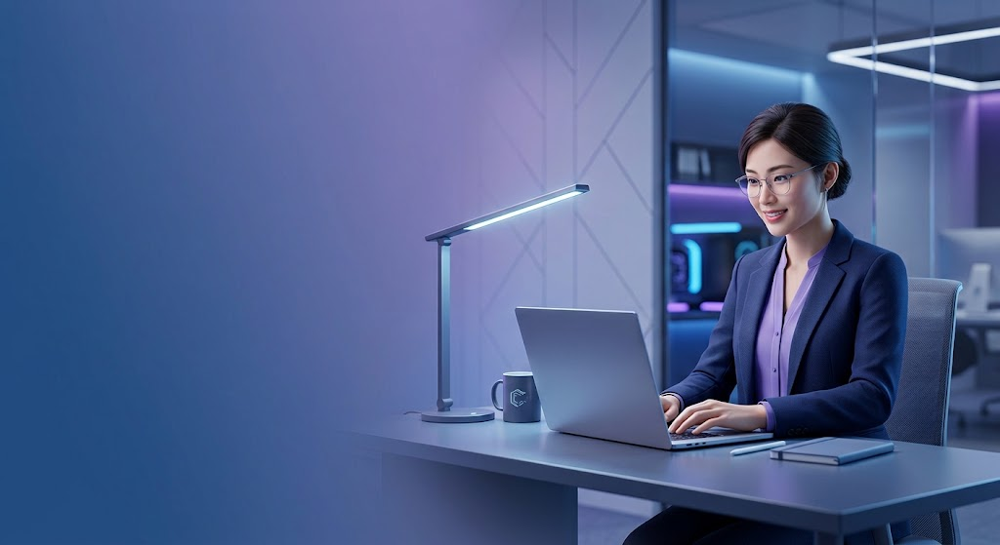
        <p style="margin-top: 8px;">
            <strong>提示詞：</strong>
            生成一張半寫實 3D 插畫，一位年輕女性坐在現代辦公桌前使用筆記型電腦，人物位於畫面右側，以半身中景呈現，左側保留大面積乾淨留白作為文字區域，背景簡潔，使用柔和光影與細緻材質，整體採藍色與紫色為主色，搭配冷色調燈光，呈現專業、科技、沉穩的視覺氛圍。
        </p>
    </div>
    <!-- 第二張 -->
    <div style="width: calc(50% - 10px);">
        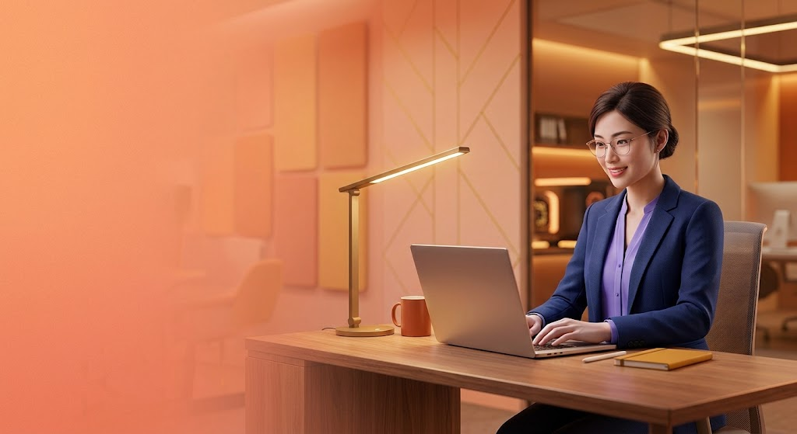
        <p style="margin-top: 8px;">
            <strong>提示詞：</strong>
            生成一張半寫實 3D 插畫，一位年輕女性坐在現代辦公桌前使用筆記型電腦，人物位於畫面右側，以半身中景呈現，左側保留大面積乾淨留白作為文字區域，背景簡潔，使用柔和光影與細緻材質，整體採橘色與黃色為主色，搭配暖色調燈光，呈現親切、溫暖、活潑的視覺氛圍。
        </p>
    </div>
</div>

### 🟡風格：統一表現方式。

風格決定圖像如何呈現，例如：

- 寫實攝影
- 插畫風格
- 半寫實插畫
- 3D 模型
- 科技 UI 視覺

> 不同風格，相同色彩 × 構圖

<!-- 兩張圖片 + 提示詞 -->
<div style="display: flex; flex-wrap: wrap; gap: 20px;">
    <!-- 第一張 -->
    <div style="width: calc(50% - 10px);">
        
        <p style="margin-top: 8px;">
            <strong>提示詞：</strong>
            生成一張年輕女性在現代辦公室工作的形象圖。畫面固定使用藍紫色作為主色，背景與服裝以藍色、紫色、白色為主，整體維持偏冷色調。人物固定站在畫面右側，採半身構圖，左側保留大面積乾淨留白，可放置標題文字。使用寫實商業攝影風格，呈現真實人物膚質、自然光影、清楚細節與專業形象，背景簡潔，不加入多餘裝飾。
        </p>
    </div>
    <!-- 第二張 -->
    <div style="width: calc(50% - 10px);">
        
        <p style="margin-top: 8px;">
            <strong>提示詞：</strong>
            生成一張年輕女性在現代辦公室工作的形象圖。畫面固定使用藍紫色作為主色，背景與服裝以藍色、紫色、白色為主，整體維持偏冷色調。人物固定站在畫面右側，採半身構圖，左側保留大面積乾淨留白，可放置標題文字。使用扁平插畫風格，以簡潔線條、乾淨色塊與少量陰影呈現人物與辦公室，造型清楚、現代且具有親和力，背景簡潔，不加入多餘裝飾。
        </p>
    </div>
</div>

### 🟡構圖：固定畫面結構。

構圖決定畫面的排列方式。可固定：

- 主體位置：置中、偏左或偏右。
- 留白區域：是否保留文字空間。
- 元素配置：人物、背景與標題區。
- 鏡頭距離：半身、中景或全身。

> 不同構圖，相同色彩 × 風格

<!-- 兩張圖片 + 提示詞 -->
<div style="display: flex; flex-wrap: wrap; gap: 20px;">
    <!-- 第一張 -->
    <div style="width: calc(50% - 10px);">
        
        <p style="margin-top: 8px;">
            <strong>提示詞：</strong>
            生成一張半寫實的現代科技人物插畫。整體採用藍紫色系，以深藍、紫色與少量白色為主要配色，維持冷色調、柔和漸層光線與乾淨專業的科技品牌風格。人物穿著簡約現代服裝，以半身方式呈現，安排在畫面正中央並正面看向鏡頭。背景加入簡潔的科技線條與抽象幾何元素，讓左右配置保持平衡，使視覺焦點集中在中央人物。
        </p>
    </div>
    <!-- 第二張 -->
    <div style="width: calc(50% - 10px);">
        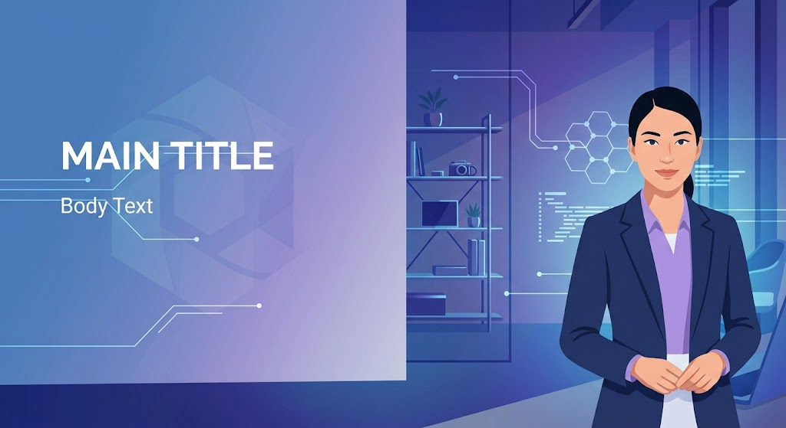
        <p style="margin-top: 8px;">
            <strong>提示詞：</strong>
            生成一張年輕女性在現代辦公室工作的形象圖。畫面固定使用藍紫色作為主色，背景與服裝以藍色、紫色、白色為主，整體維持偏冷色調。人物固定站在畫面右側，採半身構圖，左側保留大面積乾淨留白，可放置標題文字。使用扁平插畫風格，以簡潔線條、乾淨色塊與少量陰影呈現人物與辦公室，造型清楚、現代且具有親和力，背景簡潔，不加入多餘裝飾。
        </p>
    </div>
</div>

### 🟡建立視覺規則卡

```text
品牌／個人名稱：
目標受眾：
希望帶來的三種感受：
主色：
輔色：
重點色：
固定風格：
固定光線：
固定主體位置：
固定留白位置：
固定視覺元素：
禁止出現的元素：
```

```text
### 以小維 AI 教室為範例：
品牌／個人名稱：小維 AI 教室
目標受眾：想學習 AI 工具與數位應用的初學者
希望帶來的三種感受：親切、專業、科技感
主色：柔和藍紫色
輔色：米白色、淺灰色
重點色：亮紫色
固定風格：半寫實現代插畫，簡潔、柔和、有科技感
固定光線：明亮柔和的自然光，避免強烈明暗對比
固定主體位置：人物安排在畫面右側
固定留白位置：左側保留大面積乾淨空間
固定視覺元素：柔和漸層、簡潔科技線條、少量幾何圖形
禁止出現的元素：高飽和霓虹色、複雜背景、過多裝飾、恐怖元素
```

<!-- 兩張圖片 + 提示詞 -->
<div style="display: flex; flex-wrap: wrap; gap: 20px;">
    <!-- 第一張 -->
    <div style="width: calc(50% - 10px);">
        
        <p style="margin-top: 8px;">
            <strong>提示詞：</strong>
            請以「小維 AI 教室」生成一張 AI 課程宣傳主視覺，規則參考視覺規則卡：
        </p>
    </div>
    <!-- 第二張 -->
    <div style="width: calc(50% - 10px);">
        
        <p style="margin-top: 8px;">
            <strong>提示詞：</strong>
            請以「小維 AI 教室」生成一張 AI 社群知識貼文圖片，規則參考視覺規則卡：
        </p>
    </div>
</div>

### 🔵 Problem. 只改色彩，看看氛圍怎麼變

請使用 AI 生圖工具生成 **2 張圖片**。

先自行決定一個人物與場景，兩張圖片必須維持**相同的風格、人物、場景與構圖**，只能改變「色彩設定」。

例如第一張使用藍紫冷色調，第二張使用橘黃暖色調。完成後比較兩張圖片帶來的視覺感受有何不同。

**限制：色彩可以改，風格與構圖不能改。**

### 🔵 Problem. 同一畫面，挑戰兩種視覺風格

請生成 **2 張內容相同但風格不同**的圖片，例如：

「一位年輕人在咖啡廳使用筆記型電腦。」

第一張使用「寫實商業攝影」，第二張改成「扁平插畫」。兩張圖片必須維持**相同主色與構圖方式**，觀察改變風格後產生的差異。

**限制：風格可以改，色彩與構圖不能改。**

### 🔵 Problem. 用構圖改變視覺焦點

請使用相同的**藍紫色系＋半寫實插畫風格**生成 3 張圖片，但分別採用不同構圖：

1. 人物置中
2. 人物靠左、右側留白
3. 人物靠右、左側留白

三張圖片中的人物、場景、色彩與風格盡量保持一致。完成後，選出一張你認為**最適合作為社群課程宣傳圖**的構圖，並說明原因。

### 🔵 Problem. 建立你的「視覺規則卡」

假設你準備經營一個自己的社群品牌，主題可以是 AI、旅遊、美食、健身、閱讀或其他你感興趣的領域。

請先建立一張「視覺規則卡」，至少設定：**主色、輔色、固定風格、固定光線、主體位置、留白位置、固定視覺元素、禁止元素。**接著將規則整理成 AI 生圖提示詞，實際生成 **1 張品牌主視覺**。

### 🔵 Problem. 一張規則卡，生成三種品牌素材

延續 Problem 4 建立的「視覺規則卡」，請**不要修改規則卡**，直接使用同一套視覺規則生成：

1. 品牌形象主視覺
2. 社群知識貼文
3. 課程／活動宣傳圖

三張圖片的內容與用途可以不同，但必須讓人感覺是**同一個品牌製作的圖片**。

## 🔴如何用 AI 維持一致性

一致性不是靠記住，而是靠方法維持。

### 🟡方法一：延續既有圖像（Image-to-Image）。

不要每次重新生成，而是在同一張基礎圖上持續修改。這能保留：

- 原本的風格。
- 光線與色調。
- 構圖與角色。

<!-- 三張圖片 + 提示詞 -->
<div style="display: flex; flex-wrap: wrap; gap: 20px;">
    <!-- 第一張 -->
    <div style="width: calc(33.333% - 14px);">
        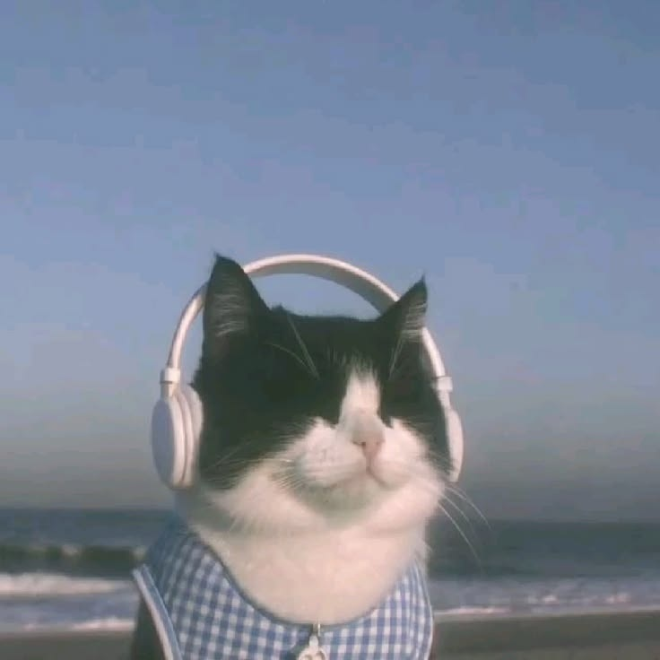
        <p style="margin-top: 8px;">
            原圖...
        </p>
    </div>
    <!-- 第二張 -->
    <div style="width: calc(33.333% - 14px);">
        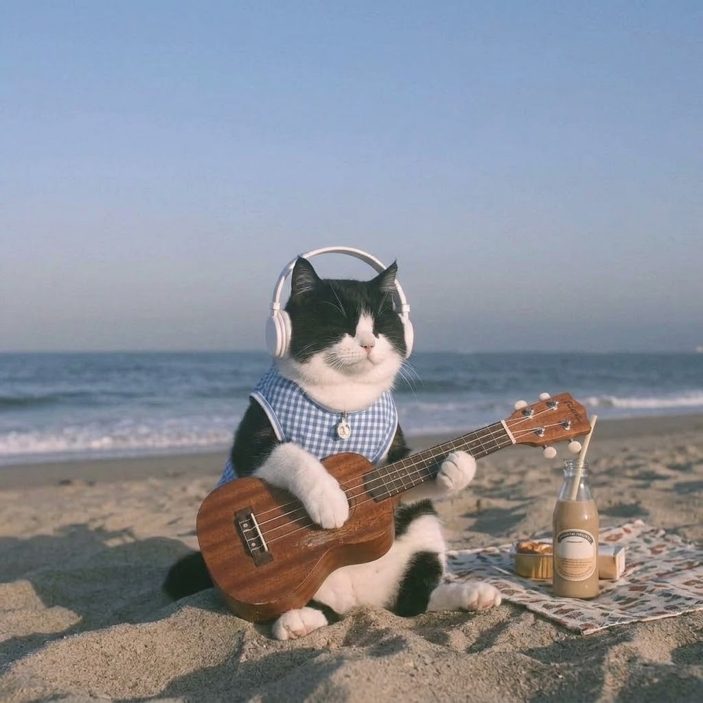
        <p style="margin-top: 8px;">
            <strong>提示詞：</strong>
            以原圖中的黑白貓為主角，保留原本的黑白毛色、臉部特徵、白色耳機與藍白格紋服裝。延伸原本的海邊場景，讓貓咪坐在沙灘上彈著一把小木吉他，身旁放著飲料與野餐墊，遠處維持海浪與藍天。保持原圖柔和、復古、療癒的攝影氛圍與自然光線，讓畫面看起來像是同一天拍攝的另一張照片。
        </p>
    </div>
    <!-- 第三張 -->
    <div style="width: calc(33.333% - 14px);">
        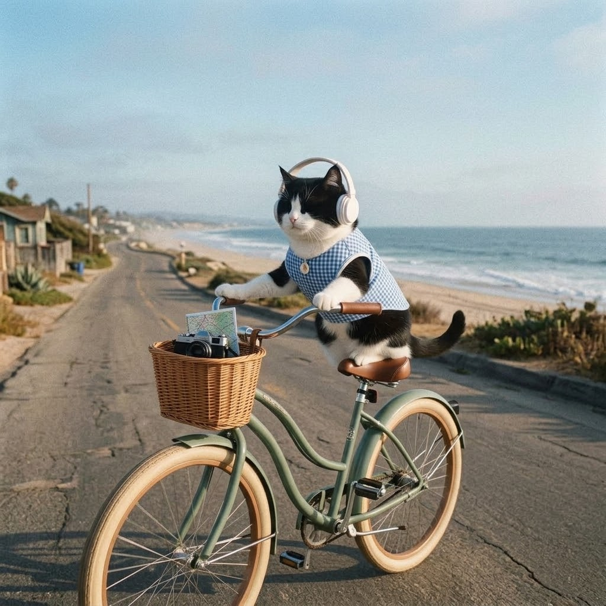
        <p style="margin-top: 8px;">
            <strong>提示詞：</strong>
            以原圖中的黑白貓為主角，保留原本的黑白毛色、臉部特徵、白色耳機與藍白格紋服裝。將情境延伸為貓咪騎著復古腳踏車沿著海岸前進，耳機仍戴在頭上，背景可以看見海洋、沙灘與沿海道路。保持原圖柔和、復古、療癒的攝影氛圍與自然光線，維持相近的色調與質感，讓畫面像是同一系列的生活紀錄照片。
        </p>
    </div>
</div>

### 🟡方法二：固定Prompt結構

讓每次生成結果穩定的另一個關鍵，是使用固定描述結構：

```text
我給你一張圖，請你將圖轉成固定結構。固定結構模板我下方給你參考：
【主題】唯一會改變的內容
【風格】寫實／插畫／科技風
【色彩】冷色／暖色／品牌色
【光線】柔光／電影感／高對比
【構圖】主體位置、鏡頭距離、留白區域
【固定元素】角色、符號、背景類型或框架
【輸出用途】社群、書封、Banner、簡報
接著，請你在幫我把模板微調成兩組，讓我進而去生成兩張圖片
```

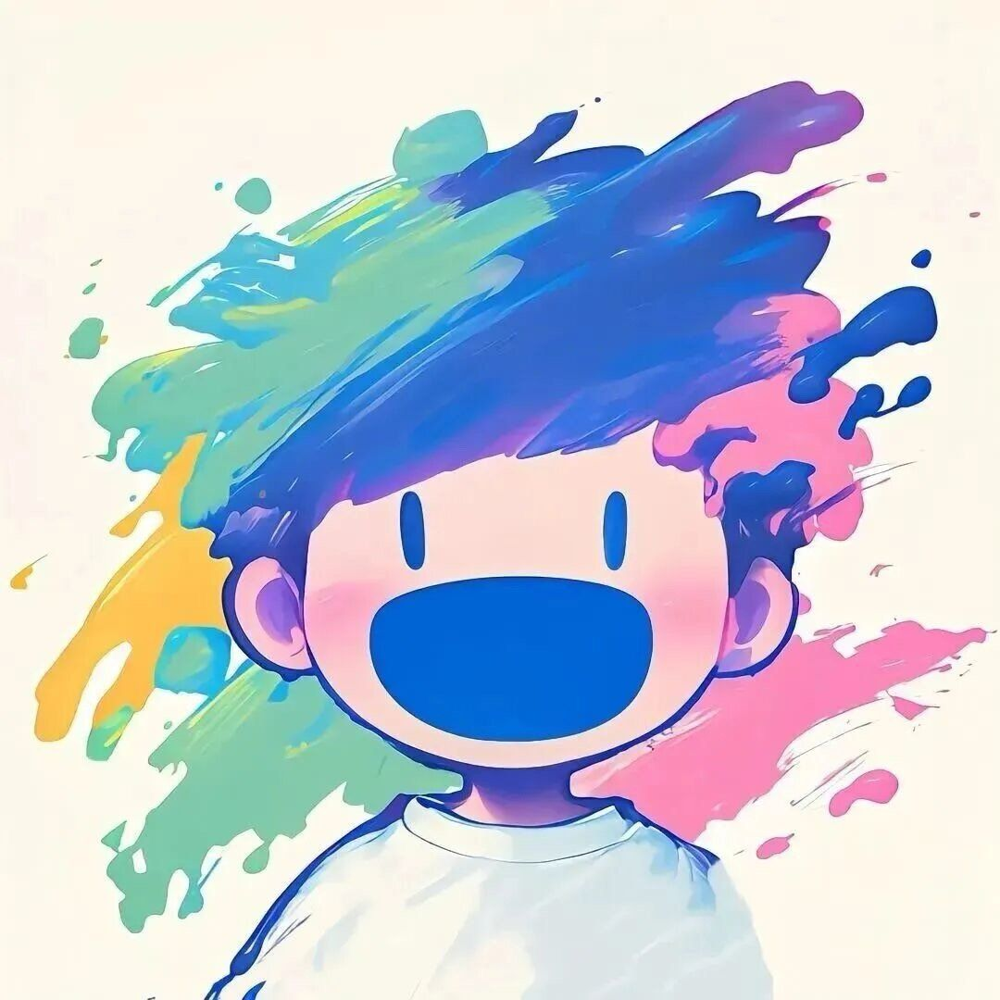

```text
### GPT給我的
【主題】可愛男孩角色的大頭肖像
【風格】簡約卡通插畫、水彩筆刷風格
【色彩】高彩度藍色、青綠色、粉紅色、黃色與紫色
【光線】明亮柔和，低陰影、低立體光影
【構圖】角色置中，正面視角，胸部以上近景，大頭比例，背景保留大量淺色留白
【固定元素】圓潤臉型、簡化五官、深藍色頭髮、白色上衣，背景使用大面積彩色潑墨與筆刷元素
【輸出用途】社群貼文、品牌角色、個人頭像、教學素材
```

<!-- 兩張圖片 + 提示詞 -->
<div style="display: flex; flex-wrap: wrap; gap: 20px;">
    <!-- 第一張 -->
    <div style="width: calc(50% - 10px);">
        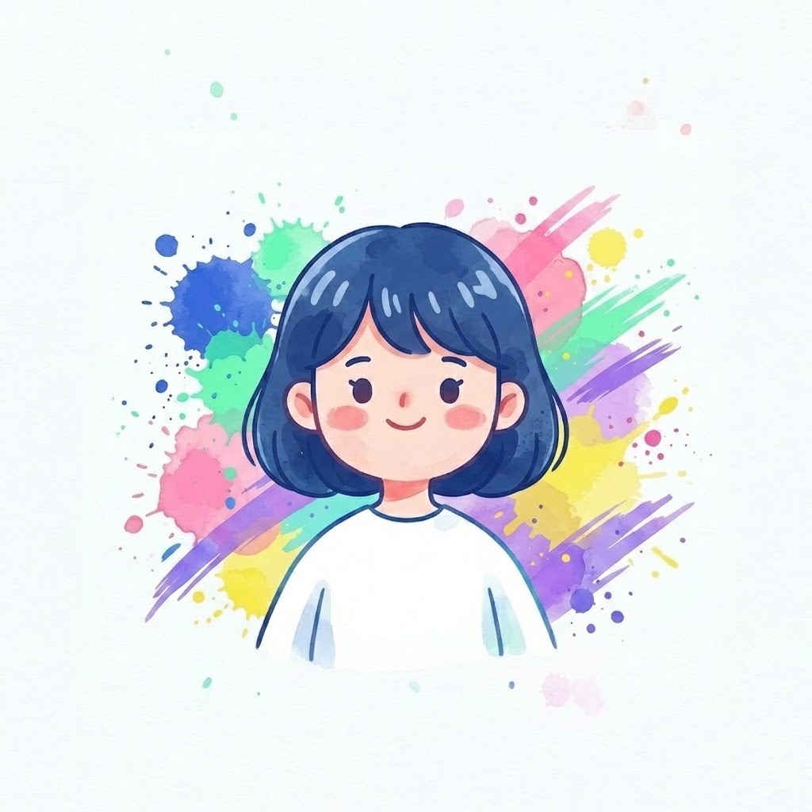
        <p style="margin-top: 8px;">
            <strong>提示詞：</strong>
            【主題】可愛女孩角色的大頭肖像
            【風格】簡約卡通插畫、水彩筆刷風格
            【色彩】高彩度藍色、青綠色、粉紅色、黃色與紫色
            【光線】明亮柔和，低陰影、低立體光影
            【構圖】角色置中，正面視角，胸部以上近景，大頭比例，背景保留大量淺色留白
            【固定元素】圓潤臉型、簡化五官、深藍色頭髮、白色上衣，背景使用大面積彩色潑墨與筆刷元素
            【輸出用途】社群貼文、品牌角色、個人頭像、教學素材
        </p>
    </div>
    <!-- 第二張 -->
    <div style="width: calc(50% - 10px);">
        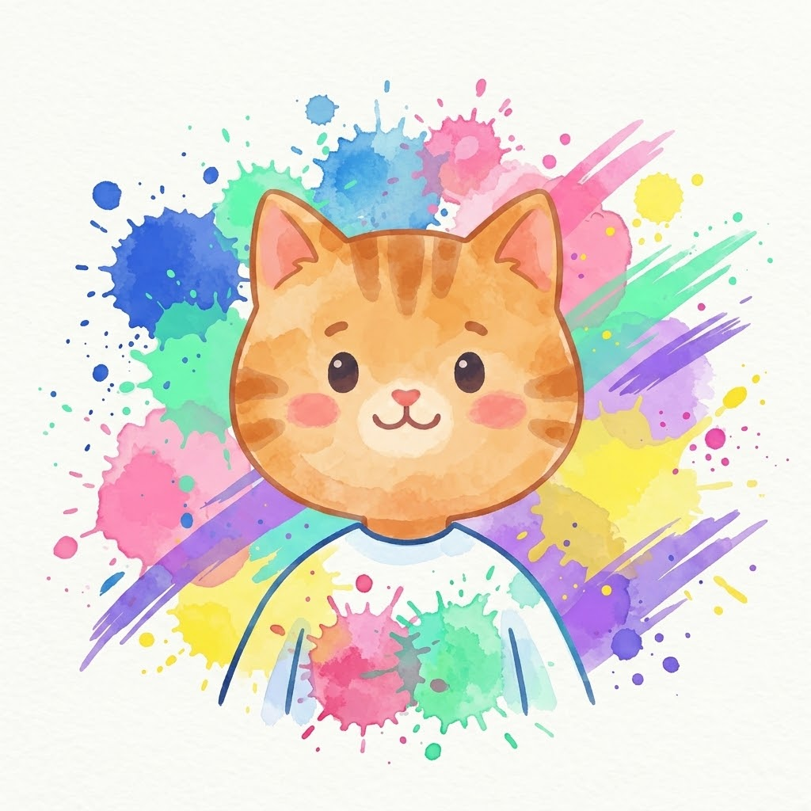
        <p style="margin-top: 8px;">
            <strong>提示詞：</strong>
            【主題】可愛橘貓角色的大頭肖像
            【風格】簡約卡通插畫、水彩筆刷風格
            【色彩】高彩度藍色、青綠色、粉紅色、黃色與紫色
            【光線】明亮柔和，低陰影、低立體光影
            【構圖】角色置中，正面視角，胸部以上近景，大頭比例，背景保留大量淺色留白
            【固定元素】圓潤可愛造型、簡化五官、白色上衣，背景使用大面積彩色潑墨與筆刷元素
            【輸出用途】社群貼文、品牌角色、個人頭像、教學素材
        </p>
    </div>
</div>

### 🔵 Problem. 延續原圖，創造下一個場景

請先使用 AI 生成一張角色圖片作為「原圖」，再利用**延續既有圖像（Image-to-Image）**的方式生成第 2 張圖片。

新圖片必須：

- 保留原角色的外觀與服裝
- 維持相近的色彩、光線與風格
- 改變角色正在進行的活動或所在場景

例如：原本「貓咪在海邊散步」→ 改成「同一隻貓咪在海邊彈吉他」。

### 🔵 Problem. 同一角色的三連拍

請先生成一個你喜歡的角色，接著以這張圖片為基礎，利用 **Image-to-Image** 延伸生成另外 2 張圖片，完成一組共 **3 張的系列作品**。

三張圖片中的角色必須讓人能辨認為「同一個角色」，但每張圖片要有**不同動作或情境**。

例如：「喝咖啡 → 使用電腦 → 看書」。

**挑戰重點：不要重新生成角色，而是延續原圖。**

### 🔵 Problem. 固定 Prompt，只改一個地方

請建立以下固定 Prompt 結構：

**【主題】【風格】【色彩】【光線】【構圖】【固定元素】【輸出用途】**

先利用這個結構生成第 1 張圖片，再複製 Prompt，**只能修改【主題】欄位**，生成第 2、3 張圖片。

最後將三張圖片放在一起，觀察它們是否具有一致的視覺風格。

### 🔵 Problem. 把一張圖片「拆解」成固定 Prompt

找一張你喜歡的圖片作為視覺參考，將圖片提供給 AI，請 AI 分析並整理成：

**【主題】【風格】【色彩】【光線】【構圖】【固定元素】【輸出用途】**

接著保持「風格、色彩、光線、構圖、固定元素」不變，只修改【主題】，實際生成 **2 張新的圖片**。

比較原圖與新生成的圖片，看看哪些視覺特徵成功被延續下來。

### 🔵 Problem. 哪種方法比較穩？

請選擇同一個角色與主題，分別使用兩種方式生成系列圖片：

**A 組：Image-to-Image**
以第一張圖片為基礎，延伸生成另外 2 張不同情境。

**B 組：固定 Prompt 結構**
不提供前一張圖片，只使用相同的固定 Prompt，改變【主題】生成另外 2 張。

最後將兩組結果放在一起，比較哪一種方法在**角色、風格、色彩、光線與構圖**上更能維持一致性，並指出你觀察到的差異。

## 🔴AI品牌風格：從個人到系統

AI 品牌風格是一組能讓 AI 持續產生相同視覺感受的規則與描述方式。它可能包含：

- 固定風格類型。
- 穩定色彩傾向。
- 一致光線與氛圍。
- 固定構圖或畫面結構。
- 固定角色或視覺元素。

與一般風格的差別：

| 類型        | 特性                       |
| ----------- | -------------------------- |
| 一般風格    | 靠感覺、不穩定、難以重現   |
| AI 品牌風格 | 可描述、可複製、可穩定輸出 |

核心價值：

1. 可重複：不需重新設計，每次都能產生一致結果。
2. 可擴展：同一風格可用於不同主題與場景。
3. 可累積：圖片之間逐漸形成關聯與記憶。

不要每次重新描述風格，而要建立一套固定的風格描述方式。

```text
### 固定品牌視覺提示詞
請以固定品牌視覺生成【主題】。
固定風格：__________
固定主色：__________
固定輔色／重點色：__________
固定光線：__________
固定構圖：__________
固定角色或物件：__________
固定視覺元素：__________
希望帶來的感受：__________
輸出比例與用途：__________
只改變主題內容，其餘視覺規則保持一致。
```

例如「藍紫色科技插畫＋柔光＋中心構圖」可以標準化為：

```text
【固定風格】半寫實科技插畫
【固定色彩】藍紫色系，少量青藍與暖色點綴
【固定光線】柔光、螢幕光與少量霓虹光效
【固定構圖】人物或產品置中，焦點集中，背景簡潔
【固定氣氛】安靜、專注、專業、帶未來科技感
【固定辨識元素】圓角科技介面、光點、細線資料流
只改變主題內容，其餘視覺規則保持一致。
```

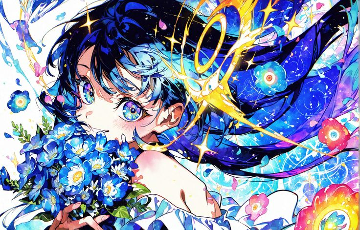

上圖可以轉換為下列提示詞：

```text
固定風格：高精緻日系幻想動漫插畫，細膩線稿，華麗裝飾感，高密度細節
固定主色：深藍、寶藍、天空藍
固定輔色／重點色：白色、金黃色，少量粉紅與青綠作為點綴
固定光線：明亮夢幻光感，局部高亮與發光效果，金色光芒作為視覺焦點
固定構圖：人物半身近景，主體偏左置中，頭髮與裝飾向右側延伸，畫面具有流動感與高密度構圖
固定角色或物件：日系動漫人物、花束、華麗髮飾
固定視覺元素：藍色花朵、金色星芒、圓環、星空紋理、彩色花瓣、流動線條、發光裝飾
希望帶來的感受：夢幻、華麗、浪漫、神秘、充滿生命力
輸出比例與用途：16:9 橫式構圖，適合 Banner、社群主視覺、活動宣傳與網站橫幅
```

<!-- 兩張圖片 + 提示詞 -->
<div style="display: flex; flex-wrap: wrap; gap: 20px;">
    <!-- 第一張 -->
    <div style="width: calc(50% - 10px);">
        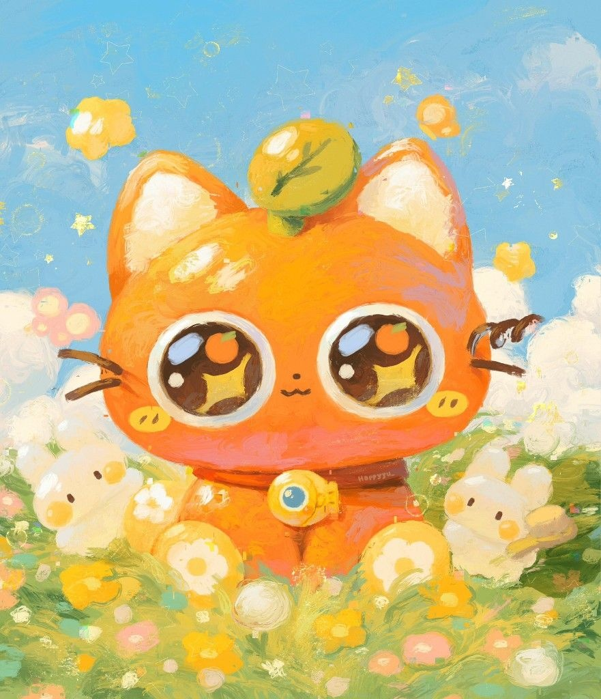
        <p style="margin-top: 8px;">
            原圖
        </p>
    </div>
    <!-- 第二張 -->
    <div style="width: calc(50% - 10px);">
        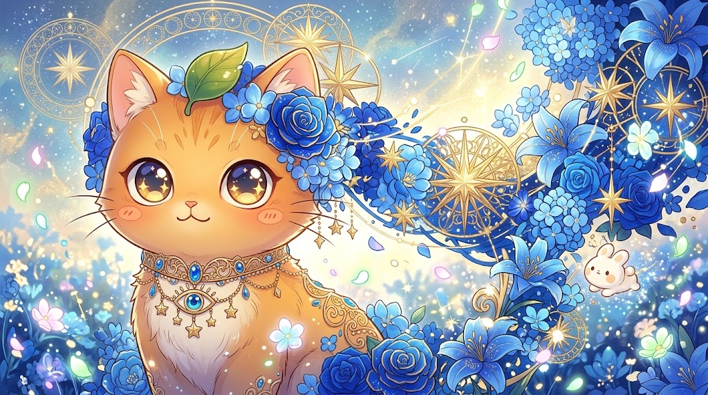
        <p style="margin-top: 8px;">
            <strong>提示詞：</strong>
            將圖片主角套用以下AI品牌風格：...
        </p>
    </div>
</div>

<!-- 兩張圖片 + 提示詞 -->
<div style="display: flex; flex-wrap: wrap; gap: 20px;">
    <!-- 第一張 -->
    <div style="width: calc(50% - 10px);">
        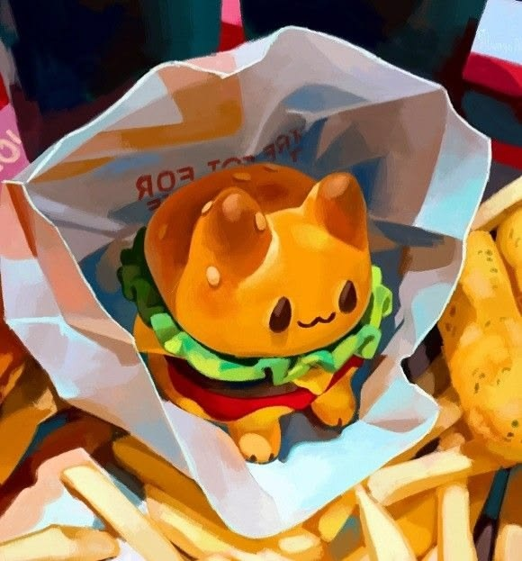
        <p style="margin-top: 8px;">
            原圖
        </p>
    </div>
    <!-- 第二張 -->
    <div style="width: calc(50% - 10px);">
        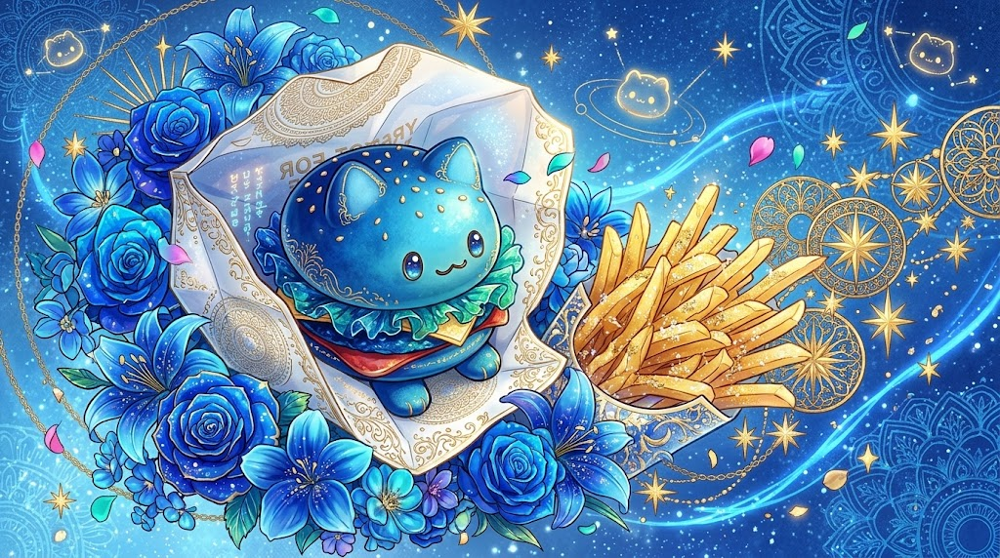
        <p style="margin-top: 8px;">
            <strong>提示詞：</strong>
            將圖片主角套用以下AI品牌風格：...
        </p>
    </div>
</div>

### 🔵 Problem. 把喜歡的圖片變成「AI 品牌風格」

請找一張你喜歡的圖片作為參考，提供給 AI 分析，將圖片的視覺特色轉換成一套可以重複使用的「AI 品牌風格提示詞」。

提示詞至少需要包含：**固定風格、主色、輔色／重點色、光線、構圖、視覺元素、整體感受**。

完成後，使用這套提示詞重新生成 **1 張不同主題的圖片**，觀察原本的視覺特色是否能被重現。

### 🔵 Problem. 同一套品牌風格，挑戰三個主題

自行設計一套「AI 品牌風格」，並使用完全相同的品牌視覺規則生成 **3 張不同主題**的圖片。

例如：**AI 學習 → 旅行 → 音樂**

三張圖片只能修改【主題】，其餘的**風格、色彩、光線、構圖與固定視覺元素都必須保持一致**。

完成後，將三張圖片並排比較，確認即使主題不同，是否仍像是同一個品牌的作品。

### 🔵 Problem. 幫不同角色穿上「同一個品牌」

請準備 **3 個外觀明顯不同的主角**，例如人物、貓咪、機器人。

建立一套固定的 AI 品牌風格，分別將這套風格套用到三個主角上並生成圖片。

三張圖片必須保留各自主角的特色，同時維持相同的**色彩、光線、構圖、畫面質感與辨識元素**。

### 🔵 Problem. 一個品牌，延伸三種使用情境

建立一套自己的「固定品牌視覺提示詞」，並使用同一套規則生成以下 **3 種品牌素材**：

1. 社群貼文主視覺
2. 活動／課程宣傳 Banner
3. 網站首頁主視覺

可以依照用途調整圖片比例與內容，但必須保留品牌的**固定風格、色彩、光線與辨識元素**。

### 🔵 Problem. 建立你的 AI 品牌風格模板

假設未來你要持續使用 AI 產生自己的品牌圖片，請設計一份可以長期重複使用的「固定品牌視覺提示詞」。

完成提示詞後，實際生成 **至少 3 張不同內容的圖片**。

最後檢查你的品牌風格是否做到：

**可描述**：能清楚用文字說明視覺規則。
**可複製**：重新生成時仍能得到相近的視覺效果。
**可擴展**：換成不同主題仍然適用。
**可辨識**：多張圖片放在一起時，看得出屬於同一系列。

## 🔴角色與視覺 IP：讓圖像被記住

風格一致能讓圖像看起來統一，但要讓人記住，還需要可辨識的核心元素。角色或視覺 IP 可以：

- 提供固定的視覺焦點。
- 建立長期記憶。
- 讓不同內容產生連結。
- 提高社群、教材與行銷素材的辨識度。

視覺 IP 不一定是卡通角色，也可以是：

- 固定人物，例如講師形象。
- 固定風格人物，例如 AI 助手角色。
- 固定視覺符號，例如特定造型或裝置。

### 🟡建立角色的三個關鍵

第一，外觀固定。角色需要具備穩定特徵：

- 臉型與髮型。
- 穿著風格。
- 色彩搭配。
- 身體比例。
- 固定配件或符號。

<!-- 兩張圖片 + 提示詞 -->
<div style="display: flex; flex-wrap: wrap; gap: 20px;">
    <!-- 第一張 -->
    <div style="width: calc(50% - 10px);">
        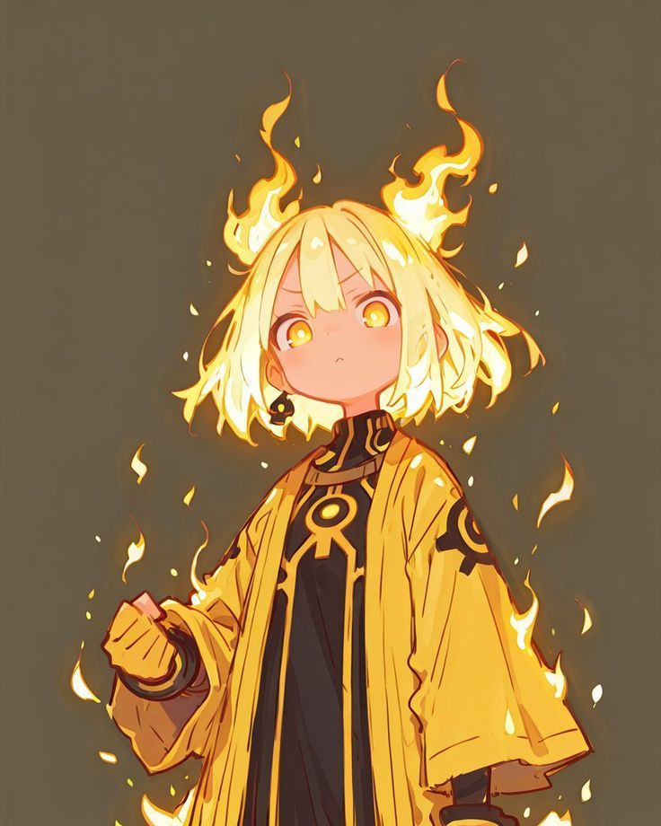
        <p style="margin-top: 8px;">
            這是我的角色IP，請幫我轉為角色IP固定提示詞，好讓我在後續做圖都可以使用這個角色IP
        </p>
    </div>
    <!-- 第二張 -->
    <div style="width: calc(50% - 10px);">
        <p style="margin-top: 8px;">
            <strong>【角色 IP 固定設定】</strong>            
            固定角色：一位嬌小可愛的日系動漫少女角色
            固定臉部：圓潤偏幼態的臉型，小巧鼻子與嘴巴，大型圓眼，五官簡潔可愛
            固定眼睛：明亮金黃色瞳孔，帶有橘黃色發光感與高光
            固定髮型：金黃色短髮，長度至下巴附近，髮尾微微向外翹，蓬鬆自然，額前有不規則瀏海
            固定特殊特徵：頭部左右兩側各有一團向上燃燒的金黃色火焰，如同火焰形成的雙角，這是角色最重要的辨識特徵，不可移除
            固定服裝：黑色高領內搭，胸前具有金黃色圓環符號，外層穿寬鬆金黃色長袖外套，衣服帶有黑色幾何線條與符號裝飾
            固定配色：金黃、橘黃、黑色為核心配色，少量白色高光
            固定元素：角色周圍漂浮少量金黃色火焰、火星與發光碎片
            固定風格：日系動漫角色插畫，乾淨細膩線稿，柔和賽璐璐上色，可愛與奇幻感並存
            固定光線：以金黃色火焰作為主要光源，角色頭髮、臉部與服裝邊緣帶有溫暖發光效果
            固定角色氣質：可愛、安靜、帶有神秘感，外表嬌小但具有火焰力量
            【一致性要求】
            後續無論更換姿勢、表情、動作、場景、背景或故事情境，都維持相同的臉部特徵、金黃色短髮、金黃色眼睛、頭頂雙火焰、黑金服裝結構與角色核心配色。
            不得任意改變髮色、瞳色、主要服裝配色與雙火焰造型，不增加動物耳朵、真正的犄角、翅膀或其他會改變角色辨識度的主要特徵。
        </p>
    </div>
</div>

第二，可延伸。角色必須適應不同情境：

- 教學場景。
- 工作場景。
- 未來科技場景。

<!-- 三張圖片 + 提示詞 -->
<div style="display: flex; flex-wrap: wrap; gap: 20px;">
    <!-- 第一張 -->
    <div style="width: calc(33.333% - 14px);">
        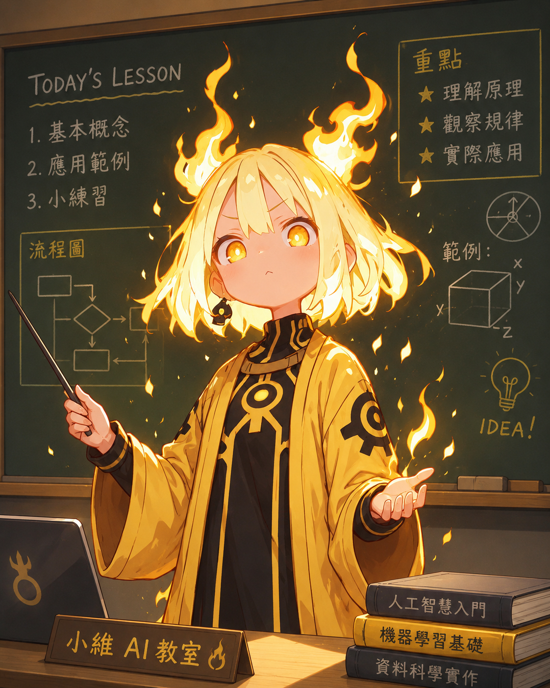
        <p style="margin-top: 8px;">
            <strong>提示詞：</strong>
            幫我把背景換為教學場景
        </p>
    </div>
    <!-- 第二張 -->
    <div style="width: calc(33.333% - 14px);">
        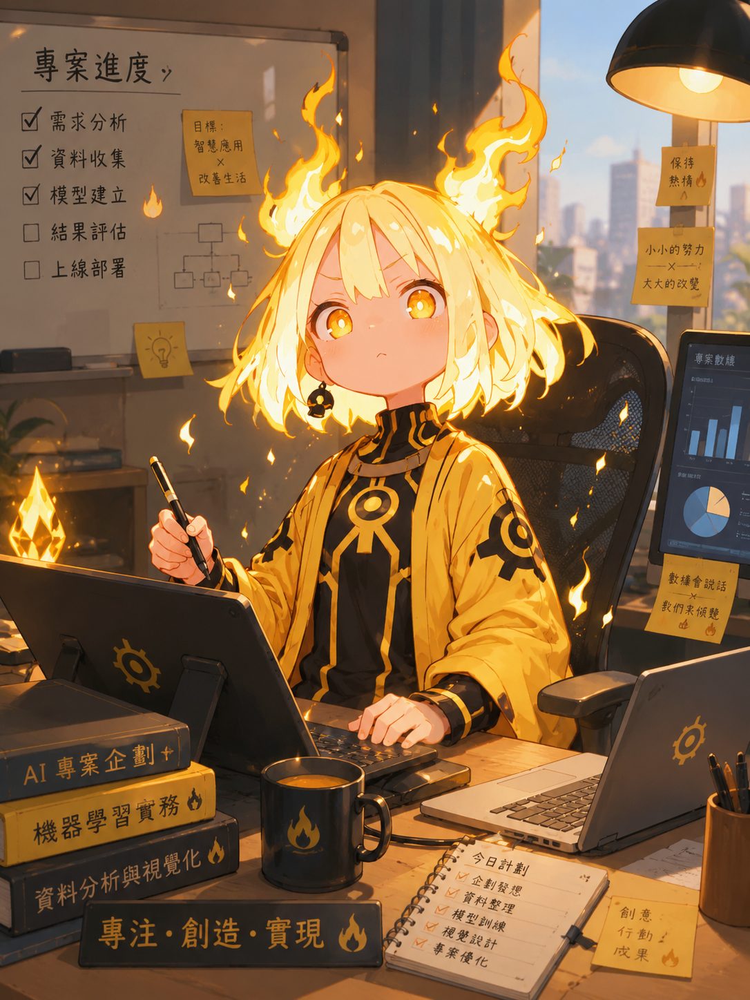
        <p style="margin-top: 8px;">
            <strong>提示詞：</strong>
            幫我把背景換為工作場景
        </p>
    </div>
    <!-- 第三張 -->
    <div style="width: calc(33.333% - 14px);">
        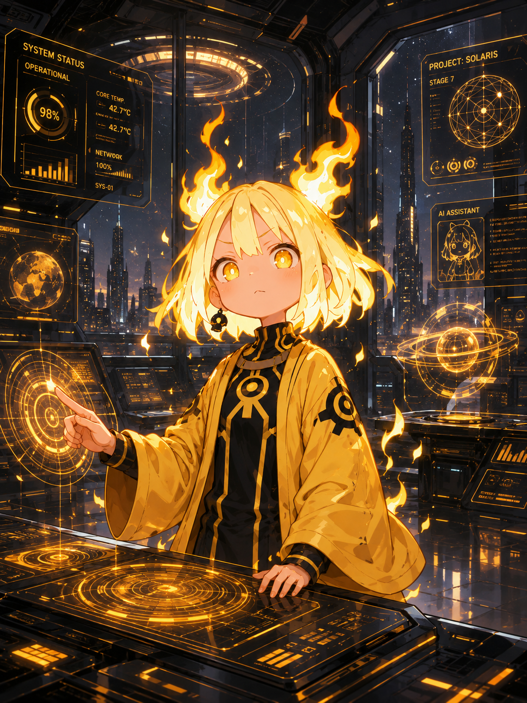
        <p style="margin-top: 8px;">
            <strong>提示詞：</strong>
            幫我把背景換為未來科技場景
        </p>
    </div>
</div>

第三，可持續使用。角色應能長期出現在：

- 社群貼文。
- 書籍插圖。
- 行銷素材。
- 簡報與網站。

<!-- 兩張圖片 + 提示詞 -->
<div style="display: flex; flex-wrap: wrap; gap: 20px;">
    <!-- 第一張 -->
    <div style="width: calc(50% - 10px);">
        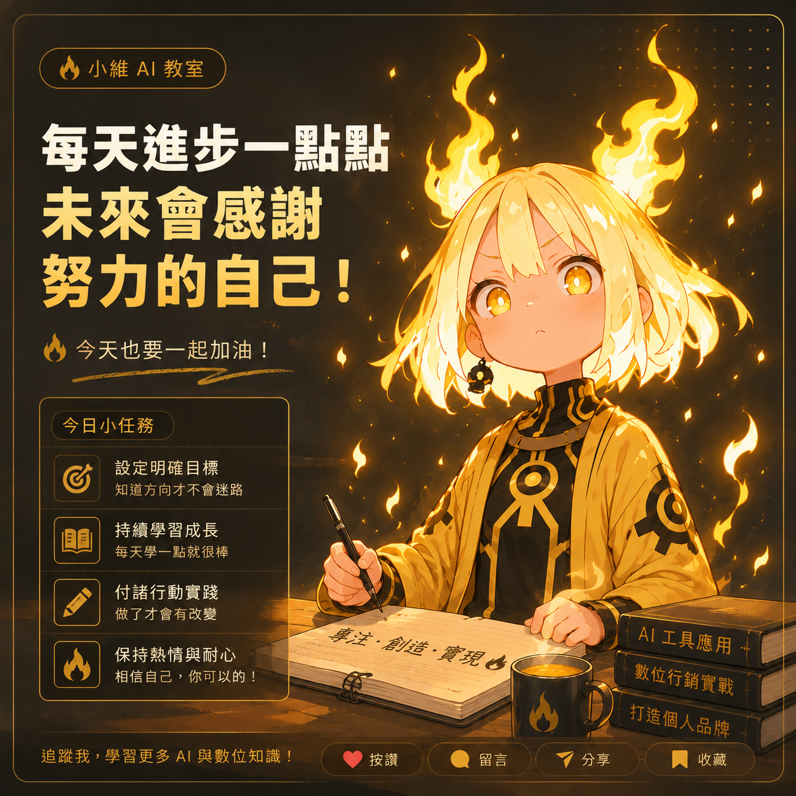
        <p style="margin-top: 8px;">
            <strong>提示詞：</strong>
            幫我做一張社群貼文，並將IP放上去
        </p>
    </div>
    <!-- 第二張 -->
    <div style="width: calc(50% - 10px);">
        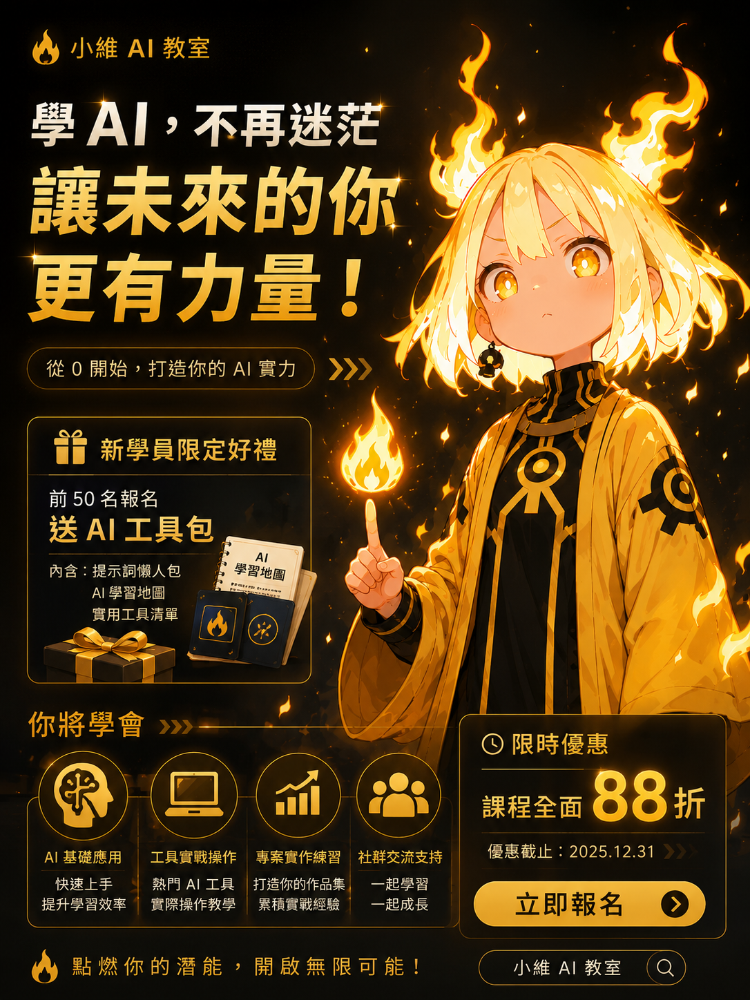
        <p style="margin-top: 8px;">
            <strong>提示詞：</strong>
            幫我做一張行銷素材，並將IP放上去
        </p>
    </div>
</div>

幫我做一張行銷素材，並將IP放上去...
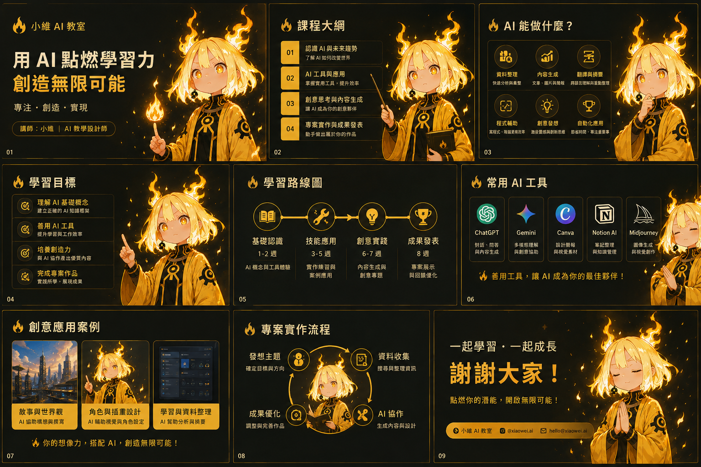

### 🔵 Problem. 創造你的角色 IP

請使用 AI 生圖工具設計一個具有辨識度的原創角色 IP。

角色至少要有 **3 個固定且容易辨認的外觀特徵**，例如特殊髮型、固定服裝、代表色、配件或特殊符號。

完成第一張角色圖片後，請讓 AI 根據圖片整理出一份「**角色 IP 固定提示詞**」，作為後續生成圖片時的角色設定。

### 🔵 Problem. 同一個 IP，挑戰三種情境

延續 Problem 1 建立的角色 IP，保持角色的**臉部、髮型、服裝、配色與核心辨識特徵不變**，分別生成：

1. 教學場景
2. 工作場景
3. 未來科技場景

可以改變角色的動作、表情與背景，但三張圖片必須讓人一眼認出是「**同一個角色**」。

### 🔵 Problem. 幫角色設計招牌特徵

請設計一個原創角色，並替角色加入一個「**不可被移除的招牌特徵**」，例如火焰雙角、特殊眼睛、星星髮飾、機器手臂、特殊項鍊等。

接著讓角色分別進行 **3 種不同動作**並生成圖片，例如：**看書 → 使用電腦 → 開心揮手**

不論姿勢如何改變，招牌特徵都必須持續出現在圖片中。

### 🔵 Problem. 讓角色 IP 進入品牌素材

使用你建立的角色 IP，分別生成 **2 種不同用途的品牌圖片**：

1. 一張社群知識貼文
2. 一張活動／產品行銷素材

兩張圖片的版面與用途可以不同，但角色 IP 的**核心外觀與辨識元素不能改變**，並思考角色應該放在哪個位置，才能成為品牌的固定視覺焦點。

### 🔵 Problem. 建立你的「IP 素材包」

請使用同一個角色 IP，完成一套至少 **5 張圖片**的角色素材包，內容包含：

**角色標準形象＋2 種表情／動作＋1 個不同場景＋1 張實際品牌應用圖。**

完成後將 5 張圖片放在一起，檢查角色的**臉型、髮型、服裝、配色、身體比例與招牌特徵**是否維持一致。
