# 🎯 情境化圖像創作與提示詞設計

## 🔴 圖像不是作品，而是「用途」

在前面的 AI 創作經驗中，我們通常先學會兩件事：想清楚要做什麼，以及生成第一張看得見的圖。接下來會遇到一個新問題：為什麼有些圖可以用，有些圖卻只能當作測試？差別不只在工具，而在於我們是否知道這張圖要用在哪裡。
有些圖片看起來很精緻，卻無法放進書封；有些圖片細節豐富，卻不適合教學；有些圖片很有氣氛，卻無法用於行銷。問題往往不在畫質，而在它是否符合用途。
在傳統創作中，圖片常被視為作品本身；在 AI 時代，圖像也可能是：

- 📕 書籍封面的主視覺
- 📚 教學內容的輔助說明
- 📣 行銷素材中的吸引元素
- 📊 簡報中的重點強化
- 🧑‍🎨 品牌長期使用的角色資產
  所以，一張圖的價值不只在於能否獨立成立，更在於它能否在特定情境中發揮作用。

### ❓ 為什麼同一張圖在不同情境會失效？

常見情況包括：

- 📱 圖片放在社群貼文很好看，但縮成手機尺寸後資訊擠成一團。
- 📊 圖片放在簡報很清楚，拿去做廣告卻沒有足夠吸引力。
- 👀 圖片細節很多，但讀者第一眼不知道該看哪裡。
- 📝 畫面很完整，卻沒有留出標題、按鈕或說明文字的位置。
  🟡 原因是不同情境需要不同的設計。圖像不是「越完整越好」，而是「越符合用途越好」。

## 🔴 三大圖像用途

為了快速判斷圖像應如何設計，可以把常見圖像分成三類：
| 類型 | 核心目的 | 希望觀眾產生的反應 | 常見形式 |
| ----------------- | ---------- | ------------------ | -------------------------------------- |
| 📘 傳達型 Explain | 讓人理解 | 「我看懂了」 | 流程圖、教學圖、資訊圖、心智圖 |
| 👀 吸引型 Attract | 讓人停下來 | 「我想多看一眼」 | 海報、Banner、書封、社群貼文 |
| 🎬 故事型 Tell Story | 讓人記住 | 「我記得這個情境」 | 漫畫、情境插圖、教學故事、品牌角色視覺 |
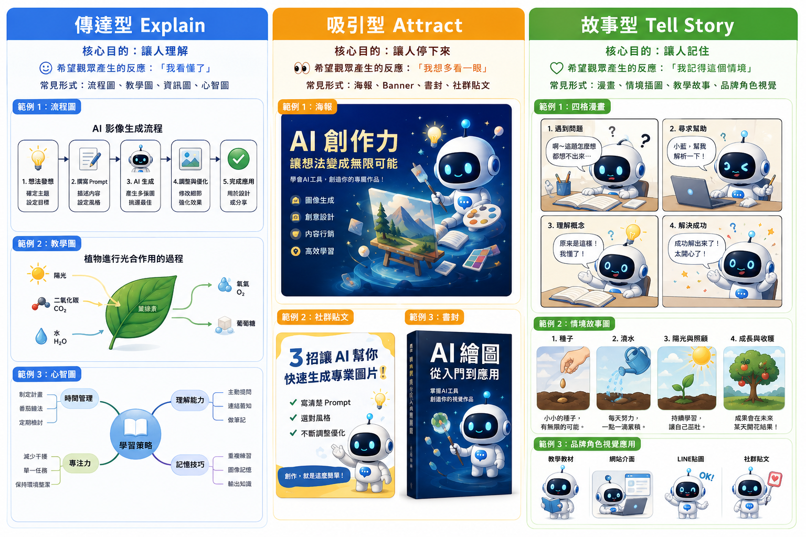

### 📘 傳達型圖像創作：讓人看懂

傳達型圖像的目的不是吸引目光，而是幫助理解。當內容涉及流程、概念或結構時，單靠文字不容易掌握重點，圖像可以大幅降低閱讀與思考負擔。
適用情境：

- 📖 書內插圖
- 🧑‍🏫 教學圖解
- ➡️ 流程圖
- 📊 資訊圖（Infographic）
- 🧠 心智圖
- 📑 簡報中的概念整理
  設計特點：
- 🧩 結構清楚
- 🎯 重點明確
- ✨ 不強調裝飾
- 👀 以理解為優先
- 🟡 資訊越多，視覺越要簡單
  🟡 很多資訊圖失敗，是因為想把所有內容一次放上去。內容越多，AI 越容易做出混亂的圖。因此流程圖不要塞進大量人物、場景和背景；若主要流程只有「開始 → 步驟一 → 步驟二 → 完成」，就讓這四個節點清楚出現。
  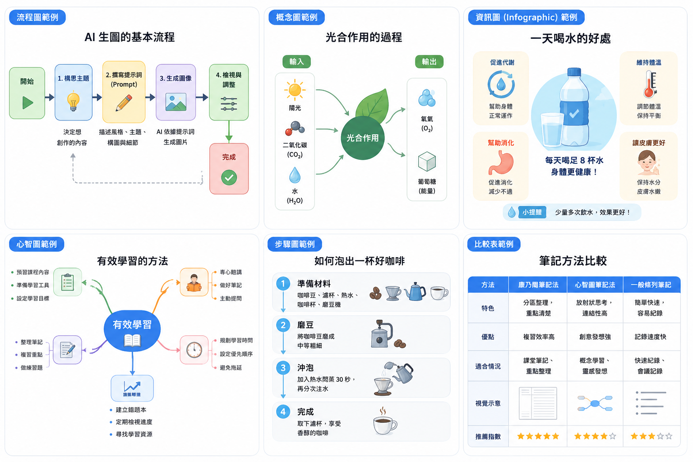

1. ➡️ 流程圖(Flowchart)：流程圖適合呈現「一件事情從開始到完成，會經過哪些階段」。它最重要的不是漂亮，而是順序與方向要一眼看懂。🟢 例
   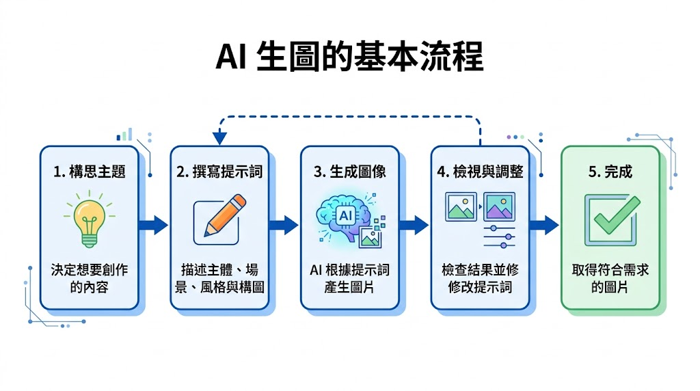

```text=
🟢 製作一張「[主題]」的流程圖。流程依序為：
1. [步驟一]：[簡短說明]
2. [步驟二]：[簡短說明]
3. [步驟三]：[簡短說明]
4. [步驟四]：[簡短說明]
5. [完成結果]
請使用清楚的箭頭連接各個步驟，讓閱讀者可以由左至右理解完整流程。
每個步驟使用獨立的圓角方框，搭配符合內容的小圖示。不同階段可使用不同的柔和色彩區分。
整體採用現代簡約資訊圖表風格，白色背景、清楚排版、適量留白、繁體中文文字，適合教學簡報使用，16:9 橫式構圖。
```

1. 🧩 概念圖(Concept Map)：概念圖不是強調「先做什麼、再做什麼」，而是解釋不同概念之間有什麼關係。
   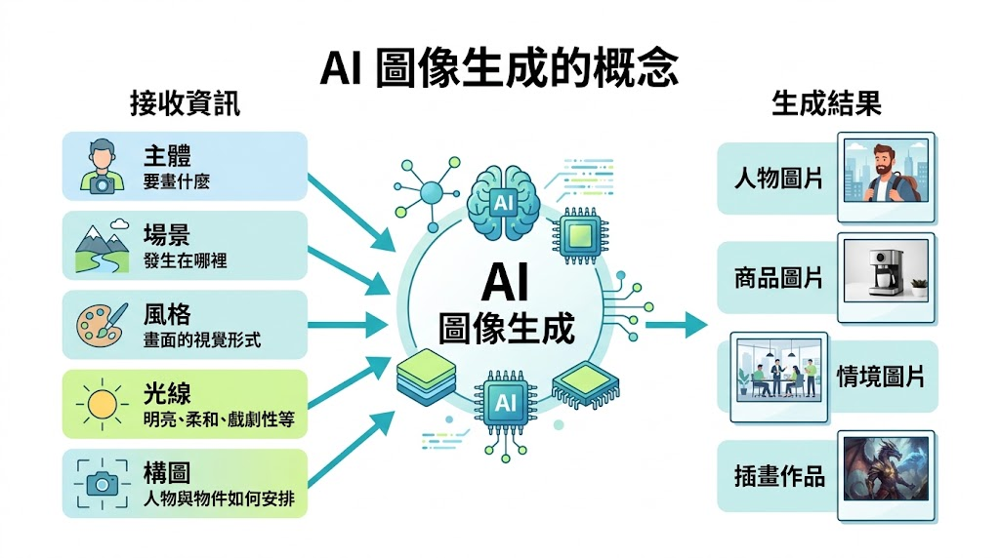

```text=
🟢 製作一張解釋「[核心概念]」的概念圖。
將「[核心概念]」放在畫面中央，作為主要視覺焦點。
左側呈現輸入或相關因素：
* [因素一]
* [因素二]
* [因素三]
右側呈現產生的結果或相關概念：
* [結果一]
* [結果二]
* [結果三]
使用箭頭或連接線呈現各概念之間的關係，每個概念搭配簡單且容易理解的圖示。
整體採用教育型資訊圖表風格，白色背景、柔和配色、乾淨排版、適量留白，避免過多裝飾。使用清楚的繁體中文文字，適合課堂教材與簡報，16:9構圖。
```

1. 📊 資訊圖(Infographic)：資訊圖的自由度最高。它會把文字、數字、圖示、插畫、重點資訊重新編排，讓原本需要讀一大段文字的內容，變成一張圖就能快速掌握。
   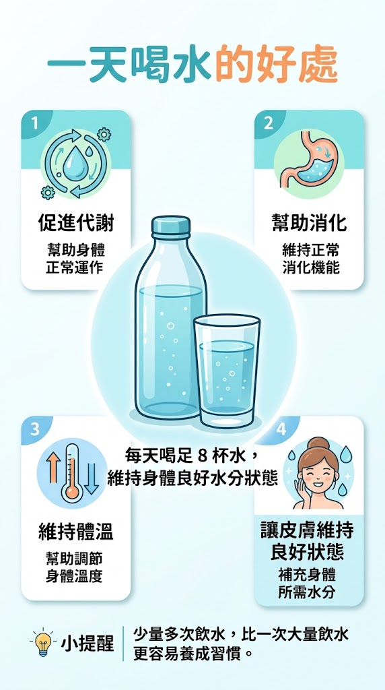

```text=
🟢 製作一張「[主題]」的資訊圖(Infographic)。
核心訊息為：「[一句話核心訊息]」
畫面中央放置：[主要人物／物件／插畫]
周圍分成 [數量] 個資訊區塊：
1. [重點一]
說明：[簡短說明]
2. [重點二]
說明：[簡短說明]
3. [重點三]
說明：[簡短說明]
4. [重點四]
說明：[簡短說明]
每個資訊區塊搭配符合內容的圖示或小型插畫，標題明顯，說明文字簡短。
建立清楚的資訊層級，讓標題、核心訊息與補充內容有明顯的字級差異。
整體採用現代資訊圖表設計，白色或淺色背景、柔和配色、卡片式排版、乾淨留白，使用繁體中文，適合社群貼文與教學教材。
```

1. 🧠 心智圖(Mind Map)：心智圖比較像把腦中的想法「攤開來」。中央放一個主題，再向外延伸不同分支，每個分支下面還可以繼續延伸。
   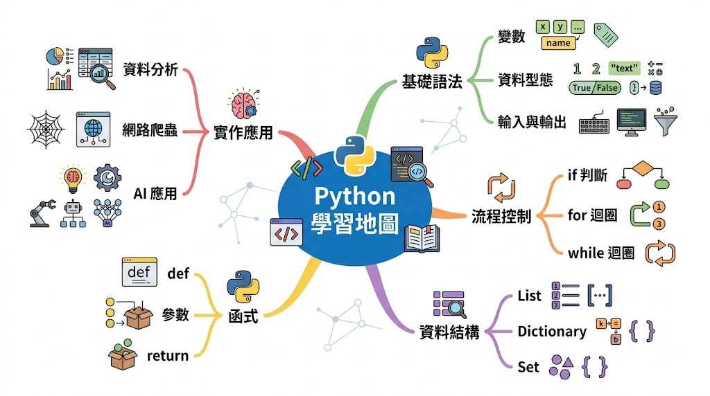

```text=
🟢 製作一張「[主題]」心智圖。
將「[核心主題]」放在畫面中央，以大型圓形或橢圓形呈現。
從中央向外延伸 [數量] 個主要分支：
* [分支一]
* [內容]
* [內容]
* [內容]
* [分支二]
* [內容]
* [內容]
* [內容]
* [分支三]
* [內容]
* [內容]
* [內容]
每個主要分支使用不同色彩區分，並搭配符合內容的簡單圖示。
使用自然曲線連接中央主題與各個分支，讓閱讀者能快速理解資訊的階層關係。
整體採用現代簡約心智圖風格，白色背景、色彩柔和、資訊層級清楚、適量留白，使用繁體中文，適合教學簡報與筆記整理。
```

1. 🪜 步驟圖(Step-by-Step)：流程圖比較強調整個流程如何運作；步驟圖則是在教讀者「照著 1、2、3、4 做，你就能完成。」
   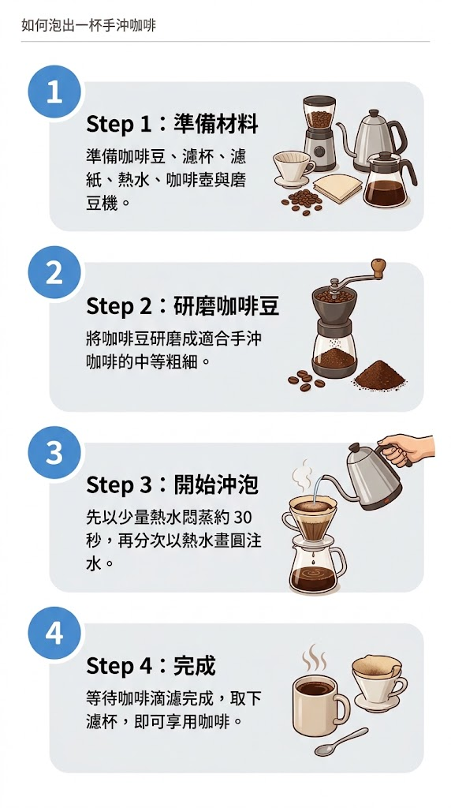

```text=
🟢 製作一張「如何 [完成某件事情]」的步驟教學圖。
將完整操作拆成 [數量] 個步驟：
Step 1：[步驟名稱]
[簡短操作說明]
Step 2：[步驟名稱]
[簡短操作說明]
Step 3：[步驟名稱]
[簡短操作說明]
Step 4：[步驟名稱]
[簡短操作說明]
每個步驟使用大型數字編號，搭配對應的操作插畫或圖示。
所有步驟依照由上至下(或由左至右)排列，使用箭頭建立閱讀方向。
每個步驟保持相同的版面結構，讓讀者可以快速按照順序操作。
整體採用清楚、簡潔的教學資訊圖風格，白色背景、藍色重點色、圓角資訊卡片、適量留白，使用繁體中文，適合教學教材。
```

1. ⚖️ 比較表(Comparison Chart)：比較表的目的很直接：把幾個選項放在同一個標準下比較。
   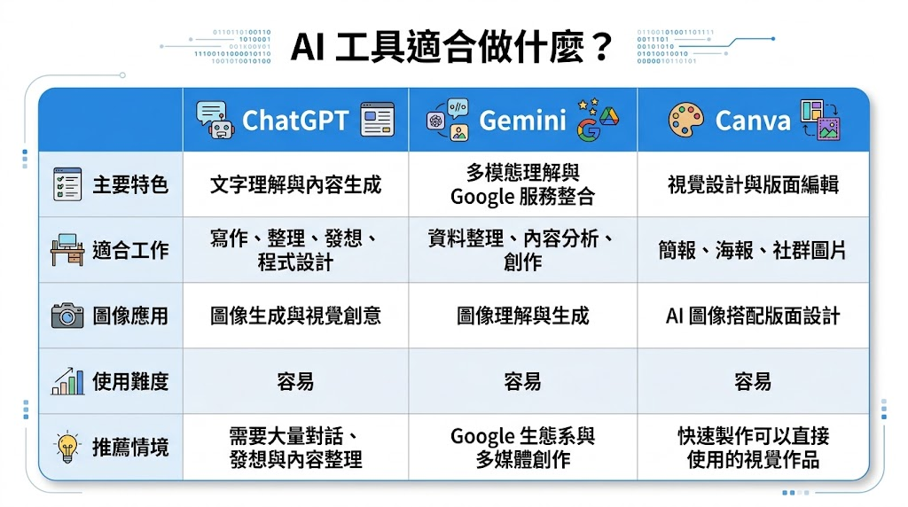

```text=
🟢 製作一張「[比較主題]」比較資訊圖表。
需要比較 [數量] 個項目：
* [項目 A]
* [項目 B]
* [項目 C]
比較以下面向：
1. 特色
2. 優點
3. 適合情況
4. 視覺示意
5. 推薦程度
請使用表格形式呈現。
第一列顯示各個比較項目的名稱，第一欄顯示比較面向，每一格使用簡短文字呈現差異。
「視覺示意」使用簡單圖示或小型插畫呈現。
「推薦程度」使用 1 至 5 顆星呈現。
不同項目可以使用些微色彩差異，但維持整體一致性。
整體採用現代簡約比較資訊圖風格，白色背景、藍色表頭、細緻分隔線、清楚的資訊層級、適量留白，使用繁體中文，適合課程教材與簡報，16:9 橫式構圖。
```

### 🔵 Problem. 把一件事變成看得懂的流程圖

請選擇一個具有明確先後順序的主題，例如「網路購物流程」、「製作一杯咖啡」或「完成一份報告」，整理成 4–6 個主要節點並生成一張流程圖。圖中必須有清楚的起點、步驟與完成結果，使用箭頭建立閱讀方向。請避免加入與流程無關的大量人物、背景或裝飾，讓讀者能在第一眼看懂「事情是怎麼進行的」。

### 🔵 Problem. 把複雜概念畫成一張圖

選擇一個不容易只用一句話解釋的概念，例如「生成式 AI」、「個人品牌」或「數位行銷」，生成一張概念圖。將核心概念放在中央，周圍安排重要因素、相關概念與可能產生的結果，並利用連接線或箭頭表達彼此關係。完成後，檢查讀者是否能透過圖片理解「這些概念之間有什麼關係」。

### 🔵 Problem. 一張圖看懂一篇文章

找一段約 200–300 字的知識型內容，先整理出「1 個核心訊息＋3–5 個重點」，再將內容轉換成一張資訊圖（Infographic）。你可以重新安排原文資訊，但不能只是把整段文字全部塞進圖片中；請利用標題、短句、數字、圖示與資訊卡片建立視覺層級，讓讀者不閱讀原文也能快速掌握重點。

### 🔵 Problem. 畫出你的知識心智圖

選擇一個你熟悉的主題，例如「學習 AI」、「經營社群」或「準備一場旅行」，生成一張心智圖。中央只能有一個核心主題，向外延伸至少 4 個主要分支，每個主要分支再包含 2–3 個次要內容。請利用顏色、圖示、大小與線條呈現資訊階層，讓人可以快速分辨「主題 → 分支 → 細節」。

### 👀 吸引型圖像創作：讓人停下來

> 🟡 吸引型圖像不是要解釋，而是要讓人願意多看一眼。
> 吸引型圖像的目的不是完整解釋內容，而是在短時間內抓住目光。適用於書籍封面、行銷海報、社群貼文、網站 Banner 與廣告素材。
> 設計特點：

- 🎯 視覺焦點強
- 🌈 色彩與光線對比明顯
- 🎭 氛圍鮮明
- 👀 可快速抓住注意力
- 🟡 大標題越少越好
- 🟡 畫面只有一個主要焦點，而不是十個焦點
  常用對比方式：
- ⚫ 黑底與亮色
- 🔠 大字與小字
- 👤 人物與留白
- ❄️🔥 冷色與暖色
- 💨 靜態主體與速度感背景

1. 📕 書籍封面：建立第一印象。書籍封面的任務不是說明全部內容，而是讓讀者在短時間內產生興趣，因此需要明確的視覺焦點與整體氛圍。
   <!-- 兩張圖片 + 提示詞 -->
   <div style="display: flex; flex-wrap: wrap; gap: 20px;">
   <!-- 第一張 -->
   <div style="width: calc(50% - 10px);">
   
   <p style="margin-top: 8px;">
   <strong>🟡 提示詞：</strong>
   🟢 請設計一張書籍封面，主題為「Google AI 創作整合術」。畫面中央為一個發光的 AI 核心，周圍延伸出數據流與未來城市輪廓，呈現科技感與創作能量。整體構圖集中，畫面上方保留空間放書名，下方預留作者名稱位置。
   </p>
   </div>
   <!-- 第二張 -->
   <div style="width: calc(50% - 10px);">
   
   <p style="margin-top: 8px;">
   <strong>🟡 提示詞：</strong>
   🟢 直式商業書封主視覺，主題「Google AI 創作整合術」。中央單一焦點：發光的抽象 AI 核心；能量線向外延伸並連接未來城市輪廓。深藍黑背景，電光藍與橙金作高對比，專業、前瞻、具出版品質感。上方約 25% 乾淨留白供主標題，下方保留作者資訊區，視覺動線由標題區進入中央核心再落到城市。不要生成小字、假出版社標誌或過多介面圖示。
   </p>
   </div>
   </div>
1. 📣 行銷海報：行銷海報的重點，是在短時間內吸引目光，並傳達活動或產品主題。
   <!-- 兩張圖片 + 提示詞 -->
   <div style="display: flex; flex-wrap: wrap; gap: 20px;">
   <!-- 第一張 -->
   <div style="">
   
   <p style="margin-top: 8px;">
   <strong>🟡 提示詞：</strong>
   🟢 請生成一張行銷海報，主題為「AI 創作工作坊」。畫面中央為一位正在操作電腦的創作者，周圍浮現 AI 圖像生成、影片、設計等元素。畫面上方保留標題區，下方預留時間與地點資訊，整體風格吸引人且具有科技感。
   </p>
   </div>
   </div>
1. 📱 社群貼文：社群圖像的重點在於情緒與親近感，而不只是完整資訊。
   <!-- 兩張圖片 + 提示詞 -->
   <div style="display: flex; flex-wrap: wrap; gap: 20px;">
   <!-- 第一張 -->
   <div style="">
   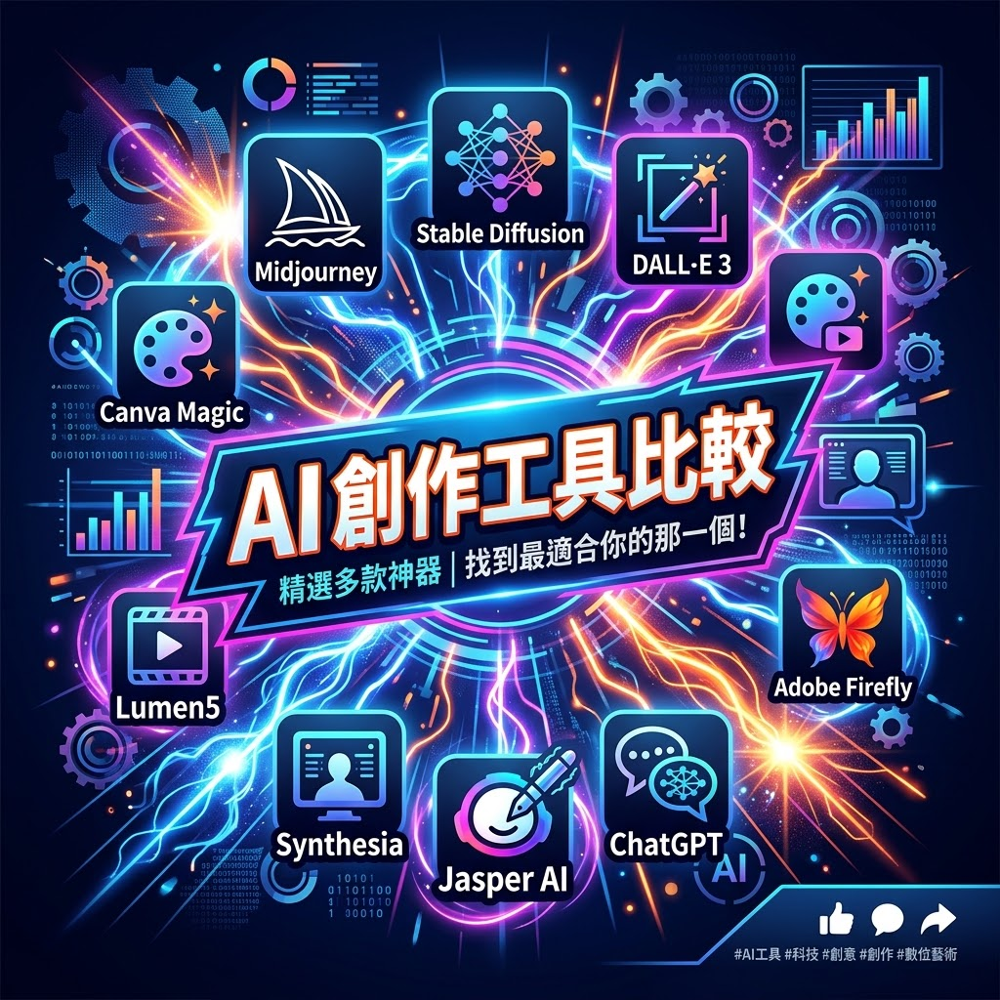
   <p style="margin-top: 8px;">
   <strong>🟡 提示詞：</strong>
   🟢 請生成一張社群貼文圖像，主題為「AI 創作工具比較」。畫面使用強對比色彩，中央為醒目的標題區，周圍搭配多個 AI 工具圖示與動態光效，整體視覺具有衝擊力與科技感。
   </p>
   </div>
   </div>
1. 🌐 網頁Banner：Banner 的任務是引導視線並支援文字內容，因此版面配置通常比細節更重要。
   <!-- 兩張圖片 + 提示詞 -->
   <div style="display: flex; flex-wrap: wrap; gap: 20px;">
   <!-- 第一張 -->
   <div style="">
   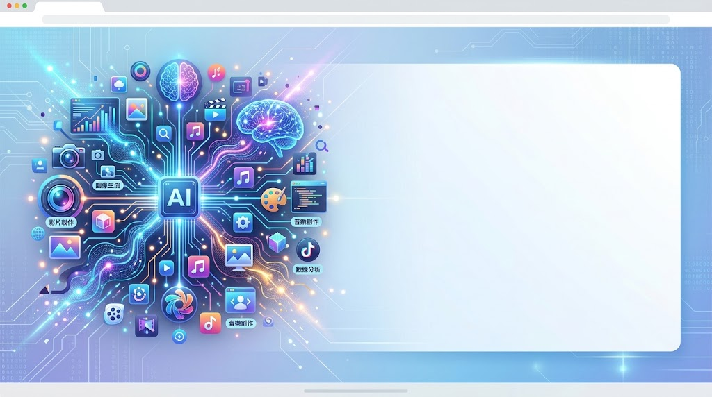
   <p style="margin-top: 8px;">
   <strong>🟡 提示詞：</strong>
   🟢 請生成一張 16:9 網頁 Banner，主題為「Google AI 創作整合術」。畫面左側為 AI 視覺元素，例如數據流、圖像生成、影片符號；右側保留大片留白區域，用於放置標題與說明文字。整體風格簡潔、現代且具科技感。
   </p>
   </div>
   </div>

這段教材很適合把題目設計成「**同一個主題，如何透過構圖、對比、焦點與留白，讓人停下來**」，也可以讓學生實際比較 Prompt 寫法對生成結果的影響。

### 🔵 Problem. 只有一個焦點的書籍封面

請自訂一本書的主題與書名，生成一張直式書籍封面。畫面只能設定 **1 個主要視覺焦點**，並利用色彩、光線、大小或留白形成強烈對比。請在構圖中預留書名與作者資訊的位置，不需要把書中所有內容都呈現在封面上。完成後檢查：如果讀者只看 3 秒，第一眼會看到什麼？

### 🔵 Problem. 讓人想報名的活動海報

選擇一個活動，例如 AI 工作坊、音樂祭、攝影展或創業講座，生成一張行銷海報。請設定一個主要人物或物件作為視覺焦點，搭配具有吸引力的色彩與氛圍，並預留活動名稱、日期與地點的資訊區域。重點不是塞入所有活動資訊，而是讓人第一眼產生「這是什麼活動？」以及「我想多看一下」的興趣。

### 🔵 Problem. 滑手機時，讓我停下來

請為「AI 幫我省下每天一小時」設計一張社群貼文圖片。假設這張圖片會出現在快速滑動的社群動態中，請運用**大字與小字、冷暖色、人物與留白、靜態與速度感**等至少兩種對比方式，建立明確的視覺焦點。畫面資訊不要過多，讓讀者即使沒有仔細閱讀，也能快速感受到主題。

### 🔵 Problem. Banner 的留白也是設計

請為一個自訂網站或線上課程生成一張 **16:9 網頁 Banner**。畫面一側安排主要人物或視覺元素，另一側必須保留大片乾淨留白，作為未來放置「主標題＋一句說明＋行動按鈕」的位置。生成圖片時不要把所有空間填滿，並思考如何利用人物視線、光線或構圖方向，把讀者的目光引導至文字區域。

### 🎬 故事型圖像創作：讓人記住

單純說明往往難以留下深刻印象；圖像若結合情境、角色與變化，內容更容易被理解並長時間記住。故事型圖像的目的不只是呈現資訊，而是建立故事感。
適用情境：

- 💬 漫畫
- 🖼️ 情境插圖
- 📚 教學故事圖
- 🧑‍🎨 品牌角色視覺
  設計特點：
- 🌆 有情境
- 👤 有角色
- 🎭 有動作或情緒
- 💡 能傳遞故事或概念
- 🔄 重點不在單一畫面，而在整體感受與前後變化
  🟡 故事型最小結構：「困難 → 協助／行動 → 理解／改變 → 結果」

1. 💬 四格漫畫：用角色呈現概念
   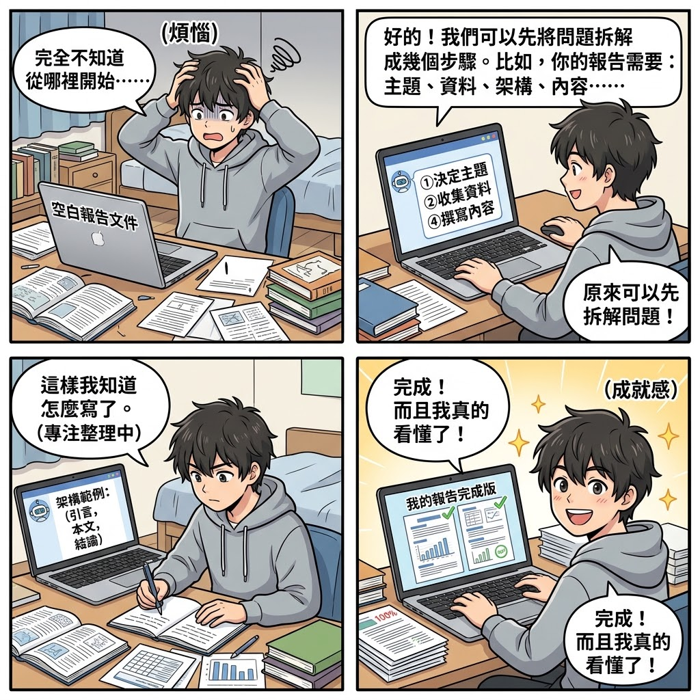

```text
### 🟡 四格漫畫提示詞 -- [主題]
🟢 請生成一張四格漫畫，主題為「[主題]」。
主要角色：[角色設定，例如大學生、上班族、老師]
發生場景：[教室／辦公室／家中／咖啡廳]
第一格：[角色遇到的問題或情境]
角色表情：[困惑／緊張／煩惱／驚訝]
對話：「[簡短對話]」
第二格：[角色開始採取行動]
角色表情：[思考／專注／期待]
對話：「[簡短對話]」
第三格：[問題逐漸獲得改善或角色有所理解]
角色表情：[理解／驚喜／專注]
對話：「[簡短對話]」
第四格：[呈現最後成果或觀念]
角色表情：[開心／有成就感／放鬆]
對話：「[簡短對話]」
四格依照左上、右上、左下、右下排列，每格具有清楚的漫畫分隔線。
角色造型與服裝在四格中保持一致，表情與動作隨劇情自然變化。
使用簡潔的繁體中文對話，每格避免過多文字。整體採用清楚、明亮、友善的教育漫畫風格，畫面易讀，適合課程教材與社群分享。
```

1. 🖼️ 情境插圖：情境插圖建立具體場景，讓讀者能「看見」內容，而不只閱讀文字。它會透過環境、光線、角色姿勢與表情形成氛圍。
   

```text
### 🟡 情境插圖提示詞 -- [主題]
🟢 請生成一張情境插圖，主題為「[主題]」。
主要角色：[人物身分與外觀]
場景：[地點與時間]
角色正在：[人物正在進行的動作]
畫面中包含：
* [環境元素一]
* [環境元素二]
* [環境元素三]
* [與主題相關的重要物件]
角色呈現[專注／開心／困惑／忙碌／放鬆]的狀態。
光線：[自然光／午後陽光／夜間燈光／科技感光線]
氛圍：[溫暖／專注／科技感／療癒／活潑]
構圖以人物與[核心物件]作為主要視覺焦點，背景保留足夠的環境資訊，但不要搶走主體注意力。
整體採用[扁平插畫／日系插畫／3D 動畫／寫實攝影／科技插畫]風格，畫面具有景深與空間層次，乾淨、自然且具有故事感。
```

1. 📚 教學故事圖：當內容含有過程或轉變，可以用連續畫面呈現，讓讀者理解從問題到解決的歷程。
   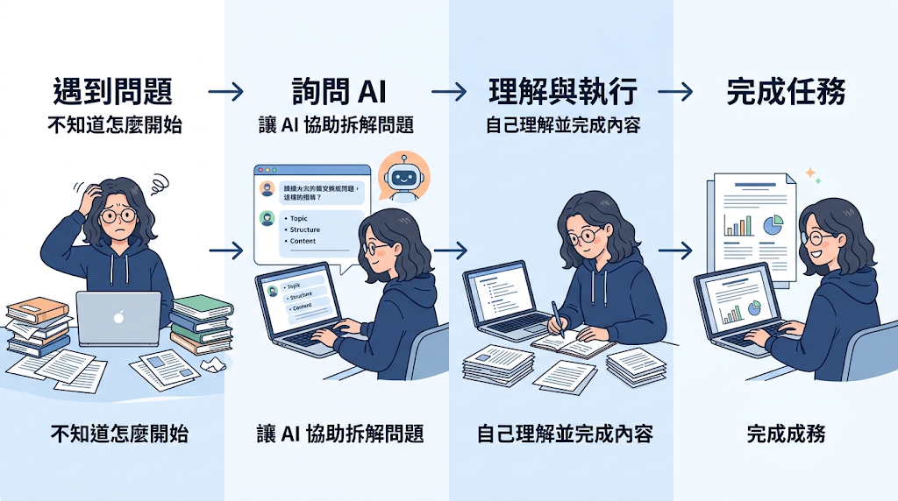

```text
### 🟡 教學故事圖提示詞 -- [主題]
🟢 請生成一張教學故事圖，主題為「[主題]」。
將畫面分成 [3／4] 個具有連續性的階段，呈現角色從「問題」到「解決」的完整變化。
第一階段｜問題
[描述角色遇到什麼問題]
人物狀態：[困惑／不知道怎麼開始／遇到困難]
第二階段｜行動
[描述角色採取什麼行動]
人物狀態：[思考／嘗試／尋找方法]
第三階段｜轉變
[描述角色如何逐漸理解或改善]
人物狀態：[理解／專注／逐漸掌握]
第四階段｜成果(如果需要)
[描述最後完成的成果]
人物狀態：[開心／有成就感／成功完成]
各階段使用箭頭或視覺動線自然連接，讓讀者可以由左至右理解「問題 → 行動 → 轉變 → 成果」。
同一位角色在所有階段保持一致的外貌、髮型與服裝，只改變動作、表情與情境。
每個階段搭配簡短標題與必要說明，不使用大量文字。
整體採用清楚、現代的教育資訊插畫風格，畫面具有連續性與故事感，適合課程教材、簡報與知識型社群內容，16:9 橫式構圖。
```

### 🔵 Problem. 用四格漫畫說完一個故事

選擇一個生活或學習中常見的問題，例如「報告做不完」、「第一次使用 AI 不知道怎麼問」或「讀了很多資料卻抓不到重點」，生成一張四格漫畫。故事必須完整呈現「困難 → 行動 → 理解／改變 → 結果」四個階段。同一角色的外貌與服裝需保持一致，但每一格的表情、動作與情境要隨故事發展產生變化，並使用簡短的繁體中文對話推進劇情。

### 🔵 Problem. 不用文字，也能看懂他在做什麼

生成一張具有故事感的情境插圖，主題為「第一次用 AI 完成工作的瞬間」。自行設定角色身分、場景、時間與正在進行的動作，並利用人物表情、姿勢、環境物件與光線呈現情緒。圖片中不要加入對話或說明文字，嘗試只靠畫面讓觀看者推測「發生了什麼事」以及「角色現在是什麼感受」。

### 🔵 Problem. 畫出「從不會到會」的變化

選擇一項具有學習過程的技能，例如「學會使用生成式 AI」、「第一次做簡報」或「學習攝影」，生成一張 16:9 教學故事圖。將畫面分成 4 個連續階段，依序呈現「遇到問題 → 嘗試方法 → 逐漸理解 → 成功完成」。四個階段必須使用同一位角色，透過表情、姿勢、環境與成果的改變，讓讀者一眼看出角色前後的成長。

## 🔴 品牌角色：建立記憶與辨識

品牌角色的三個功能：

1. 👀 辨識：讀者一看到角色，就知道內容來自誰。
2. 🤝 陪伴：角色能降低距離感，形成親切的溝通者。
3. 🧠 記憶：一致且反覆出現的角色，比單次精美圖片更容易被記住。
   品牌角色不是一張單獨圖片，而是長期可重複使用的視覺元素。當角色持續出現在不同內容中，讀者會逐漸產生熟悉感與記憶。

### 🧑‍🎨 品牌角色 Prompt 模板

```text
🟢 我要建立一個品牌角色
- 角色名稱：小維
- 角色類型：一個長髮小姐姐，年輕、知性、帶有柔和氣質
- 個性：溫柔、耐心、細心、喜歡分享知識，給人容易親近但不失專業的感覺
- 主色：霧紫 × 奶油白 × 淡灰藍，以霧紫作為主要識別色，營造唯美、安靜又帶一點科技感的氣質
- 辨識特徵：長直髮或微捲長髮、自然空氣瀏海、柔和眼神；髮側固定配戴一枚四芒星髮飾，作為小維最重要的角色識別符號
- 線條與造型：日系清新插畫風，使用柔和細線、圓潤輪廓與低飽和配色；人物比例自然，不過度 Q 版，介於「角色插畫」與「日系雜誌人物」之間
- 可用於：網站、貼圖、簡報、教學、社群
- 希望帶給讀者的感受：有知識，唯美
```

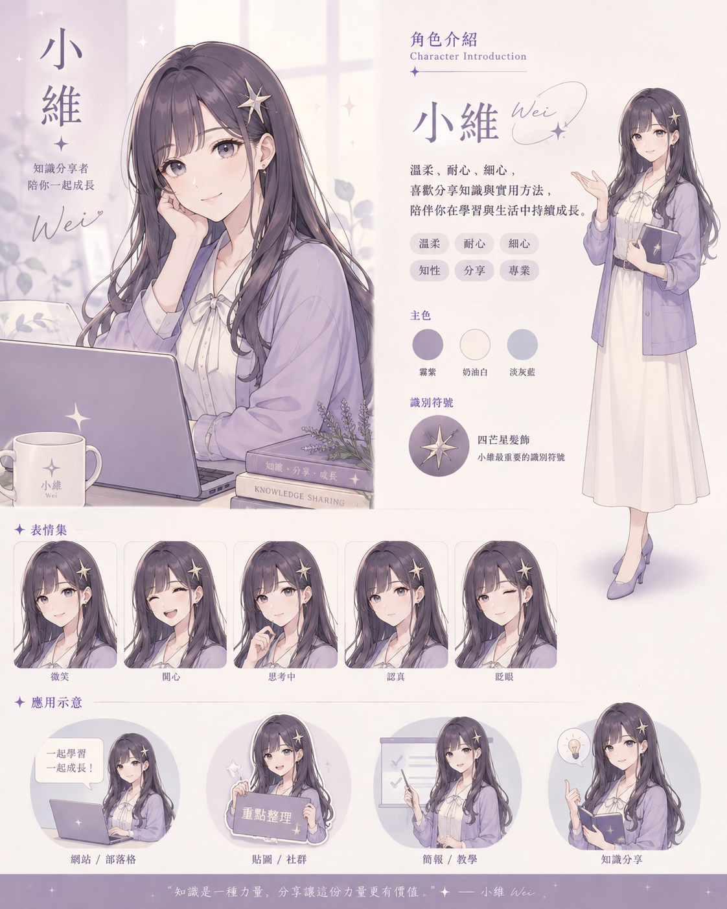

🟡 在品牌角色圖像中，重點不在細節是否精緻，而在是否容易辨識。當讀者看到角色，就能聯想到內容與主題，角色設計就成功了。

### 🟡 角色一致性的實務方法

- 📌 固定不可改變的 3–5 個辨識特徵，例如眼睛、天線、胸前符號、主色與輪廓。
- 🧑‍🎨 先做角色設定圖，再延伸不同姿勢與場景。
- 🔁 每次 Prompt 重複寫入固定設定，不只寫角色名稱。
- 🖼️ 保留同一張角色參考圖供後續圖片生成使用。
- 🎨 讓服裝、比例、材質與配色保持一致，只改動表情、動作與情境。

### 🔵 Problem. 打造你的品牌角色

請為一個自訂品牌設計專屬品牌角色，並生成一張「角色設定圖」。角色需包含名稱、個性、主色與至少 3 個固定辨識特徵。請思考：即使角色換了姿勢或表情，哪些視覺元素仍能讓讀者一眼認出它？

### 🔵 Problem. 一眼就認得出來嗎？

請生成一張品牌角色圖片，並刻意強化角色的 3–5 個核心辨識特徵，例如髮飾、服裝配色、胸前符號、特殊輪廓或配件。圖片完成後，檢查這些特徵是否足夠明確，讓角色不需要搭配品牌 Logo，也具有辨識度。

### 🔵 Problem. 同一個角色，三種情境

選擇一個已建立的品牌角色，讓它分別出現在「教學知識」、「社群互動」、「產品介紹」三種不同情境中，生成 3 張圖片。三張圖可以改變動作、表情與背景，但角色的髮型、服裝、主色、比例與核心辨識特徵必須保持一致。

### 🔵 Problem. 用參考圖維持角色一致性

先生成一張品牌角色的標準設定圖，接著將這張圖片作為參考圖，再生成角色的新姿勢或新場景。比較「只有文字 Prompt」與「文字 Prompt＋角色參考圖」的生成結果，觀察哪一種方式更能維持角色外型與品牌辨識度。

### 🔵 Problem. 小維的品牌日常

使用教材中的「小維」角色設定，生成一張新的品牌情境圖，例如小維正在講解 AI 知識、製作簡報或與讀者打招呼。生成時必須保留霧紫 × 奶油白 × 淡灰藍配色、長髮、自然空氣瀏海、柔和眼神與四芒星髮飾等設定，只改變角色的表情、動作與所在情境。
