# 🎨 快速生成圖像：用 Gemini 建立第一張作品

很多人認為 AI 生圖就是「輸入 Prompt → 產生圖片」。但真正的創作流程更接近「💡 Idea → 📋 Design Brief → 🎨 選擇風格 → ✍️ 描述畫面 → 🤖 AI 生成 → 👀 判斷 → 🔧 修正 → ✅ 完成作品」。

AI 並不是替你做設計，而是把你的設計想法轉成圖片。圖片品質通常取決於三件事：

- 💡 想法有沒有清楚。
- ✍️ 描述有沒有完整。
- 👀 使用者是否知道如何判斷與修正。

## 🔴 Gemini 適合做創作起點的原因

Gemini 的「建立圖像」適合把想法快速轉成可見成果。它可以：

- ⚡ 快速驗證主題是否適合變成畫面。
- 🎨 快速確認風格方向是否成立。
- 🖼️ 把創作藍圖第一次視覺化。
- 🔄 讓學員在同一段對話中繼續補充與修改。

不是要取代所有專業圖像工具，而是幫助創作者從「有想法」跨到「看見畫面」。

🟡 對初學者而言，先做出來比一次做到最好更重要。新手常見焦慮包括：

- 😵 不會寫很長的 Prompt。
- ❓ 不知道哪個工具最好。
- 😟 擔心生成結果不好看。
- ⏳ 害怕浪費次數。

## 🔴 快速生成不等於精準控制

Gemini 適合快速把概念變成畫面、確認方向、取得第一張圖。但它可能出現：

- 🔍 細節不完全準確。
- 🖼️ 構圖不夠穩定。
- 🎨 風格有時無法完全固定。
- 🔤 品牌字樣、Logo 或長文字不正確。

這些不是第一張圖的失敗，而是提醒我們下一步需要修正。

> 🟡 Gemini 在本章的任務，是完成創作的第一個視覺成果，而不是直接成為最終精修工具。

## 🔴 Gemini 建立圖像：基本操作

實際操作時，可在 Gemini 選擇「工具」，再選擇「建立圖像」。不同帳號或版本的介面可能略有差異，若系統已能直接生圖，也可在對話中清楚要求建立圖片。

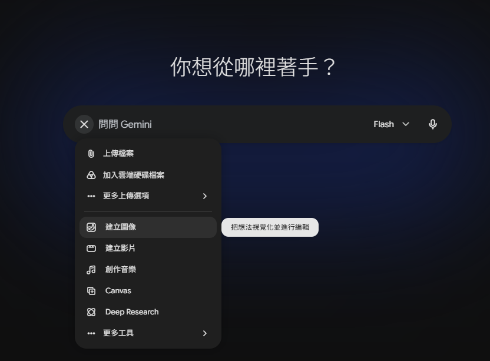

### 🎨 理解圖像風格：選擇的基礎

圖像風格不是裝飾選項，而是畫面方向的起點。它會直接影響：

- ✨ 視覺質感。
- 🌈 色彩表現。
- 💡 光線氛圍。
- 💭 情緒傾向。
- 🖼️ 整體圖像語言。

### 📷 第一類：寫實、攝影、商業質感類

這類風格接近真實攝影，畫面通常較穩定、質感清楚，也適合初學者。

相關風格包含：黑白、沙龍、電影氛圍、深沉、柔和人像、仲展台。

共同特點：

- 📷 接近真實攝影效果。
- 💡 光影表現自然。
- 🖼️ 畫面穩定，接受度高。
- 💼 適合品牌與商業應用。

適用情境：

- 🏷️ 品牌主視覺。
- 📦 商品圖。
- 📱 社群貼文。
- 📕 書封設計。
- 👤 人像形象照。

🟡 若創作目標是穩定、專業、質感、容易成功，這一類通常最安全。

> ⚫ 黑白攝影
> 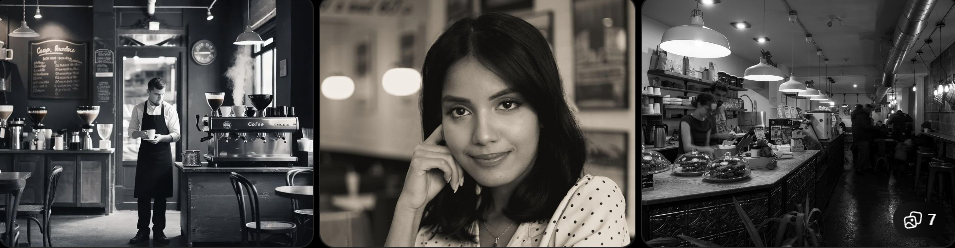
> 📸 沙龍攝影
> 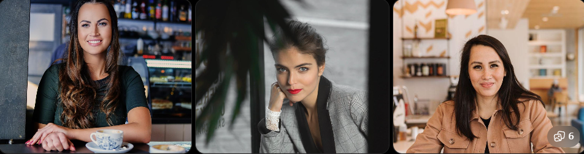
> 👤 柔和人像
> 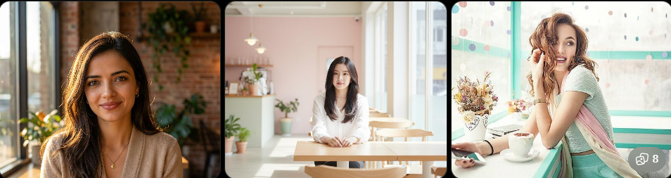
> 🎬 電影氛圍
> 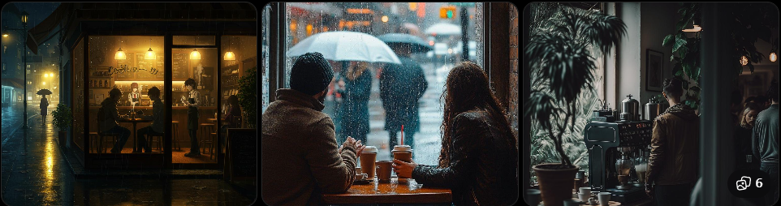

### 🔵Problem. 孤獨的美食家，深夜食堂

請生成一張具有「電影氛圍」的寫實風格照片。畫面中，一位略顯疲憊的上班族大叔獨自坐在深夜小吃攤的櫃檯前，正低頭大口吃著一碗熱氣騰騰的拉麵。他的西裝外套隨意地掛在椅背上。小吃攤內部的燈光溫暖而昏暗，雨點拍打在攤外的塑膠簾上，窗外的街景模糊而有深度。這張照片應該要充滿敘事感，光影層次分明，呈現出一種孤獨卻溫暖的深夜氛圍。

### 🔵Problem. 貓咪的黑白沙龍照

請生成一張高品質、低色調的黑白攝影照片。主角是一隻擁有蓬鬆長毛的貓咪，它正懶洋洋地趴在天鵝絨沙發上。這張照片需要運用側光，突顯出貓咪毛髮的質感、眼睛的深度以及沙發絨面的細節。畫面應該要簡潔有力，強調黑白灰的階調變化，營造出一種優雅、安靜且專業的沙龍攝影質感。

### 🔵Problem. 創業者的自然形象照

請生成一張自然、親切且專業的柔和人像照片。一位年輕的創業女性正坐在陽光充足的咖啡廳中，她一邊喝著咖啡，一邊對著鏡頭露出自信而自然的微笑。她的眼神明亮，神情輕鬆，手裡拿著一本筆記本和一支筆。背景是溫暖的咖啡廳裝潢和窗外的街景，但要保持柔和的散景效果。這張形象照需要光線柔和自然，膚色表現真實，並散發出一種平易近人卻又不失專業感的商業氛圍。

### 🔵Problem. 絕望的週一早晨，社畜的內心獨白

請生成一張具有強烈「電影氛圍」的寫實風格照片，捕捉週一早晨擠在通勤捷運上的疲憊社畜群像。畫面中，一位戴著眼鏡、面無表情的男子正被擁擠的人潮擠在角落，他低頭看著手機螢幕，手機的微光映照在他疲憊的臉上。他周圍是其他表情各異、神情倦怠的通勤族，有的在打瞌睡，有的在滑手機，每個人都沉浸在自己的世界裡。捷運車廂的燈光昏暗而刺眼，窗外的景色在高速移動下變得模糊。這張照片應該要充滿寫實的質感和敘事感，突顯出都市生活中令人窒息的壓抑和無奈。

### 🎨 第二類：設計、插畫、手作表現類

這一類偏向平面設計、插畫感或工藝質感，不追求真實攝影，而是強調視覺表現。

相關風格包含：色塊、特藝彩色、素描、油畫、復古印刷、珐瑯別針、歌德陶土。

共同特點：

- 🎨 具有明顯設計感或材質感。
- ✍️ 帶有手作、插畫或藝術表現。
- 🖼️ 較不追求真實攝影效果。

適用情境：

- 🖌️ 插圖。
- 📜 海報。
- 📖 書籍配圖。
- 💡 設計提案。
- 🎁 文創商品概念圖。

🟡 若想讓畫面更有設計感、插畫感、工藝感或材質特色，可以考慮這一類。

> 🟦 色塊
> 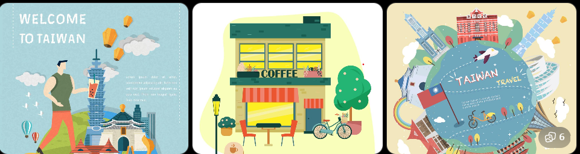
> 🌈 特藝彩色
> 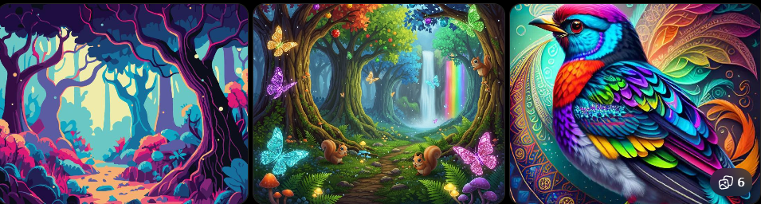
> ✏️ 素描
> 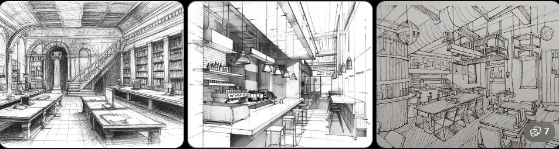
> 🖌️ 油畫
> 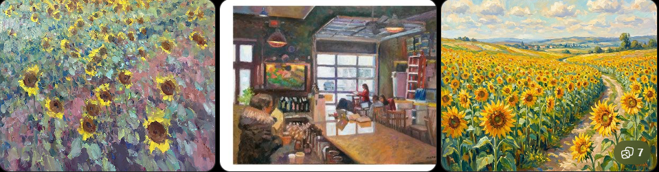
> 📰 復古印刷
> 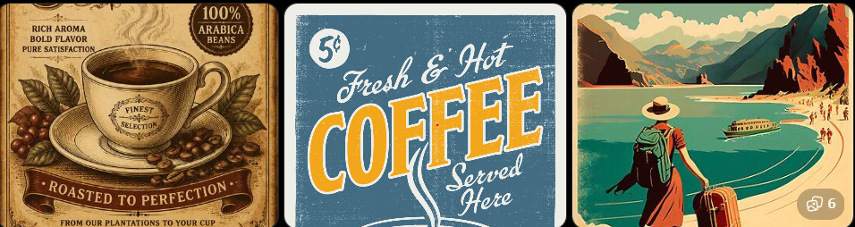

### 🔵Problem. 用「色塊」風格設計城市旅遊海報

請使用 AI 生圖工具，生成一張以「城市旅遊」為主題的直式海報。畫面必須採用「色塊」風格，以大面積、清楚分明的色彩區域構成建築、天空與人物，強調平面設計與插畫感，避免寫實攝影效果。

### 🔵Problem. 用「素描」風格繪製咖啡店插圖

請生成一張「街角咖啡店」的素描風格圖片。畫面需包含咖啡店外觀、桌椅、植物與行人，並利用鉛筆線條、明暗陰影與手繪筆觸呈現素描的材質感，使作品適合作為書籍內頁插圖。

### 🔵Problem. 用「油畫」風格創作自然風景

請生成一幅以「夕陽下的山間湖泊」為主題的油畫風格作品。運用明顯的顏料筆觸、厚重的色彩與光影變化表現夕陽、湖水及山景，讓畫面具有傳統繪畫的藝術感與材質感，而非照片般的寫實效果。

### 🔵Problem. 用「復古印刷」設計音樂節海報

請生成一張以「夏日音樂節」為主題的復古印刷風格海報。畫面需包含舞台、樂器或音樂元素，並呈現有限色彩、印刷顆粒、網點或些微套色偏移等視覺特色，營造老式印刷品的質感。

### 🧙 第三類：奇幻、世界觀、強風格創作類

這類風格辨識度高、想像力強，適合角色設定、故事世界觀與創作型內容。

相關風格包含：蒸氣龐克、神話戰士、超現實、生化人、Dynamite、Anyma's world。

共同特點：

- 🎭 風格鮮明。
- 🌍 世界觀強烈。
- 💭 想像成分高。
- 💥 視覺衝擊力明顯。

適用情境：

- 🧙 角色設計。
- 🏰 奇幻創作。
- 🤖 科幻題材。
- 📖 視覺小說。
- 🎨 概念藝術。

🟡 若目標是讓畫面具有故事感、設定感、未來感或強烈個性，這一類很適合。不過品牌主視覺若沒有世界觀需求，過強的風格也可能搶走品牌本身。

> ⚙️ 蒸氣龐克
> 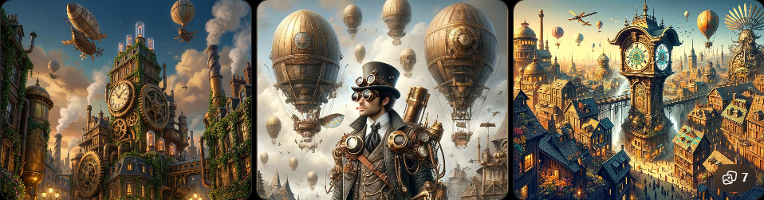

> ⚔️ 神話戰士
> 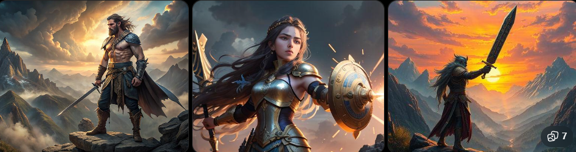

> 📰 復古印刷
> 

> 🌀 超現實
> 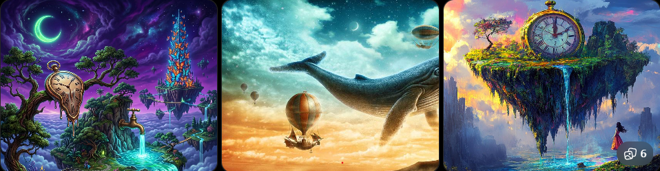

> 💥 Dynamite
> 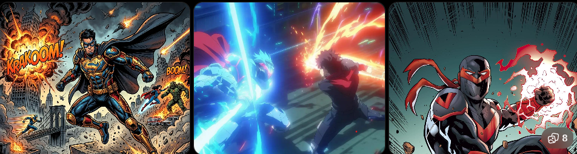

> 🌌 Anyma's World
> 

### 🔵Problem. 用「蒸氣龐克」打造未來城市世界觀

請使用 AI 生圖工具，生成一張具有「蒸氣龐克」風格的城市場景。畫面需包含大型齒輪、金屬機械、蒸汽管線與具有年代感的建築，並加入至少一名角色，使觀者能從圖片中感受到這個世界的科技特色與故事背景。

### 🔵Problem. 設計一位「神話戰士」角色

請生成一張原創神話戰士的角色概念圖。自行設定角色所屬的文明或神話世界，並透過服裝、武器、盔甲、圖騰與場景呈現角色設定。畫面需具有強烈的英雄感、奇幻感與視覺辨識度。

### 🔵Problem. 創作不可能存在的「超現實」世界

請以「城市中的夢境」為主題，生成一張超現實風格圖片。畫面至少加入三種違反現實邏輯的元素，例如漂浮建築、巨大生物、扭曲空間或不符合比例的物件，創造具有夢境感與想像力的視覺作品。

### 🔵Problem. 設計一位存在於未來世界的「生化人」

請生成一張科幻世界中的生化人角色概念圖。角色需同時具有明顯的人類與機械特徵，並透過身體結構、科技裝置、服裝及背景環境呈現其所處的未來世界，讓圖片不只是角色外觀設計，也能傳達完整的世界觀。

### 🔵Problem. 建立自己的奇幻世界

請從「蒸氣龐克、神話戰士、超現實、生化人、Dynamite、Anyma's World」中選擇一種風格，生成一張「另一個世界的入口」概念藝術。除了呈現所選風格的視覺特色外，還需透過環境、角色、建築或特殊物件，讓觀者可以推測這個世界的文明、科技或故事設定。

### 🌅 第四類：情境、氛圍、主題感類

這類風格不一定改變材質，而是加強畫面的感覺。

相關風格包含：日出，也可以用 Prompt 指定溫暖、安靜、懷舊、孤獨、夢幻、專注。

共同特點：

- 💭 強調情感。
- 🎯 畫面主題明確。
- 🌅 容易帶出特定時間、情緒或氛圍。

適用情境：

- 💗 情緒型圖像。
- ✍️ 文案配圖。
- 🌆 氣氛主題圖。
- 📱 社群視覺內容。

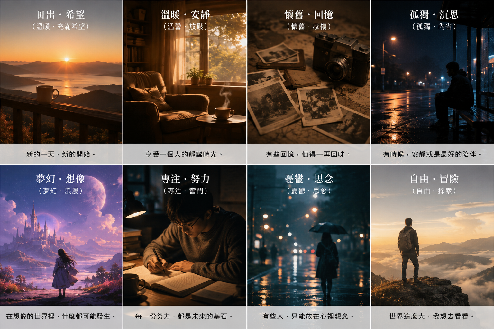

### 🔵Problem. 1. 用 Prompt 打造「溫暖的日出」

請設計一段圖片生成 Prompt，以「日出」為主要情境，加入溫暖、平靜的氛圍描述。生成圖片後，觀察光線、色彩與時間感是否成功傳達「溫暖」的情緒。

### 🔵Problem. 2. 同一場景，不同情緒

選擇一個固定場景，例如「窗邊的房間」、「城市街道」或「海邊」，分別撰寫「安靜」與「孤獨」兩種 Prompt。比較生成結果，說明哪些畫面元素讓情緒產生差異。

### 🔵Problem. 3. 製作一張懷舊主題圖

以「懷舊」為核心情緒，設計一段 Prompt 並生成圖片。Prompt 中至少加入 3 個能強化懷舊感的描述，例如時間、光線、色調、場景或人物狀態。

### 🔵Problem. 4. 為文案設計夢幻配圖

假設文案主題是「在夢想實現以前，先好好想像它的模樣」，請設計一段具有「夢幻」氛圍的圖片生成 Prompt。生成的圖片需能作為文案或社群貼文的視覺配圖。

### 🔵Problem. 5. 一張圖傳達「專注」

請運用情境、光線、構圖與人物狀態，設計一段能表現「專注」氛圍的 Prompt。完成圖片後，指出至少 2 個讓觀者感受到「專注」的畫面元素。

## 🔴 套用基本案例：同一間咖啡館的不同風格

```text
🟢 共用描述：
請幫我生成一張圖：
一間現代風格的咖啡館外觀，位於安靜的城市街道夜晚，大面玻璃窗透出溫暖燈光，木質外觀設計，整體風格簡約，氛圍安靜且具有質感，光影層次明顯，高細節。
```

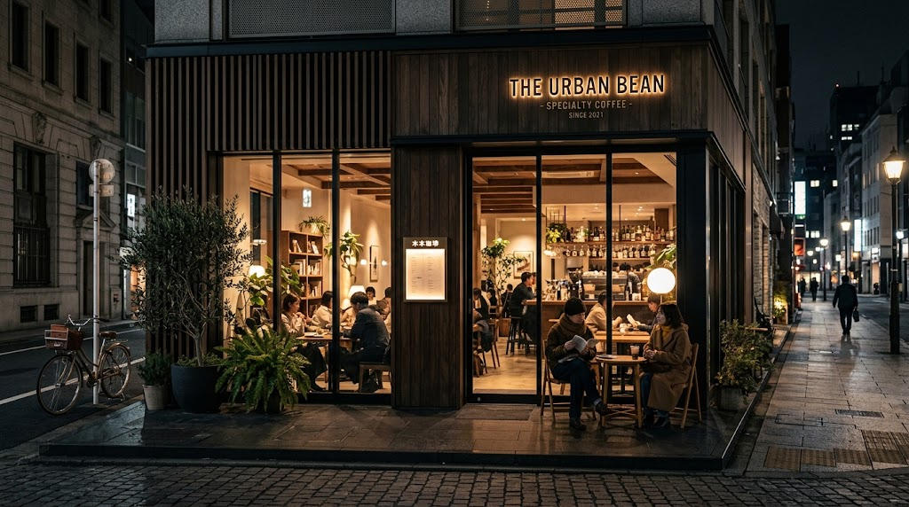

<!-- 兩張圖片 + 提示詞 -->

<div style="display: flex; flex-wrap: wrap; gap: 20px;">
<!-- 第一張 -->
<div style="width: calc(50% - 10px);">
    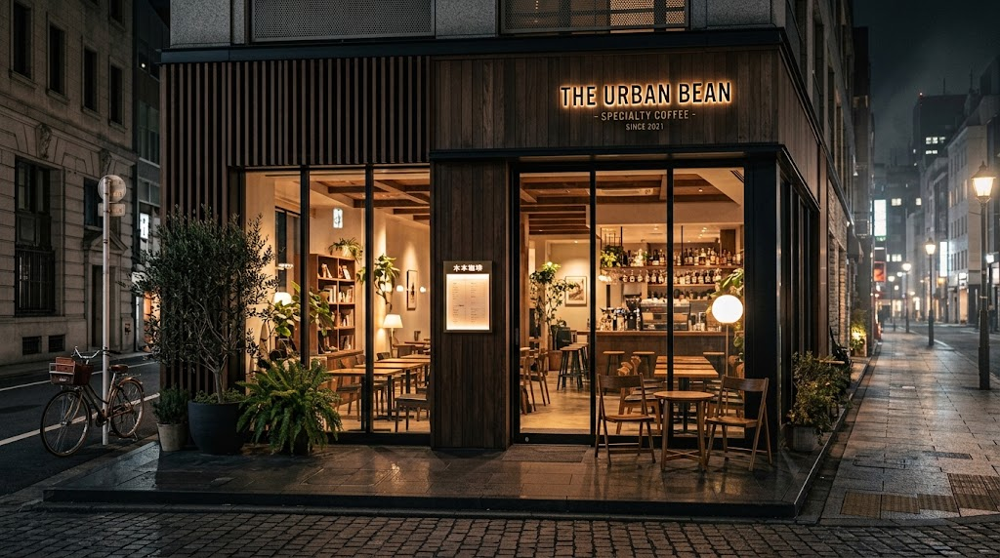
    <p style="margin-top: 8px;">
        <strong>咖啡館-電影氛圍(商業質感)：</strong>
        一間現代風格的咖啡館外觀，位於安靜的城市街道夜晚，大面玻璃窗透出溫暖燈光，木質外觀設計，整體風格簡約，氛圍安靜且具有質感，光影層次明顯，高細節。圖片氛圍：接近真實攝影、光影明顯、高端品牌感、畫面帶敘事性。圖瑱比例16:9。
    </p>
</div>
<!-- 第二張 -->
<div style="width: calc(50% - 10px);">
    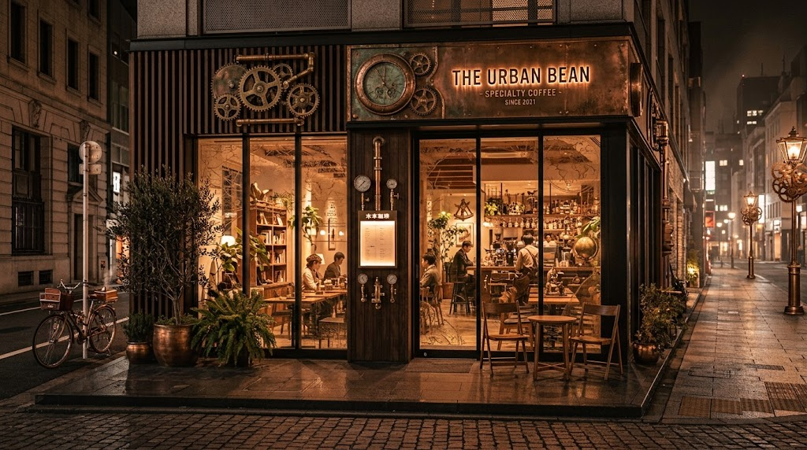
    <p style="margin-top: 8px;">
        <strong>蒸氣龐克(世界觀風格)</strong>
        一間現代風格的咖啡館外觀，位於安靜的城市街道夜晚，大面玻璃窗透出溫暖燈光，木質觀設計，整體風格簡約，氛圍安靜且具有質感，光影層次明顯，高細節。圖片氛圍：暖銅色調、機械或復古工業元素、世界觀強烈、咖啡館不再只是品牌空間，而像故事場景。圖瑱比例16:9。
    </p>
</div>
</div>

<!-- 一張圖片 + 提示詞 -->
<div style="display: flex; flex-wrap: wrap; gap: 20px;">
    <div style="">
        
        <p style="margin-top: 8px;">
            <strong>咖啡館-油畫風格(藝術表現)：</strong>
            一間現代風格的咖啡館外觀，位於安靜的城市街道夜晚，大面玻璃窗透出溫暖燈光，木質外觀設計，整體風格簡約，氛圍安靜且具有質感，光影層次明顯，高細節。圖片氛圍：明顯筆觸、色彩較濃、材質與藝術感強、適合插畫、書封或展覽概念，不一定適合真實商業空間展示。圖瑱比例16:9。
        </p>
    </div>
</div>

### 🔵Problem. 半夜冰箱裡的秘密派對

請使用生圖工具製作一張「冰箱裡的食物趁主人睡著後偷偷舉辦派對」的圖片。畫面中至少要有 3 種擬人化食物，並自行設定場景風格、光線與角色動作。請透過 Prompt 明確描述主體、環境、構圖與視覺風格，讓生成結果具有完整故事感。

### 🔵Problem. 我家巷口變成電影場景

選擇一個日常生活中常見的地點，例如早餐店、便利商店、公車站或學校走廊，使用生圖工具將它重新設計成具有強烈電影感的場景。請在 Prompt 中指定時間、天氣、光線、色調與鏡頭視角，並保留至少 2 個能讓人辨識原本生活場景的元素。

### 🔵Problem. 這張貼圖很有事

設計一張適合傳給朋友的趣味貼圖，例如「報告做到靈魂出竅」、「月底只剩 87 元」或「明天早八但現在凌晨三點」。請生成一個能清楚表達情緒的角色，並利用表情、姿勢、道具與背景強化情境。角色不限定人類，也可以是動物、食物或其他物品。

## 🔴 從創作藍圖到圖像：關鍵轉換

Design Brief 能幫我們釐清主題、訊息與風格，但若只寫「高級感、溫暖氣氛、科技感」，AI 仍只能猜測畫面。因此，創作藍圖必須轉換成可以被視覺化的語言。

🟡 最基本的圖像描述結構是：

```text
主體 + 場景 + 氛圍
```

1. 🎯 主體：畫面最重要的物件或人物，例如：
   - 一間咖啡館外觀。
   - 一個工作桌面。
   - 一台筆記型電腦。
   - 一杯咖啡。
2. 🌆 場景：主體所在的環境與空間，例如：
   - 夜晚的城市街道。
   - 室內工作空間。
   - 窗邊位置。
   - 木質風格空間。
3. 🎨 氛圍與風格：畫面要傳達的感覺，例如：
   - 安靜。
   - 專注。
   - 溫暖。
   - 高質感。
   - 電影氛圍。

## 🔴 套用範例：現代高樓辦公室

🟢 假設 Design Brief 是：

```text
主題：現代化辦公環境。
訊息：專業、高效、城市視野。
風格：高質感、沉穩、電影氛圍。
```

🟡 如果只寫：

```text
一個很高級的辦公室。
一個可以看到風景的工作環境。
```

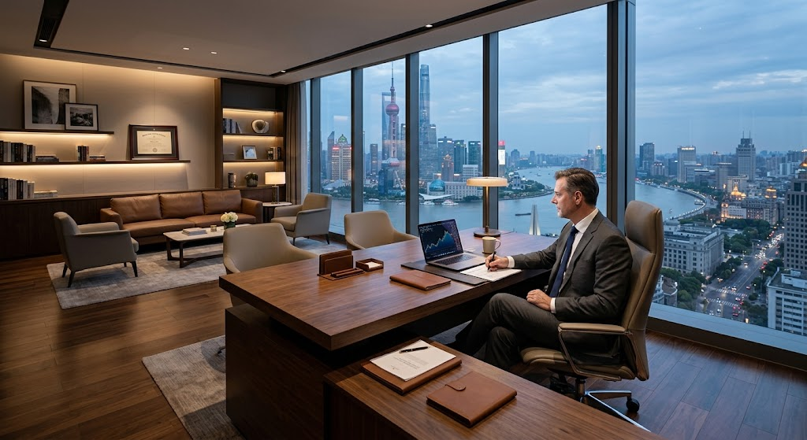

🟡 描述過於抽象，畫面資訊不足。可以改成：

```text
一間位於台北高樓層的現代辦公室空間。
- 大面落地窗設計
- 窗外可遠眺台北 101 大樓、基隆河與陽明山景色。
- 室內為簡約高質感設計，包含辦公桌與雙電腦設備
- 白天自然光從窗外灑入。
- 整體氛圍專業、安靜且高效率，電影氛圍風格，高細節。
```

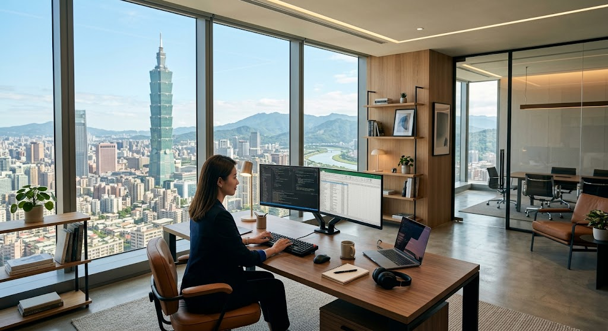

這段描述具有：

- 🎯 明確主體：現代辦公室。
- 🌆 清楚場景：台北高樓、101、基隆河、陽明山。
- 🎨 一致氛圍：專業、高效、高質感。

相較原本的抽象描述，這種轉換能讓 AI 產出具有地點辨識度與一致氣氛的畫面。

### 🔵Problem. 期末週的深夜基地

```text=
Design Brief：
主題：學生期末趕報告的夜晚。
訊息：忙碌、專注，但帶有一點疲憊。
風格：溫暖、安靜、有生活感。
```

請將以上抽象的 Design Brief 轉換成一段可以實際用來生成圖片的具體描述。你需要自行決定畫面的主體、所在場景，以及哪些物件、光線、人物狀態或環境細節，可以讓觀眾感受到「忙碌、專注、疲憊」與「溫暖安靜」的氛圍。完成提示詞後，使用生圖工具產生圖片。

### 🔵Problem. 今天開始認真運動

```text=
Design Brief：
主題：開始培養運動習慣。
訊息：健康、活力、重新開始。
風格：清爽、明亮、充滿朝氣。
```

請將 Design Brief 中「健康、活力、重新開始」等抽象概念，轉換成具體可見的畫面元素。自行設定人物或物件、運動地點、時間、天氣、光線與周遭環境，撰寫完整的生圖提示詞並生成圖片。避免只在提示詞中寫「很有活力」、「健康的感覺」等抽象形容詞，要思考什麼畫面真的能讓人產生這些感受。

### 🔵Problem. 巷口那間讓人想待一下午的店

```text=
Design Brief：
主題：社區中的特色小店。
訊息：放鬆、親切、讓人想停留。
風格：溫暖、有質感、有生活氣息。
```

請自行選擇一種店家，例如咖啡店、甜點店、書店、花店或其他生活中的小店，將 Design Brief 轉換成具體的視覺描述。提示詞中需要描述店家的空間、陳設、光線、周遭環境與能表現「放鬆、親切」的細節，完成後使用生圖工具生成圖片。

### 🔵Problem. 我的房間，今天不一樣

```text=
Design Brief：
主題：重新打造自己的私人空間。
訊息：舒服、有個性、屬於自己的地方。
風格：療癒、自在、具有個人特色。
```

請想像一個符合以上 Design Brief 的房間，將「舒服」、「療癒」、「有個性」轉換成 AI 可以具體生成的視覺元素。自行決定房間主人可能有什麼興趣，並透過家具、牆面、收藏品、桌面物件、色彩、材質與光線呈現這些特色。撰寫完整提示詞後生成圖片。

### 🔵Problem. 雨天也可以很有電影感

```text=
Design Brief：
主題：下雨天的日常城市生活。
訊息：孤獨，但不悲傷。
風格：安靜、電影感、帶有故事性。
```

請將「孤獨但不悲傷」、「電影感」、「故事性」轉換成具體的畫面描述。自行決定人物、地點、時間與正在發生的事情，並思考可以利用哪些天氣、燈光、街景、人物動作與構圖呈現這些感受。完成一段包含「主體＋場景＋氛圍」的生圖提示詞，並使用生圖工具產生圖片。

## 🔴 完整生圖 Prompt 公式

🟡 當基本結構能穩定生成後，可擴充為：

```text
主體 + 場景 + 風格 + 光線 + 鏡頭／構圖 + 細節 + 用途／比例
```

這段適合把難度再往上拉：不只把抽象 Design Brief 具體化，還要求學生有意識地補齊「風格、光線、鏡頭／構圖、細節、用途／比例」。題目可以這樣設計：

### 🔵Problem. 凌晨兩點的便利商店

```text=
Design Brief：
主題：深夜便利商店。
訊息：城市還醒著，但世界突然安靜下來。
風格：孤獨、平靜、帶有電影感。
用途：社群貼文主視覺。
```

請將以上 Design Brief 改寫成完整的生圖 Prompt，不能只使用「孤獨」、「平靜」、「電影感」等抽象形容詞，而是要轉換成具體可見的畫面元素。Prompt 需包含「主體＋場景＋風格＋光線＋鏡頭／構圖＋細節＋用途／比例」，完成後實際生成圖片，確認畫面是否成功傳達 Design Brief。

### 🔵Problem. 拜託讓我準時交作業

```text=
Design Brief：
主題：大學生趕作業的最後一小時。
訊息：時間緊迫、手忙腳亂，但仍努力完成任務。
風格：真實、有生活感、帶一點幽默。
用途：校園活動宣傳圖。
```

請將 Design Brief 轉換成完整的生圖 Prompt。思考哪些人物動作、桌面物件、環境、光線與畫面構圖，可以讓觀眾「看出來」這個人正在趕死線，而不是直接在 Prompt 中寫「非常緊張」。Prompt 需包含完整生圖公式中的七項元素，並設定適合宣傳圖使用的圖片比例。

### 🔵Problem. 早餐店也能拍成精品廣告

```text=
Design Brief：
主題：台灣日常早餐。
訊息：熟悉的日常，也可以很有質感。
風格：精緻、溫暖、具有商業攝影感。
用途：早餐品牌形象廣告。
```

請選擇一種常見早餐作為畫面主角，將 Design Brief 發展成完整的商業生圖 Prompt。你需要自行決定餐點所在的場景、光線方向、拍攝角度、構圖方式與周圍細節，讓普通早餐呈現出品牌廣告般的視覺效果。最後指定適合廣告使用的圖片比例並生成圖片。

### 🔵Problem. 我的暑假像一部電影

```text=
Design Brief：
主題：暑假的某個平凡瞬間。
訊息：當下看起來普通，回想起來卻很珍貴。
風格：青春、自然、帶有回憶感。
用途：電影海報。
```

請自行設定一個暑假生活場景，例如旅行、騎車、海邊、午後街道或與朋友相處的時刻，並將抽象的「青春」與「回憶感」轉換成可被生成的視覺元素。Prompt 必須描述光線、色彩、人物或物件、鏡頭視角、構圖與環境細節，同時考慮電影海報需要預留標題或文字的位置，並設定適合的圖片比例。

### 🔵Problem. 如果我的桌面會說話

```text=
Design Brief：
主題：用一張桌面呈現一個人的生活。
訊息：不出現人物，也能讓觀眾猜出這個人的個性與最近在忙什麼。
風格：自然、真實、細節豐富。
用途：人物專題文章封面。
```

畫面中不能出現人物。請自行設定桌面主人的身分或興趣，並透過桌上的物品、使用痕跡、空間環境與光線暗示這個人的生活狀態。將想法整理成符合「主體＋場景＋風格＋光線＋鏡頭／構圖＋細節＋用途／比例」的完整 Prompt，再實際生成圖片。
