# 🎨 風格×編修×控制

剛接觸 AI 圖像時，我們很容易把「生成圖片」當成完整創作：打一段描述，取得一張看起來不錯的圖，工作似乎就結束了。
但當圖片真的要用在教材、廣告、品牌或故事中，我們會發現，多數生成圖不能直接使用。真正的進階能力，不是一次生成更多圖片，而是知道如何讓圖像一步一步接近自己的想法。

### 🔄 兩種創作流程比較

- ❌ 錯誤但常見的流程：輸入 Prompt → 生成 → 不滿意 → 整張重來 => 不斷重置。
- ✅ 較成熟的流程：生成 → 篩選 → 修改 → 檢查 → 優化 => 累積成果。

## 🎨 風格控制

決定圖像的感覺。風格是觀眾第一眼感受到的元素。同一主題可以呈現為：

- 📷 寫實攝影
- 📣 商業廣告
- 🧑‍🏫 教學插畫
- 🎌 動漫角色
- 🏷️ 品牌視覺
- 🎬 電影劇照
- 🎨 風格差異不只在「畫法」，還包括色彩、材質、光線、構圖、鏡頭與情緒。
  🟡 接到圖像任務時，不要先堆疊形容詞，而要先問：「這張圖要拿來做什麼？」
  例如招生廣告可以使用寫實品牌風；課堂流程適合插畫圖解風；社群角色經營適合固定 IP 的品牌插畫。

#### 📷 寫實風：讓人相信

適合商業廣告、產品形象與專業內容。

```text
### 🟡 提示詞
[主體與動作]，[場景]，[鏡頭與構圖]，[光線與氛圍]，[服裝／材質細節]，自然膚質，真實攝影質感，商業攝影，高解析度。
```

<!-- 兩張圖片 + 提示詞 -->
<div style="display: flex; flex-wrap: wrap; gap: 20px;">
<!-- 第一張 -->
<div style="width: calc(50% - 10px);">
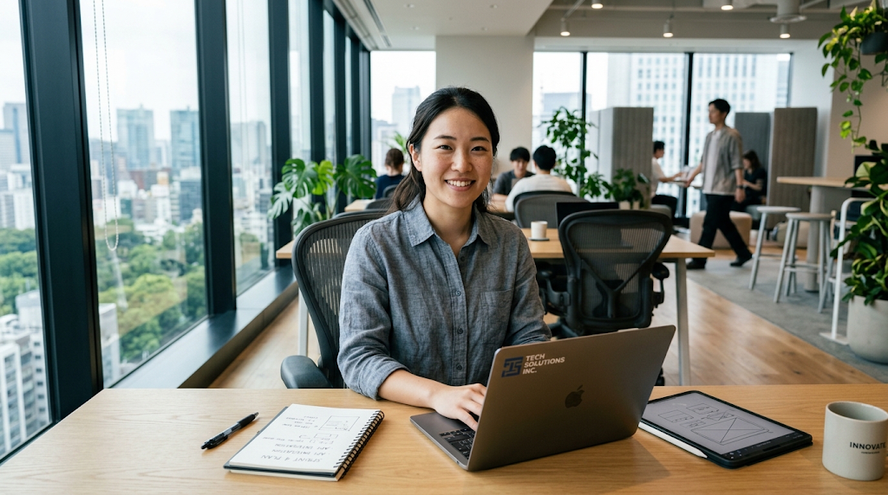
<p style="margin-top: 8px;">
<strong>🟡 提示詞：</strong>
🟢 一位長髮年輕女性坐在咖啡廳窗邊閱讀，桌上放著咖啡與筆記本，半身近景，人物微微側身看向窗外，午後自然光從側面照入，柔和陰影與淺景深，白色襯衫與細緻髮絲，自然膚質，真實攝影質感，商業攝影，高解析度。
</p>
</div>
<!-- 第二張 -->
<div style="width: calc(50% - 10px);">
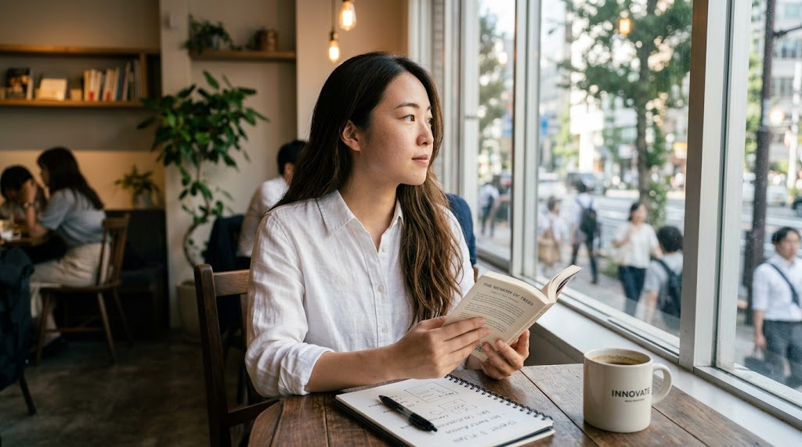
<p style="margin-top: 8px;">
<strong>🟡 提示詞：</strong>
🟢 一位年輕女性工程師坐在現代辦公室使用筆記型電腦，桌面有筆記本與平板，腰部以上中景構圖，人物自然看向鏡頭，大片落地窗提供柔和自然光，背景輕微散景，簡約灰藍色襯衫與真實布料細節，自然膚質，真實攝影質感，商業攝影，高解析度。
</p>
</div>
</div>

#### ✏️ 插畫風：讓人理解

適合教材、圖解、簡報與說明內容。

```text
### 🟡 提示詞
[主題]的教學插畫，呈現[主要內容／元素]，[構圖方式]，扁平插畫風，柔和配色，資訊層級清楚，畫面簡潔易讀，適合教材與簡報。
```

<!-- 兩張圖片 + 提示詞 -->
<div style="display: flex; flex-wrap: wrap; gap: 20px;">
<!-- 第一張 -->
<div style="width: calc(50% - 10px);">

<p style="margin-top: 8px;">
<strong>🟡 提示詞：</strong>
🟢 AI 輔助學習的教學插畫，呈現「提出問題 → AI 分析 → 整理重點 → 完成學習」四個階段，橫向流程構圖，搭配學生、電腦與文件圖示，扁平插畫風，柔和藍紫色配色，資訊層級清楚，畫面簡潔易讀，適合教材與簡報。
</p>
</div>
<!-- 第二張 -->
<div style="width: calc(50% - 10px);">

<p style="margin-top: 8px;">
<strong>🟡 提示詞：</strong>
🟢 網路安全觀念的教學插畫，呈現密碼保護、可疑連結、個人資料與雙重驗證四個重點，四區塊資訊圖構圖，搭配盾牌、鎖頭、手機與警告圖示，扁平插畫風，柔和配色，資訊層級清楚，畫面簡潔易讀，適合課堂投影。
</p>
</div>
</div>

#### 🏷️ 品牌風：讓人記住

適合社群貼文、品牌角色與長期行銷素材。

```text
🟢 為[品牌／主題]設計品牌視覺，以[主色]為主要配色，固定使用[角色／識別符號]，[整體風格]，畫面簡潔且具有一致辨識度，保留標題與 Logo 空間。
```

<!-- 兩張圖片 + 提示詞 -->
<div style="display: flex; flex-wrap: wrap; gap: 20px;">
<!-- 第一張 -->
<div style="width: calc(50% - 10px);">
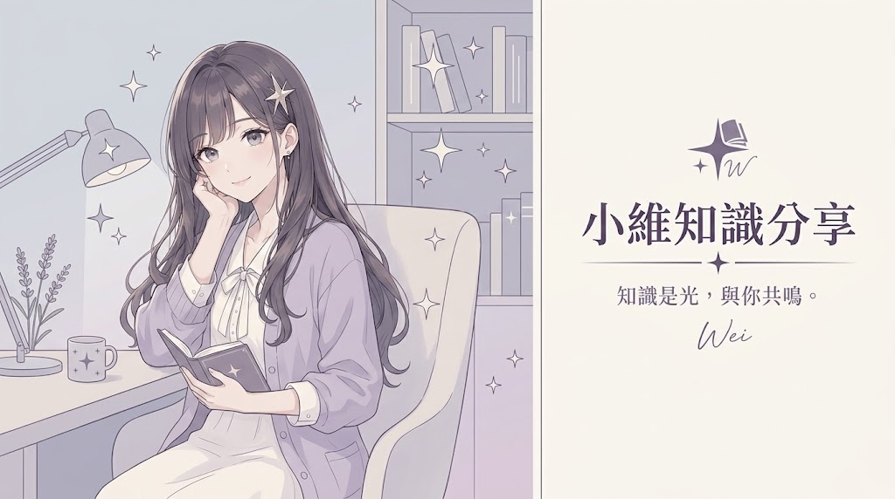
<p style="margin-top: 8px;">
<strong>🟡 提示詞：</strong>
🟢 為「小維知識分享」設計品牌主視覺，以霧紫、奶油白、淡灰藍為主要配色，固定使用長髮女性角色「小維」與四芒星符號，日系清新插畫風，柔和細線與低飽和色彩，呈現知性、唯美、溫柔的氣質，畫面簡潔且具有一致辨識度，右側保留標題與 Logo 空間。
</p>
</div>
<!-- 第二張 -->
<div style="width: calc(50% - 10px);">
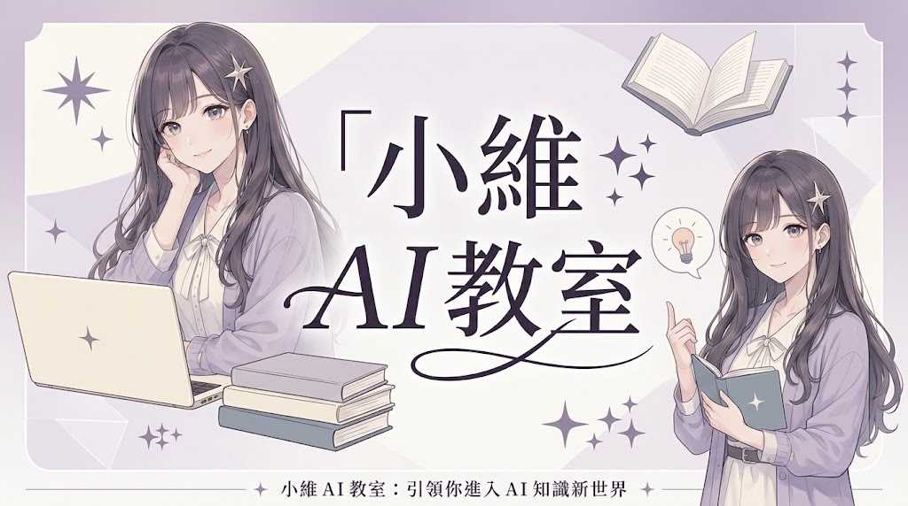
<p style="margin-top: 8px;">
<strong>🟡 提示詞：</strong>
🟢 為「小維 AI 教室」設計社群品牌視覺，以霧紫、奶油白、淡灰藍為主要配色，畫面固定出現配戴四芒星髮飾的小維，搭配書本、筆記型電腦與星星元素，日系雜誌插畫風，乾淨、柔和、有知識感，中央保留大型標題空間，適合製作系列社群貼文。
</p>
</div>
</div>

### 🔵 Problem. 同一個主題，三種風格

請選擇一個主題，例如「AI 學習」、「咖啡生活」或「未來工作」，使用相同的主體與情境，分別生成「寫實攝影風」、「教學插畫風」與「品牌視覺風」三張圖片。生成時請依照不同用途調整色彩、材質、光線、構圖與畫面氣氛，觀察同一個內容在不同風格下產生的視覺差異。

### 🔵 Problem. 為用途選擇最適合的風格

假設你要製作一張「AI 入門課程招生」的宣傳圖片，請自行判斷適合使用寫實風、插畫風或品牌風，並生成一張完整圖片。Prompt 中需要明確描述人物或主體、場景、構圖、光線、色彩與整體風格，讓圖片符合「招生宣傳」的實際用途，而不只是看起來漂亮。

### 🔵 Problem. 把照片感做到更真實

請生成一張「年輕上班族使用 AI 工作」的寫實商業攝影圖片。自行設定人物所在場景與正在進行的動作，並在 Prompt 中加入鏡頭距離、人物構圖、光線方向、景深、服裝與材質等描述。圖片需呈現自然膚質與真實攝影質感，避免產生過度平滑或明顯的 AI 插畫感。

### 🔵 Problem. 把複雜內容變成教學插畫

請選擇一個適合教學的主題，例如「如何辨識假訊息」、「AI 提問流程」或「網路安全」，生成一張教學插畫。畫面需使用簡單圖示、扁平插畫與清楚的資訊層級呈現內容，控制裝飾元素與背景複雜度，讓學生第一眼就能理解圖片想傳達的主要資訊。

### 🔵 Problem. 建立一套看得出是同品牌的圖片

自行設定一個品牌的名稱、主色、輔助色、角色或識別符號與插畫風格，先生成一張品牌主視覺，再使用相同設定生成第二張不同情境的社群圖片。兩張圖片的內容與構圖可以不同，但必須維持相同的色彩、角色特徵、識別符號與視覺風格，讓觀看者能從圖片判斷它們屬於同一個品牌系列。

## 🔴 Image-to-Image：從「重來」到「延續」

Image-to-Image 是以上傳圖片為基礎，透過指令修改、延伸或優化。
| 方法 | 操作方式 | 結果 |
| -------------- | ------------------ | ------------------------------ |
| 🔄 重新生成 | 每次重新計算整張圖 | 結果不穩定，人物與構圖容易改變 |
| 🖼️ Image-to-Image | 在既有圖片上修改 | 保留基礎，只調整指定內容 |
三個核心價值：

1. 🔒 一致性：人物、場景與構圖可以保留下來。
2. 🎛️ 可控性：只指定需要修改的地方。
3. 🧱 累積性：每次修改都建立在前一版本上。

### 🛠️ 標準操作流程：

1. 🖼️ 生成或挑選最接近需求的圖片。
2. 📝 列出「必須保留」與「需要修改」。
3. 🎯 每次只處理一至兩個明確問題。
4. 🔍 檢查人物、構圖、色彩、文字是否漂移。
5. ✅ 以目前最佳版本繼續修改，直到符合需求。

### 🧰 四種常見操作

1. 🌆 背景替換：室內改戶外、白天改夜晚。
2. ➕ 元素新增：桌上增加咖啡、加入裝飾。
3. ➖ 元素移除：刪除路人、移除干擾物或錯誤文字。
4. 🎨 色彩與材質調整：改服裝色、整體色調或物件材質。

```text
### 🟡 局部修改 Prompt 公式
將[指定區域／物件]改成[目標內容]，
保留[人物／構圖／背景／光線／其他內容]不變，
使修改後的光線、比例、透視、色溫、陰影與原圖自然一致。
```

### 🌆 背景替換

<!-- 兩張圖片 + 提示詞 -->
<div style="display: flex; flex-wrap: wrap; gap: 20px;">
<!-- 第一張 -->
<div style="width: calc(50% - 10px);">
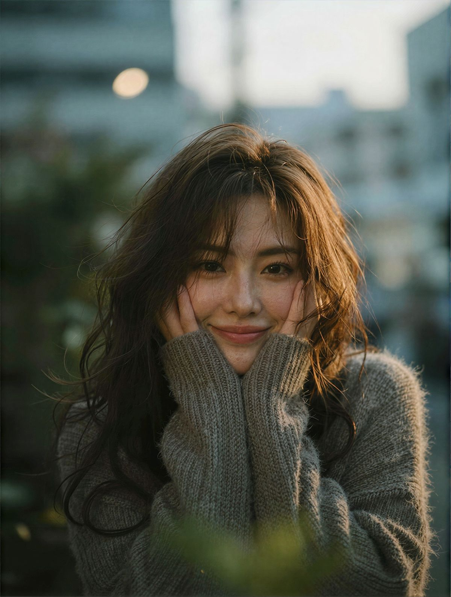
<p style="margin-top: 8px;">
原圖
</p>
</div>
<!-- 第二張 -->
<div style="width: calc(50% - 10px);">
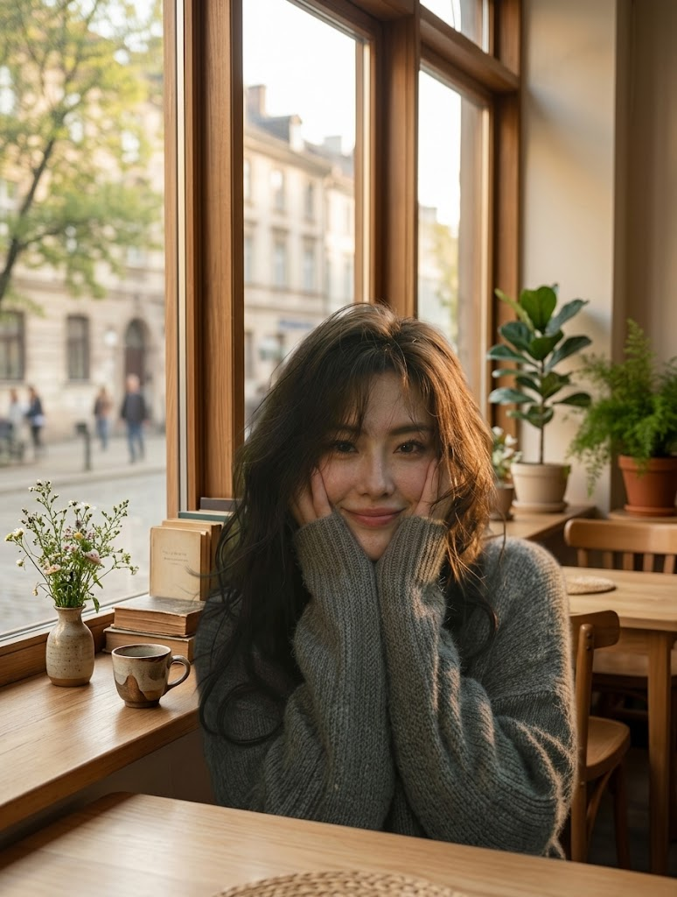
<p style="margin-top: 8px;">
<strong>🟡 提示詞：</strong>
🟢 請保留照片中的人物、五官、髮型、姿勢、表情與服裝完全不變，只替換背景。將原本的戶外背景替換成「日系咖啡廳窗邊」，背景有大片落地窗、木質桌椅與柔和綠色植物，午後陽光自然灑入，呈現溫暖、安靜、文藝的氛圍。背景保持自然景深與輕微散景，光線方向需與人物原本的光影一致，人物邊緣、頭髮細節與背景融合自然，呈現真實攝影效果，不要改變人物本身。
</p>
</div>
</div>

### ➕ 元素新增

<!-- 兩張圖片 + 提示詞 -->
<div style="display: flex; flex-wrap: wrap; gap: 20px;">
<!-- 第一張 -->
<div style="width: calc(50% - 10px);">

<p style="margin-top: 8px;">
原圖
</p>
</div>
<!-- 第二張 -->
<div style="width: calc(50% - 10px);">
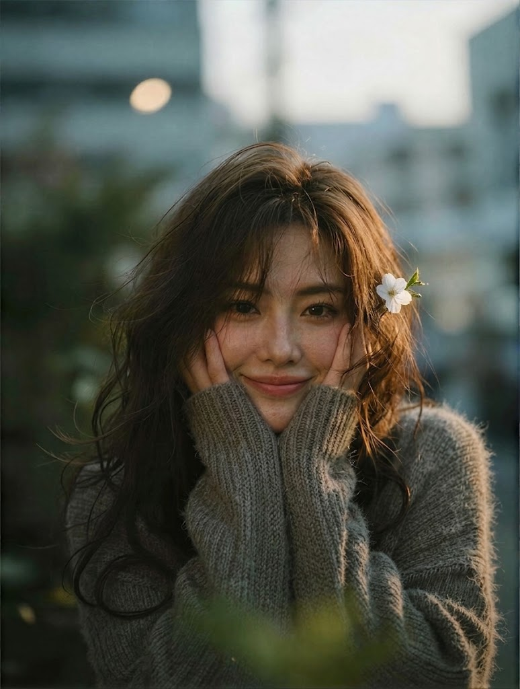
<p style="margin-top: 8px;">
<strong>🟡 提示詞：</strong>
🟢 請保留照片中的人物、姿勢、服裝、背景、光線與原始構圖不變。在人物的頭髮右側新增一個小巧的白色花朵髮飾，位置自然地固定在髮絲之間。髮飾需符合原照片的光線方向、景深與色調，呈現真實攝影效果，看起來像拍攝當下原本就存在於畫面中。不要改變人物五官、髮型與其他畫面元素。
</p>
</div>
</div>

### ➖ 元素移除

<!-- 兩張圖片 + 提示詞 -->
<div style="display: flex; flex-wrap: wrap; gap: 20px;">
<!-- 第一張 -->
<div style="width: calc(50% - 10px);">

<p style="margin-top: 8px;">
原圖
</p>
</div>
<!-- 第二張 -->
<div style="width: calc(50% - 10px);">
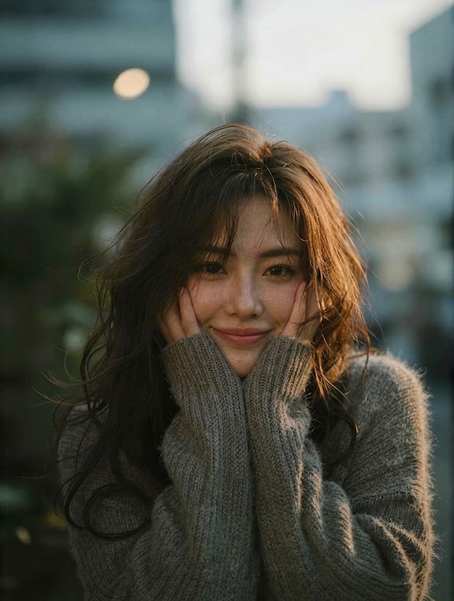
<p style="margin-top: 8px;">
<strong>🟡 提示詞：</strong>
🟢 請移除畫面右下方前景中模糊的綠色植物葉片，並自然補齊被遮住的毛衣與背景。保留人物的五官、髮型、姿勢、服裝、光線與原本構圖不變，修補區域需與周圍材質、景深與光影自然融合，不留下明顯移除痕跡。
</p>
</div>
</div>

### 🎨 色彩與材質調整

<!-- 兩張圖片 + 提示詞 -->
<div style="display: flex; flex-wrap: wrap; gap: 20px;">
<!-- 第一張 -->
<div style="width: calc(50% - 10px);">

<p style="margin-top: 8px;">
原圖
</p>
</div>
<!-- 第二張 -->
<div style="width: calc(50% - 10px);">
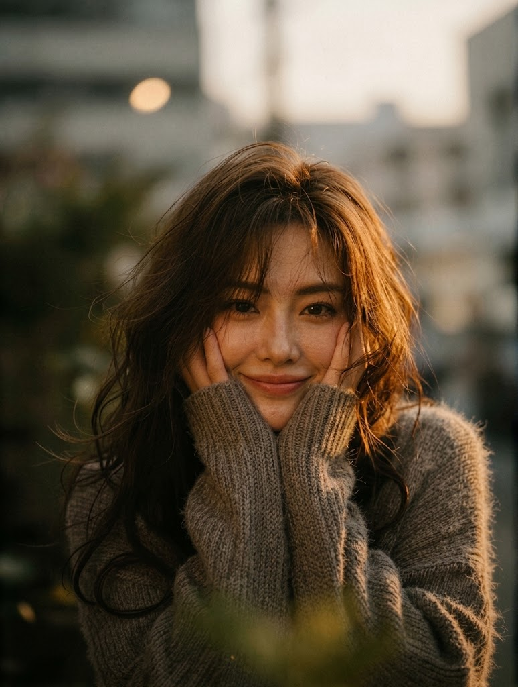
<p style="margin-top: 8px;">
<strong>🟡 提示詞：</strong>
🟢 請移除畫面右下方前景中模糊的綠色植物葉片，並自然補齊被遮住的毛衣與背景。保留人物的五官、髮型、姿勢、服裝、光線與原本構圖不變，修補區域需與周圍材質、景深與光影自然融合，不留下明顯移除痕跡。
</p>
</div>
</div>

### 🔵 Problem. 幫照片換一個場景

請先生成或選擇一張有人物的圖片，再使用 Image-to-Image 將原本的背景替換成另一個場景，例如「辦公室 → 咖啡廳」、「室內 → 海邊」或「白天街道 → 夜晚城市」。修改時必須保留人物的五官、髮型、姿勢、表情、服裝與原始構圖，只改變背景，並讓新背景的光線、透視、景深與人物自然融合。

### 🔵 Problem. 加入一個原本不存在的物件

選擇一張現有圖片，利用 Image-to-Image 在畫面中新增一個指定元素，例如桌上的咖啡、人物的髮飾、牆上的裝飾或手中的物品。除了新增物件之外，其餘人物、背景與構圖都必須保持不變。新增物件需符合原圖的比例、光線、陰影與材質，讓觀看者看不出它是後來加入的。

### 🔵 Problem. 把多餘的東西消失

選擇一張包含干擾元素的圖片，例如背景路人、桌面雜物、植物、錯誤文字或不需要的裝飾，使用 Image-to-Image 將其中一個元素移除。移除後需要自然補齊原本被遮住的背景或物件，同時保留其他內容不變，避免產生明顯的修補痕跡。

### 🔵 Problem. 只換衣服，不換人

選擇一張人物圖片，使用 Image-to-Image 將人物服裝的顏色或材質進行修改，例如「白色棉質襯衫 → 深藍色丹寧襯衫」或「黑色外套 → 米白色針織外套」。人物的臉部、髮型、表情、姿勢與背景都必須保持一致，並注意新的布料紋理、皺褶、光影是否符合原本場景。

### 🔵 Problem. 一張圖片，連續修改三次

先生成一張接近需求的人物情境圖，接著不要重新生成，而是以目前最佳版本進行三次 Image-to-Image 修改。第一次只修改背景，第二次只新增一個物件，第三次只調整一項色彩或材質。每次修改前都要列出「必須保留」與「需要修改」的內容，最後比較初始圖片與第三版圖片，檢查人物、構圖與其他未指定內容是否在連續修改過程中產生漂移。

## 🔴 角色一致性：讓同一人物持續存在

同一人物跨圖片時，常出現：

- 😵 臉部改變。
- 🎨 五官、膚色或髮型漂移。
- 🌫️ 氣質不穩定。
- 👥 看起來不像同一角色。
  這會直接影響可信度與可用性。
  需要角色一致性的情境包括：
- 📣 行銷素材中的固定模特兒。
- 🧑‍🎨 品牌角色與 IP。
- 🧑‍🏫 教學內容中的固定引導者。
- 📖 故事與漫畫中的連續人物。

```text
### 🟡 角色一致性 Prompt 公式
以參考圖中的同一位人物為主角，
保持臉部輪廓、五官比例、膚色、髮色與整體辨識特徵一致。
只改變[服裝／姿勢／場景／髮型]，
其他人物核心特徵不變。
```

### 👗 服裝變化

<!-- 三張圖片 + 提示詞 -->
<div style="display: flex; flex-wrap: wrap; gap: 20px;">
<!-- 第一張 -->
<div style="width: calc(33.333% - 14px);">
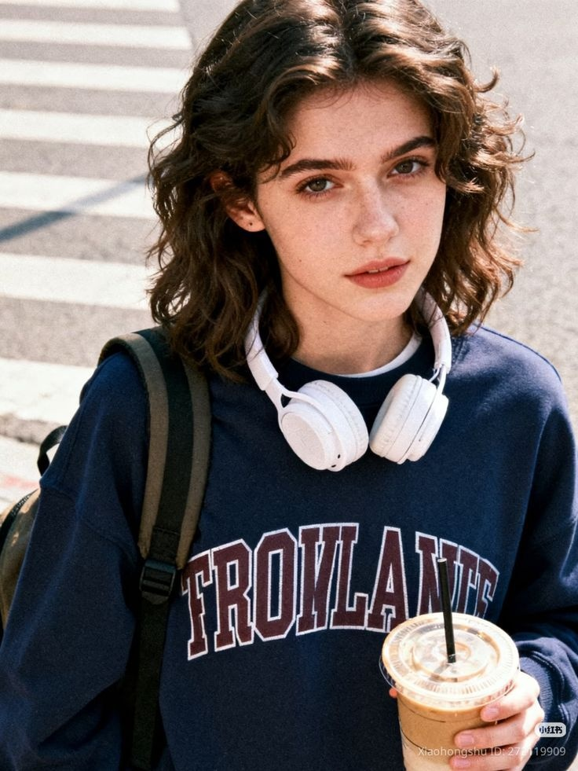
<p style="margin-top: 8px;">
原圖
</p>
</div>
<!-- 第二張 -->
<div style="width: calc(33.333% - 14px);">
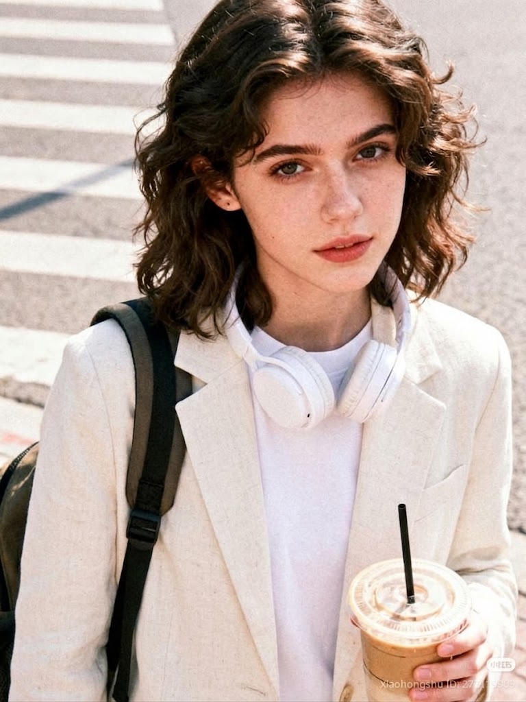
<p style="margin-top: 8px;">
<strong>🟡 提示詞：</strong>
🟢 以參考圖中的同一位女性為主角，保持臉部輪廓、五官比例、膚色、髮型、髮色與整體氣質一致。將原本的灰色毛衣更換為米白色休閒西裝，人物姿勢、表情與背景維持不變。確保更換服裝後仍能清楚辨識為同一位人物。
</p>
</div>
<!-- 第三張 -->
<div style="width: calc(33.333% - 14px);">
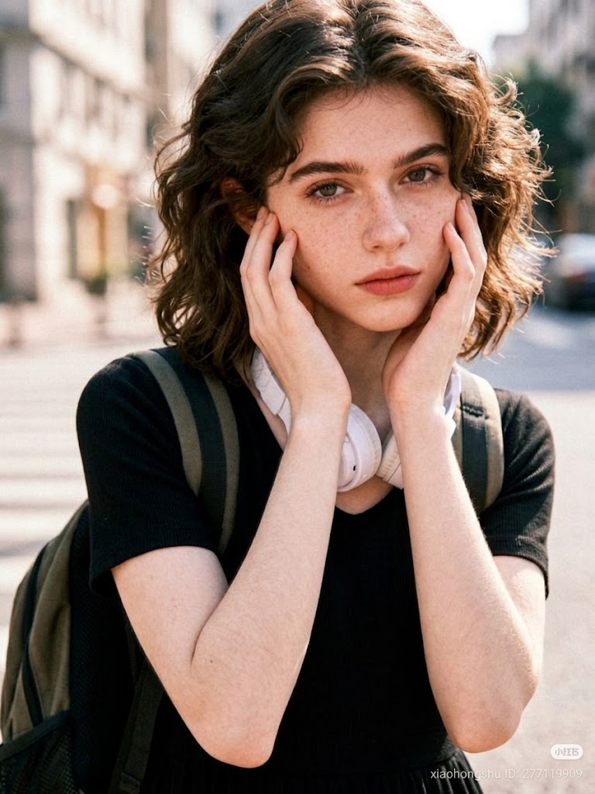
<p style="margin-top: 8px;">
<strong>🟡 提示詞：</strong>
🟢 以參考圖中的同一位女性為主角，保持臉部輪廓、五官比例、膚色、髮型、髮色與整體氣質一致。將原本的灰色毛衣更換為黑色洋裝，人物姿勢、表情與背景維持不變。確保更換服裝後仍能清楚辨識為同一位人物。
</p>
</div>
</div>

### 🌆 場景變化

<!-- 三張圖片 + 提示詞 -->
<div style="display: flex; flex-wrap: wrap; gap: 20px;">
<!-- 第一張 -->
<div style="width: calc(33.333% - 14px);">
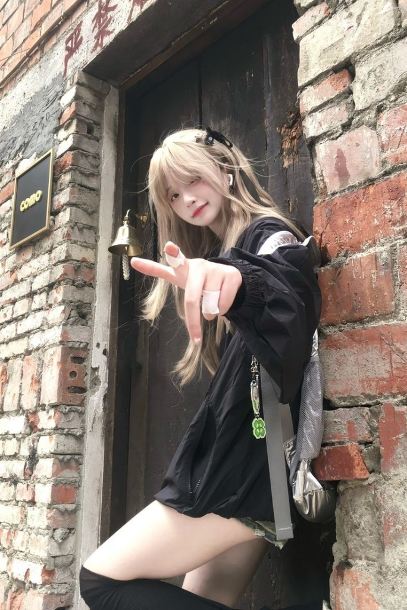
<p style="margin-top: 8px;">
原圖
</p>
</div>
<!-- 第二張 -->
<div style="width: calc(33.333% - 14px);">
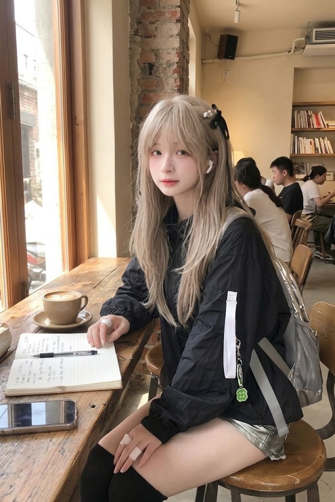
<p style="margin-top: 8px;">
<strong>🟡 提示詞：</strong>
🟢 以參考圖中的同一位女性為主角，保持臉部輪廓、五官比例、膚色、髮型、髮色與整體辨識特徵一致。將場景改為明亮現代的辦公室，人物坐在辦公桌前工作，桌上放著筆記型電腦、筆記本與咖啡，背景有辦公桌椅與自然採光。維持原本人物的服裝與氣質，確保不同場景中仍然像同一位人物。
</p>
</div>
<!-- 第三張 -->
<div style="width: calc(33.333% - 14px);">
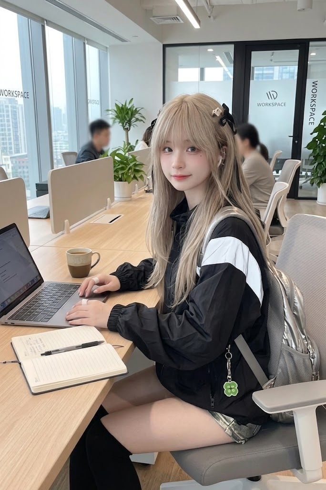
<p style="margin-top: 8px;">
<strong>🟡 提示詞：</strong>
🟢 以參考圖中的同一位女性為主角，保持臉部輪廓、五官比例、膚色、髮型、髮色與整體辨識特徵一致。將場景改為明亮現代的辦公室，人物坐在辦公桌前工作，桌上放著筆記型電腦、筆記本與咖啡，背景有辦公桌椅與自然採光。維持原本人物的服裝與氣質，確保不同場景中仍然像同一位人物。
</p>
</div>
</div>

### 🧍 姿勢變化

<!-- 三張圖片 + 提示詞 -->
<div style="display: flex; flex-wrap: wrap; gap: 20px;">
<!-- 第一張 -->
<div style="width: calc(33.333% - 14px);">
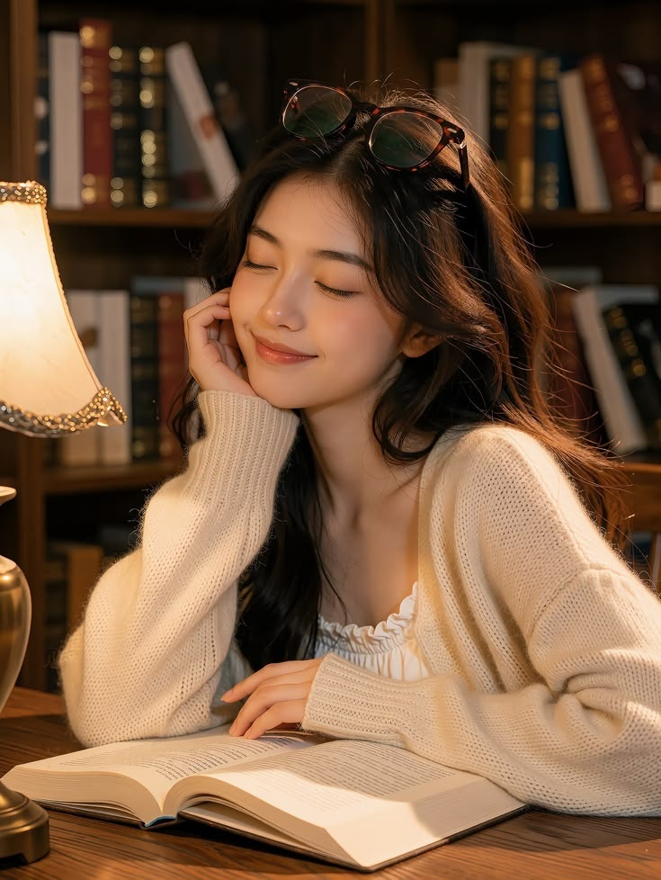
<p style="margin-top: 8px;">
原圖
</p>
</div>
<!-- 第二張 -->
<div style="width: calc(33.333% - 14px);">
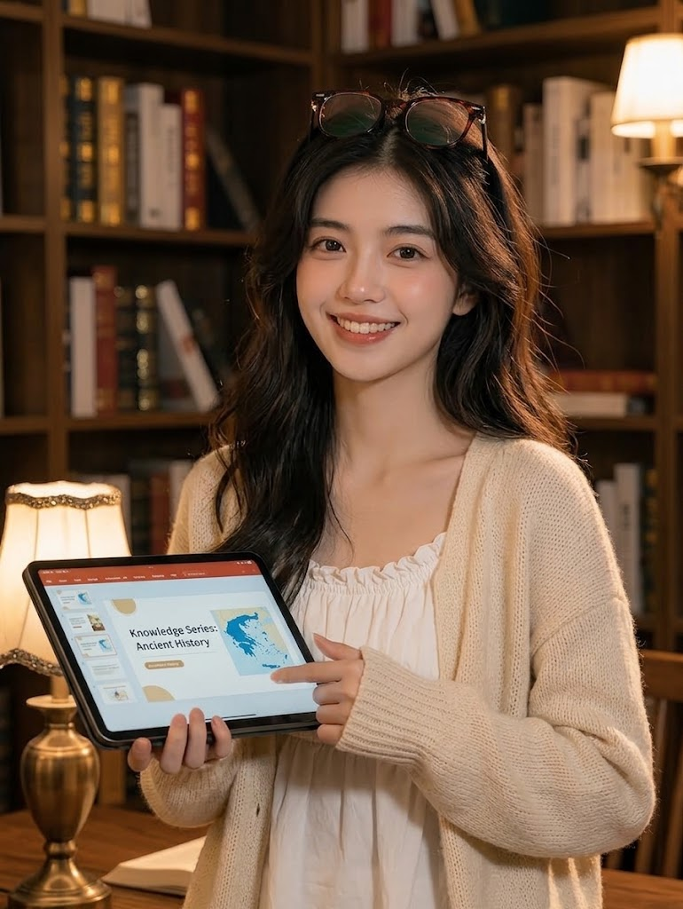
<p style="margin-top: 8px;">
<strong>🟡 提示詞：</strong>
🟢 以參考圖中的同一位女性為主角，保持臉部輪廓、五官比例、膚色、髮型、髮色與背景特徵一致。將人物改為站在前方，手持平板電腦並微笑介紹內容，呈現自然、親切、有知識感的講師形象。只改變姿勢與情境，人物核心外貌特徵不變。
</p>
</div>
<!-- 第三張 -->
<div style="width: calc(33.333% - 14px);">
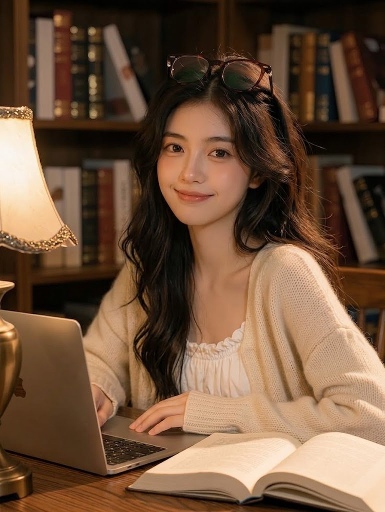
<p style="margin-top: 8px;">
<strong>🟡 提示詞：</strong>
🟢 以參考圖中的同一位女性為主角，保持臉部輪廓、五官比例、膚色、髮型、髮色與背景特徵一致。將人物改為一手自然放在桌面，另一手輕扶筆記型電腦，身體微微側向鏡頭並自然微笑。只改變人物姿勢，維持原本服裝、場景與人物核心外貌特徵不變。
</p>
</div>
</div>

### 💇 髮型變化

<!-- 三張圖片 + 提示詞 -->
<div style="display: flex; flex-wrap: wrap; gap: 20px;">
<!-- 第一張 -->
<div style="width: calc(33.333% - 14px);">
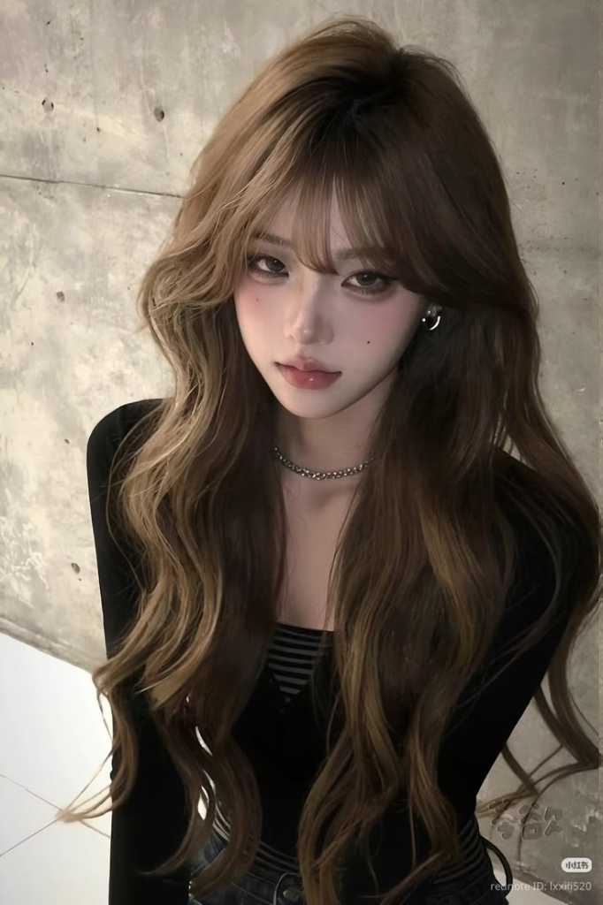
<p style="margin-top: 8px;">
原圖
</p>
</div>
<!-- 第二張 -->
<div style="width: calc(33.333% - 14px);">
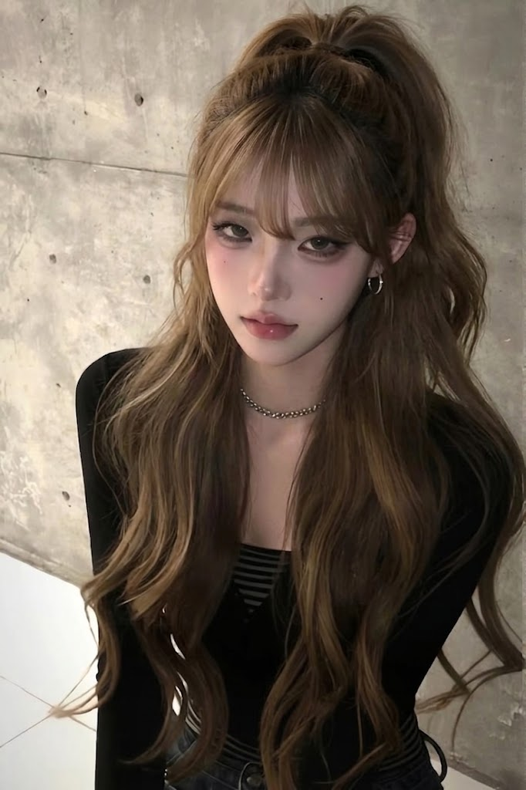
<p style="margin-top: 8px;">
<strong>🟡 提示詞：</strong>
🟢 以參考圖片為基礎進行局部修改。只修改人物髮型，將原本的長捲髮改為自然高馬尾，保留原本的瀏海、髮色與髮絲質感。人物的臉部輪廓、五官比例、眼睛、鼻子、嘴唇、妝容、膚色、表情、頭部角度、身體姿勢、服裝、飾品、背景、構圖、光線與色調全部保持原圖不變。除了髮型改為馬尾之外，不修改任何其他內容。
</p>
</div>
<!-- 第三張 -->
<div style="width: calc(33.333% - 14px);">
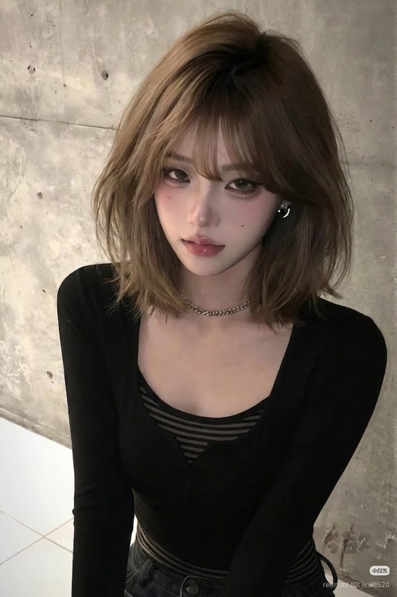
<p style="margin-top: 8px;">
<strong>🟡 提示詞：</strong>
🟢 以參考圖片為基礎進行局部修改。只修改人物髮型，將原本的長捲髮改為自然的及肩短髮，保留原本的瀏海、髮色與髮絲質感。人物的臉部輪廓、五官比例、眼睛、鼻子、嘴唇、妝容、膚色、表情、頭部角度、身體姿勢、服裝、飾品、背景、構圖、光線與色調全部保持原圖不變。除了頭髮長度改為短髮之外，不修改任何其他內容。
</p>
</div>
</div>

### 🔵 Problem. 同一個人，三套不同穿搭

請先生成或選擇一張人物參考圖，再以參考圖中的同一位人物為主角，分別生成「日常休閒」、「正式工作」、「活動聚會」三種不同服裝版本。三張圖片需保持人物的臉部輪廓、五官比例、膚色、髮色、髮型與整體氣質一致，只改變服裝與相關配件，讓觀看者能明確辨識三張圖是同一個人。

### 🔵 Problem. 帶著同一個角色去不同地方

選擇一張人物參考圖，讓同一位人物分別出現在「咖啡廳」、「現代辦公室」、「戶外公園」三個不同場景中。人物可以配合場景進行不同活動，但必須保持臉部、五官、膚色、髮型與主要辨識特徵一致。生成完成後，檢查場景大幅改變時，角色是否仍具有足夠的一致性。

### 🔵 Problem. 同一位講師的三種姿勢

以一張人物圖片作為參考，生成同一位人物「站立介紹」、「坐著操作電腦」、「手持平板講解」三種姿勢。只改變人物的姿勢、手勢與動作，保持臉部、髮型、服裝與主要外貌特徵一致。三張圖片需讓人物看起來像同一位固定講師，可直接使用於同一套課程或簡報素材。

### 🔵 Problem. 換髮型，但不要換一張臉

選擇一張長髮人物參考圖，分別將人物髮型修改為「高馬尾」與「及肩短髮」。除了髮型之外，人物的臉部輪廓、五官比例、膚色、表情、妝容、姿勢、服裝、背景、構圖與光線都需保持一致。比較三張圖片，觀察改變髮型時，AI 是否同時造成臉部或人物氣質漂移。

### 🔵 Problem. 建立一組固定人物素材庫

先建立一位固定人物並生成標準參考圖，再以這張圖片為基礎生成至少 4 張延伸圖片，例如「辦公室工作」、「拿著平板介紹」、「咖啡廳閱讀」、「站在白板前教學」。每張圖片可以改變場景、動作或服裝，但每次最多改變 1–2 個主要條件。最後將所有圖片放在一起比較，檢查臉型、五官、膚色、髮色與其他核心辨識特徵是否能維持一致。

## 🔴 多圖融合：從單一素材到創意組合

多圖融合（Image Fusion）是把不同圖片中的主體、場景、產品或風格整合成新畫面。
| 類型 | 特點 |
| -------- | -------------------------- |
| ✏️ 局部修改 | 在同一張圖片中調整 |
| 🧩 多圖融合 | 整合多張圖片，重新組成內容 |
三個價值：

1. 🚀 創作自由度提升。
2. 💡 抽象靈感可以直接具體化。
3. ♻️ 現有素材可以重新組合，產生新價值。

```text
### 🟡 多圖融合 Prompt 公式
以圖片 A 的[人物／物件]為來源主體，放入圖片 B 的[場景／背景]。
保留[來源主體的核心特徵]，
調整人物比例、站位、透視、光線方向、色溫、陰影、景深與接觸關係，
使兩者自然融合，像原本就在同一場景中。
```

### 🟢 範例：人物 + 服裝

<!-- 三張圖片 + 提示詞 -->
<div style="display: flex; flex-wrap: wrap; gap: 20px;">
<!-- 第一張 -->
<div style="width: calc(33.333% - 14px);">
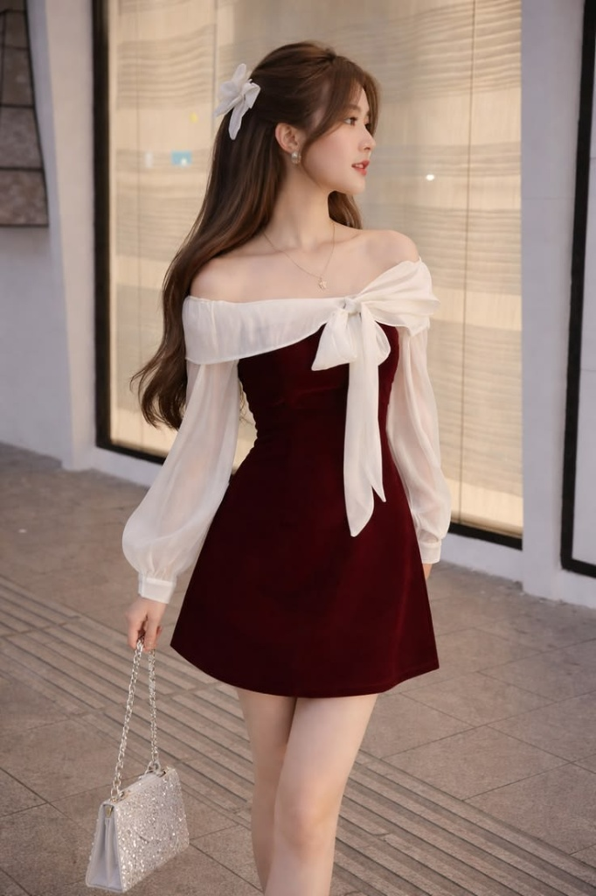
<p style="margin-top: 8px;">
圖片A
</p>
</div>
<!-- 第二張 -->
<div style="width: calc(33.333% - 14px);">
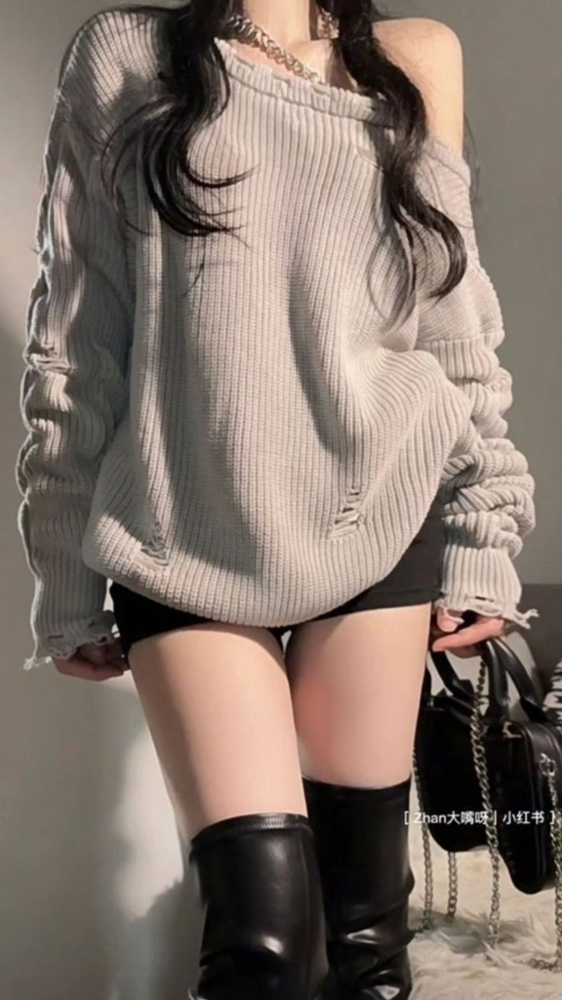
<p style="margin-top: 8px;">
圖片B
</p>
</div>
<!-- 第三張 -->
<div style="width: calc(33.333% - 14px);">
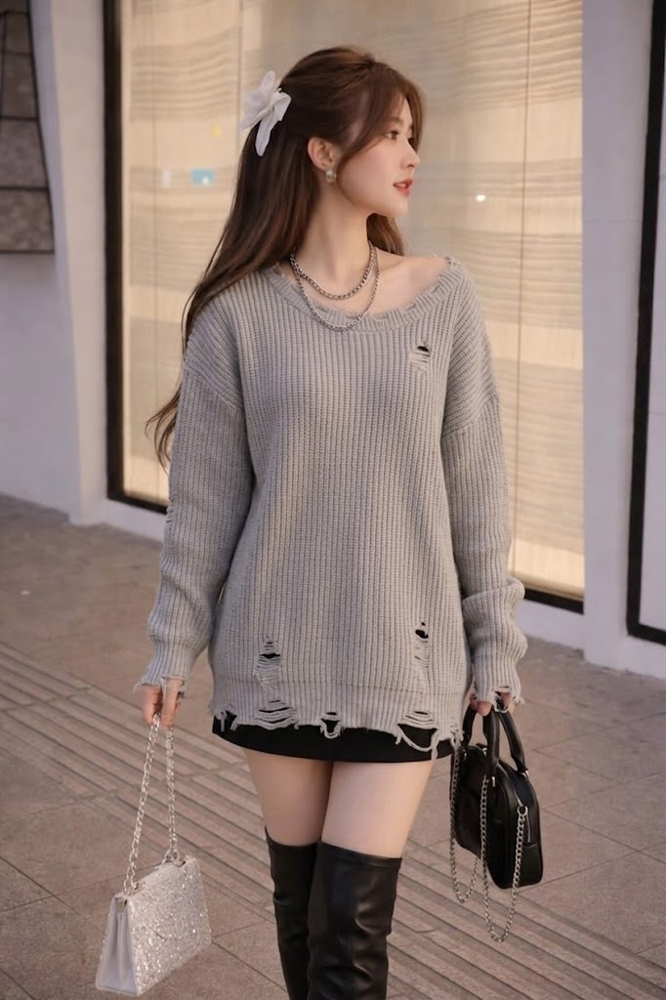
<p style="margin-top: 8px;">
<strong>🟡 提示詞：</strong>
🟢 以圖片 A 的人物作為主角，保持人物的臉部、五官、髮型、膚色與身形特徵一致。參考圖片 B 的服裝，讓圖片 A 的人物穿上圖片 B 中的服裝，保留服裝原本的顏色、剪裁、材質與設計細節。人物姿勢、背景與整體構圖維持圖片 A 不變。
</p>
</div>
</div>

### 🟢 範例：人物 + 場景

<!-- 三張圖片 + 提示詞 -->
<div style="display: flex; flex-wrap: wrap; gap: 20px;">
<!-- 第一張 -->
<div style="width: calc(33.333% - 14px);">
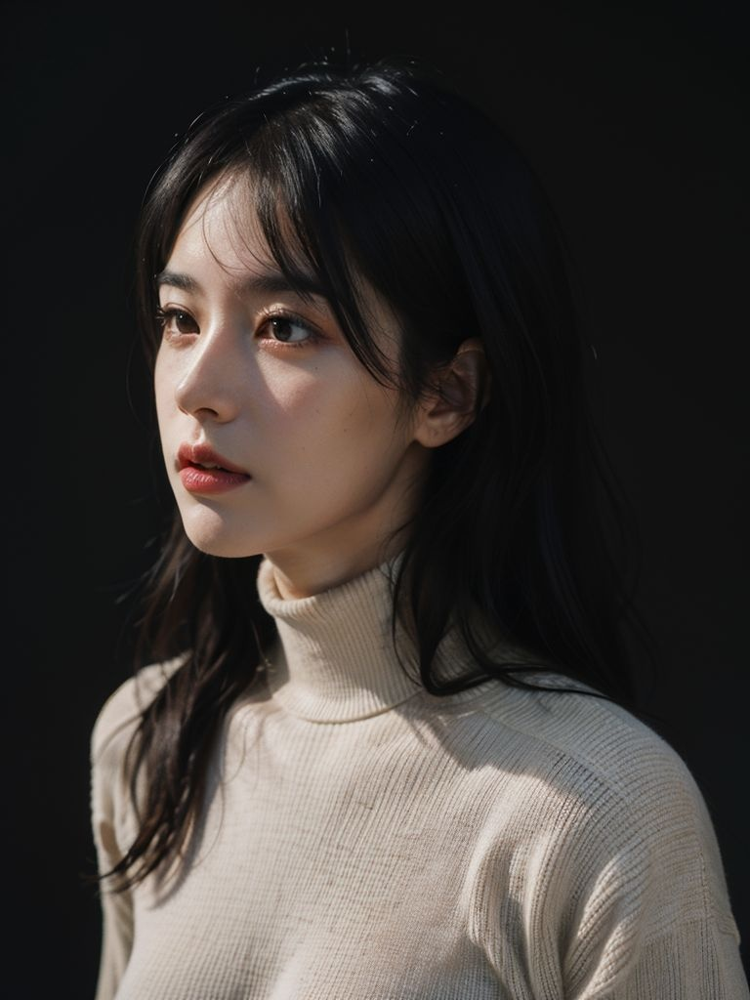
<p style="margin-top: 8px;">
圖片A
</p>
</div>
<!-- 第二張 -->
<div style="width: calc(33.333% - 14px);">
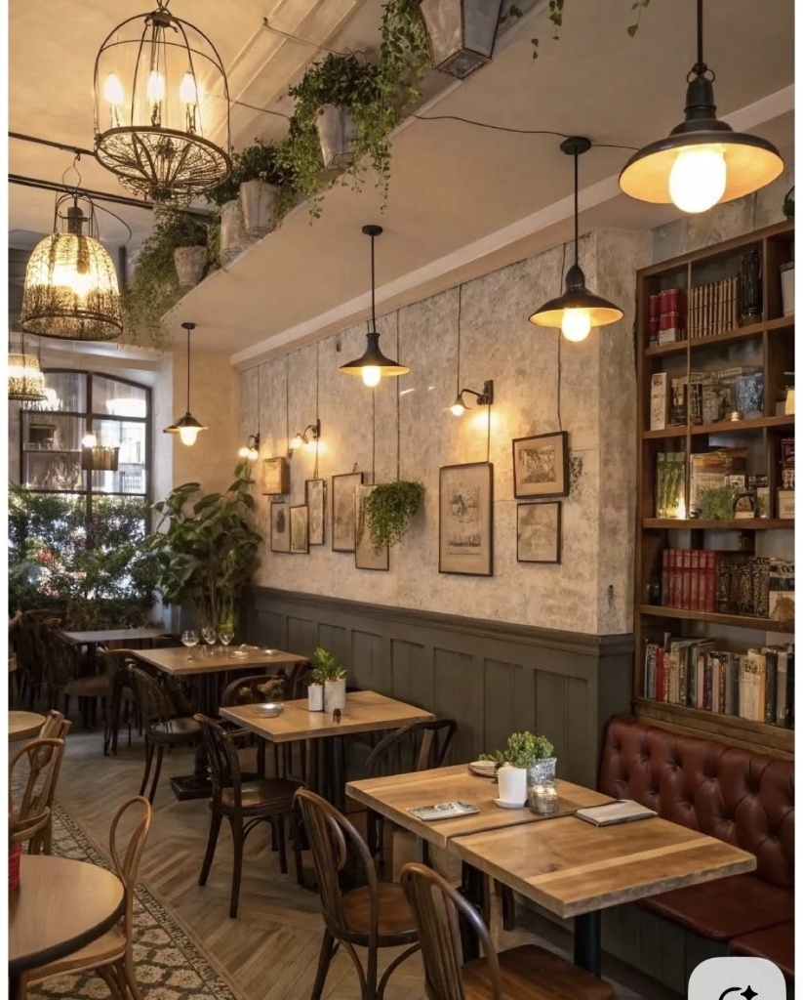
<p style="margin-top: 8px;">
圖片B
</p>
</div>
<!-- 第三張 -->
<div style="width: calc(33.333% - 14px);">
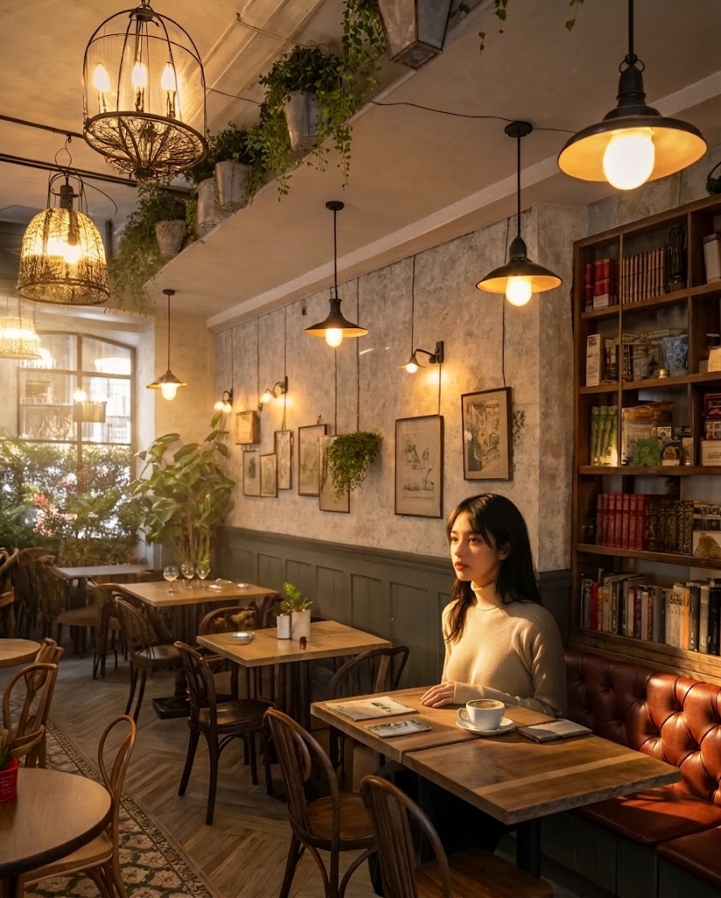
<p style="margin-top: 8px;">
<strong>🟡 提示詞：</strong>
🟢 以圖片 A 的人物作為主角，保持人物的臉部、五官、髮型、服裝與整體辨識特徵一致。將人物自然融入圖片 B 的咖啡廳場景，參考圖片 B 的空間配置、光線與環境氛圍。調整人物與環境的光影，使人物看起來真正位於該場景中，不要改變人物核心外貌。
</p>
</div>
</div>

### 🔵 Problem. 幫人物換上參考穿搭

準備兩張圖片，圖片 A 為人物照片，圖片 B 為一套完整服裝。使用多圖融合，讓圖片 A 的人物穿上圖片 B 的服裝。生成時需保留人物原本的臉部、五官、髮型、膚色與身形特徵，同時保留服裝的顏色、剪裁、材質與設計細節，讓服裝自然符合人物姿勢與身體比例。

### 🔵 Problem. 把人物帶到另一個世界

準備一張人物圖片與一張場景圖片，例如咖啡廳、海邊、森林、未來城市或現代辦公室。將圖片 A 的人物自然放入圖片 B 的場景中，保留人物的核心外貌與服裝，同時調整人物大小、站位、透視、光線、色溫、陰影與景深，讓最終圖片看起來像人物原本就在該場景中。

### 🔵 Problem. 打造不存在的產品情境照

準備一張產品圖片與一張情境背景，例如「保溫杯＋露營場景」、「香水＋高級飯店」或「筆記型電腦＋現代辦公桌」。將產品自然融入新的場景中，保留產品原本的造型、Logo、顏色與材質，並根據環境重新調整產品的光線、陰影、反射與接觸關係，生成一張具有商業攝影感的產品情境照。

### 🔵 Problem. 三張圖片合成一張廣告

準備三張不同來源的圖片：圖片 A 為人物、圖片 B 為產品、圖片 C 為場景。將三張素材融合成一張完整的商業廣告圖片，讓人物自然使用或拿著產品，並置於圖片 C 的場景中。生成時需特別處理人物與產品的比例、手部接觸、光線方向、陰影與透視，使三種不同來源的素材看起來像同一次拍攝完成。

### 🔵 Problem. 哪一張融合得最自然？

選擇一張人物圖片與一張場景圖片，使用相同素材生成兩個融合版本。第一個版本只描述「把人物放進場景」，第二個版本則加入人物比例、站位、透視、光線方向、色溫、陰影、景深與接觸關係等細節。比較兩張生成結果，觀察加入融合條件後，人物是否更自然地存在於新的場景之中。
