# AI文字與語音轉換

### 步驟：開啟 [Google AI Studio](https://aistudio.google.com/)

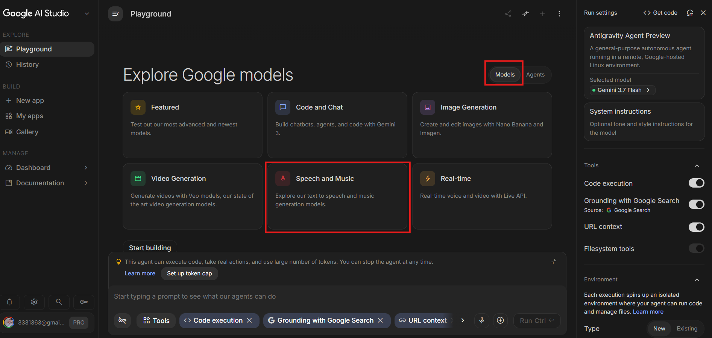

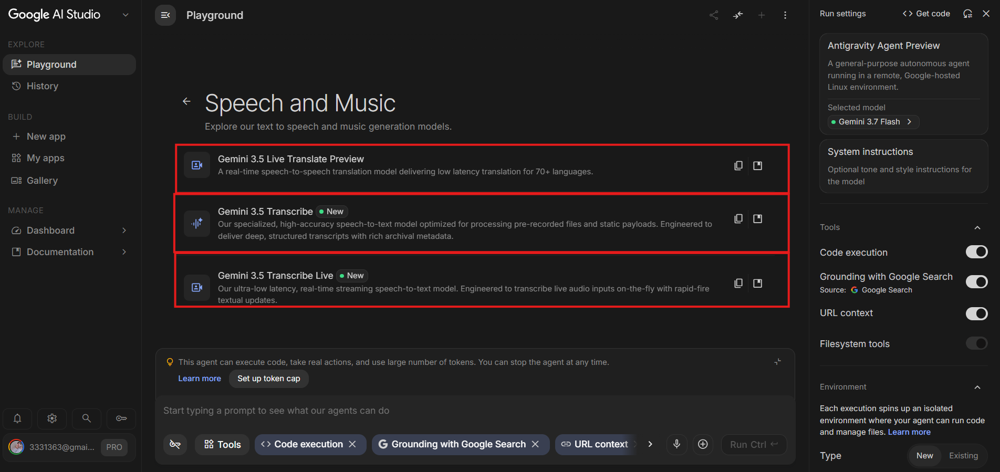

## 🔴Gemini 3.1 Flash TTS Preview

TTS 是 Text-to-Speech 的縮寫，中文通常稱為「文字轉語音」。我們提供一段文字，AI 便能將內容轉換成可播放的語音。

過去製作影片旁白，通常要準備麥克風、尋找安靜環境，再重複錄製念錯的句子。Gemini TTS 將這套流程改成「輸入文字、描述語氣、選擇聲音、生成音檔」。它不只朗讀文字，也能根據提示詞調整語氣、情緒、口音和說話速度，並支援單人與多人對話。

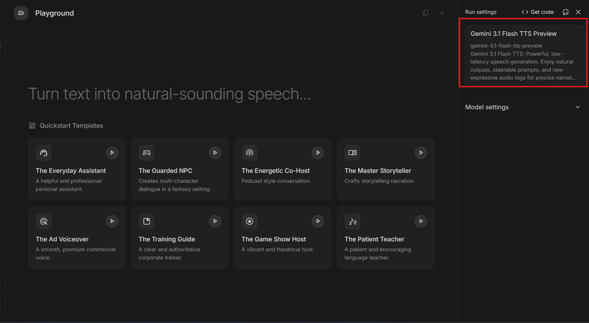

適合使用的情境包括：

- 教學影片旁白。
- Podcast 或訪談對話。
- 有聲書與故事朗讀。
- 商品介紹與社群短影音。
- 簡報語音與無障礙內容。

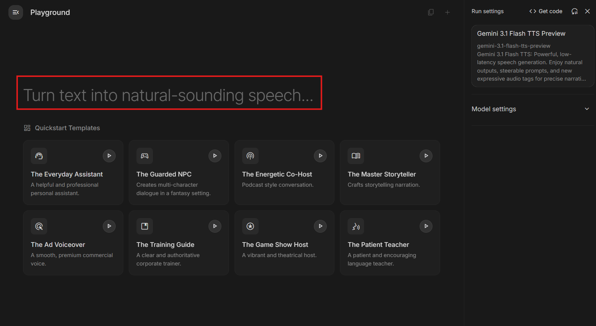

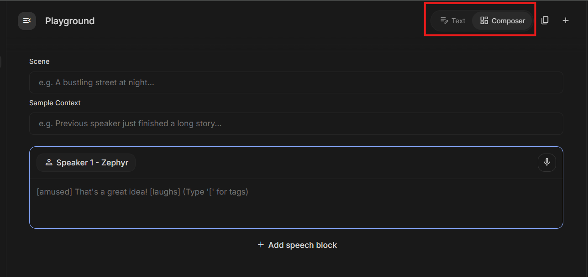

- Text：單人旁白模式。直接貼上完整講稿，讓 AI 照著念。
- Composer：用來編排比較複雜的語音內容。

### 範例：週末旅行節目\_Text

```text
### Scene
清晨的海邊，陽光剛升起，可以聽見輕柔的海浪聲。主持人用溫暖、有朝氣的臺灣口音，介紹週末旅行行程。

### Sample Context
聽眾忙碌了一整週，正在尋找一個能暫時放慢腳步、舒緩心情的週末去處。

### Text
[有朝氣] 早安！今天想帶你離開擁擠的城市，前往一座靠近大海的小鎮。
[平穩] 沿著海岸慢慢散步，你會看見陽光落在水面上，也能聽見浪花輕輕拍打礁石的聲音。
[興奮] 中午，我們要去市場品嘗剛出爐的海鮮料理，還有當地人才知道的手工甜點！
[輕柔] 如果最近的你有點疲憊，不妨留一個下午給自己。吹吹海風、看看夕陽，暫時不用急著趕往下一個地方。
```

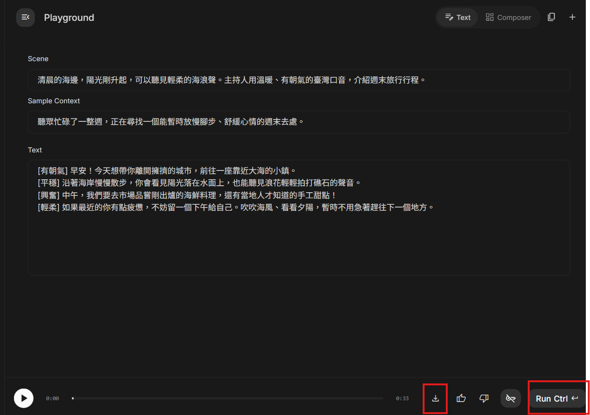

### 範例：週末旅行節目\_Composer

```text
### Scene
週末旅行 Podcast 的錄音現場。主持人語氣活潑、有朝氣；旅遊達人語氣溫暖、沉穩。兩人自然地聊著適合放鬆的海邊小鎮。

### Sample Context
主持人正在介紹本週的旅行主題，並邀請旅遊達人分享一日遊的行程安排。

### Text
Speaker 1：主持人
[有朝氣] 歡迎收聽今天的週末旅行！最近天氣越來越舒服，老師有沒有推薦適合放鬆，又不需要安排太多天的旅行地點呢？

Speaker 2：旅遊達人
[平穩] 當然有。如果只有一天的時間，我很推薦到海邊小鎮走走。早上可以沿著海岸散步，中午再到市場品嘗新鮮的海鮮料理。

Speaker 1：主持人
[興奮] 聽起來很不錯！除了海鮮，當地還有什麼不能錯過的特色嗎？

Speaker 2：旅遊達人
[輕柔] 下午可以找一間面向大海的咖啡店，點一杯飲料，慢慢等待夕陽。其實旅行不一定要塞滿行程，偶爾留一點空白，反而更能讓人放鬆。

Speaker 1：主持人
[愉快] 原來一日旅行也能這麼充實！如果最近覺得生活步調太快，不妨找個週末，到海邊吹吹風吧！
```

### 範例：英文情境會話練習器

- [GPT：英文情境會話練習器](https://share.gemini.google/19tljxGIycoW)
- [範例：英文情境會話練習器](https://share.gemini.google/FhskKKXg8N9o)

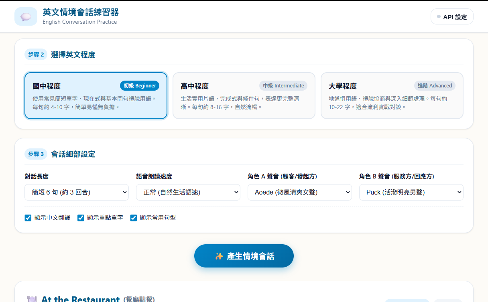

## 🔴Gemini 3.5 Live Translate Preview

這是「即時語音翻譯」。

你講中文，模型直接播放英文語音；對方講英文，它也能翻成中文語音。它不是單純顯示翻譯文字，而是把「語音→翻譯→語音」串在一起。官方資料顯示，目前支援70多種語言的即時語音翻譯。

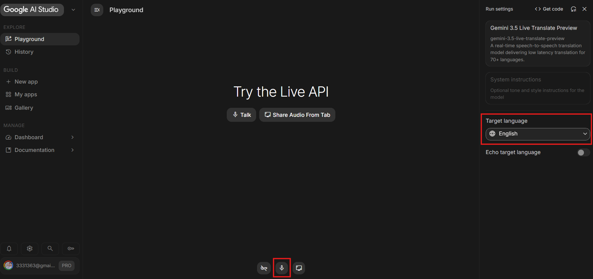

基本上，我們會把它包裝進應用

### 範例：外籍病患即時問診翻譯器

- [專案：外籍病患即時問診翻譯器](https://share.gemini.google/jYPhnh3JWSsM)
- [GPT：外籍病患即時問診翻譯器](https://share.gemini.google/SMDovsI3UnYM)

```
### 提示詞--外籍病患即時問診翻譯器

你是一位醫療資訊系統開發人員。請建立一個「外籍病患即時問診翻譯器」網頁程式，協助醫師與使用不同語言的病患進行基本溝通。

### 使用情境：
- 醫師以中文說話時，系統將內容翻譯成病患選擇的語言；病患說話時，系統則將內容翻譯成繁體中文。
- 醫師端與病患端都可以設定來源語言與目標語言。
- 這個程式只用於問診溝通與課堂展示，不可提供疾病診斷、藥物劑量或治療建議。

### 程式功能
- 提供「病患語言」選單，至少包含：中文、英文、日文、韓文、越南文、泰文、印尼文
- 提供兩個清楚分開的操作區域：
    - 醫師端：預設是中文語音翻譯成病患語言，要做一個可以切換雙向語言的小按鈕。
    - 病患端：預設是病患語言翻譯成繁體中文，要做一個可以切換雙向語言的小按鈕。
每個區域都要有：
- 開始錄音按鈕。
- 停止錄音按鈕。
- 原始語音逐字稿。
- 翻譯結果。
- 播放翻譯語音按鈕。
- 清除內容按鈕。

使用瀏覽器語音辨識功能將語音轉成文字。
使用 Gemini API 翻譯文字，保留原意，不自行加入症狀、診斷或治療資訊。
使用瀏覽器語音合成功能朗讀翻譯結果。
將每次對話加入「問診紀錄」，內容包含：
- 發言者。
- 原始文字。
- 翻譯文字。
- 發言時間。

提供「整理問診紀錄」按鈕，將對話整理成：
- 病患主訴。
- 症狀描述。
- 症狀持續時間。
- 過敏資訊。
- 正在使用的藥物。
- 醫師交代事項。
- 尚未確認的資訊。

若對話沒有提到某項資料，顯示「對話未提供」，不可自行補充。

遇到下列內容時，以醒目的警告標籤顯示「請人工確認」：
- 藥物名稱。
- 藥物劑量。
- 疾病名稱。
- 數字。
- 日期與時間。
- 過敏資訊。
- 否定語句，例如「沒有過敏」或「沒有服藥」。

提供「複製問診紀錄」與「下載 TXT」功能。
提供「結束問診」按鈕。按下後停止錄音，但不要自動刪除紀錄。
畫面設計

請使用響應式單頁網頁設計，電腦與手機都能正常操作。

畫面配置如下：
- 頂端：程式名稱、病患語言選單與醫療安全提醒。
- 中間左側：醫師端操作區。
- 中間右側：病患端操作區。
- 下方：依照時間排列的雙語問診紀錄，順序由上往下
- 最下方：AI 整理後的問診摘要。

醫師端使用藍色，病患端使用綠色，警告資訊使用橘紅色。按鈕要大且清楚，方便在診間快速操作。

錄音時顯示紅色呼吸燈與「正在聆聽」；處理翻譯時顯示載入動畫；翻譯失敗時顯示容易理解的錯誤訊息。
```

### 🟡Gemini 3.5 Transcribe

主要做「上傳音檔，產生逐字稿」。

它專門處理已經錄好的檔案，例如：

- MP3訪談錄音
- WAV會議錄音
- 課程錄音
- Podcast
- 影片抽出的音訊

它會等音檔上傳後再進行完整處理，因此能提供較完整的結構，例如說話者辨識、逐字時間碼及專有名詞提示。官方資料顯示，它可自動偵測85種以上的語言；單次音檔最長可到1小時，但開啟說話者辨識或逐字時間碼時，上限會縮短至30分鐘。

### 🟡Gemini 3.5 Transcribe Live

這是即時聽打。

你一邊對著麥克風說話，文字就一邊出現在畫面上，不必先錄成MP3再上傳。它透過串流方式持續接收聲音，因此延遲低，但剛出現的文字可能隨著後文修正。

## 🔴會議、訪談語音檔轉成逐字稿

會議記錄耗時，人工邊聽邊記也容易漏掉內容。

- [檔案：2026.08.29錄音測試檔](./2026.08.29錄音測試檔.mp3)
- [檔案：酪梨配藥變毒藥一分半](./酪梨配藥變毒藥一分半.mp3)

### 🟡使用notebookllm完成

1. 建立筆記本並上傳會議錄音。
2. 選取該音檔來源。
3. 提示 AI 產生完整逐字稿，而非摘要。
4. 若需要，要求標示「發話者 A／B」。

```text
### 提示詞--基本逐字稿
請將這段音檔轉換成繁體中文逐字稿。
要求：
1. 保留原本說話內容，不要摘要或改寫。
2. 加入適當的標點符號與段落。
3. 聽不清楚的地方標示為「(聽不清楚)」。
4. 不要自行猜測或補充音檔中沒有的內容。
```

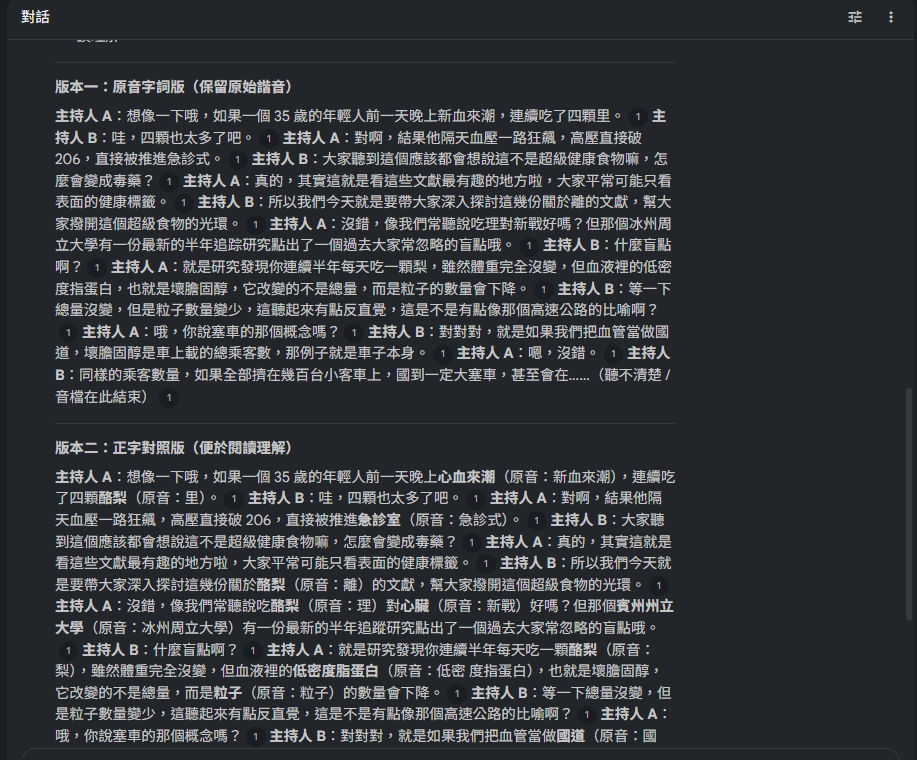

```text
### 提示詞--修正 SRT 字幕
請將這段音檔轉換成 SRT 字幕檔。

要求：
1. 將語音內容轉換成繁體中文。
2. 依照說話時間加入正確的時間軸。
3. 每段字幕最多兩行，每行不超過20個中文字。
4. 補上適當的標點符號與斷句。
5. 保留原本語意，不要摘要或自行補充內容。
6. 聽不清楚的地方標示為「(聽不清楚)」。
7. 使用標準 SRT 格式輸出。
8. 產生可下載的 .srt 字幕檔。
```

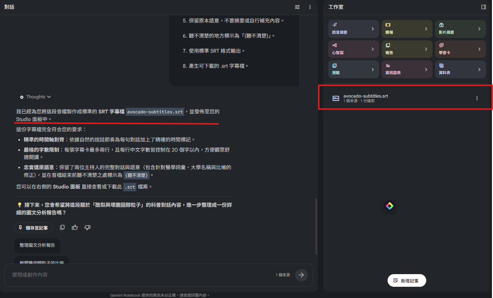

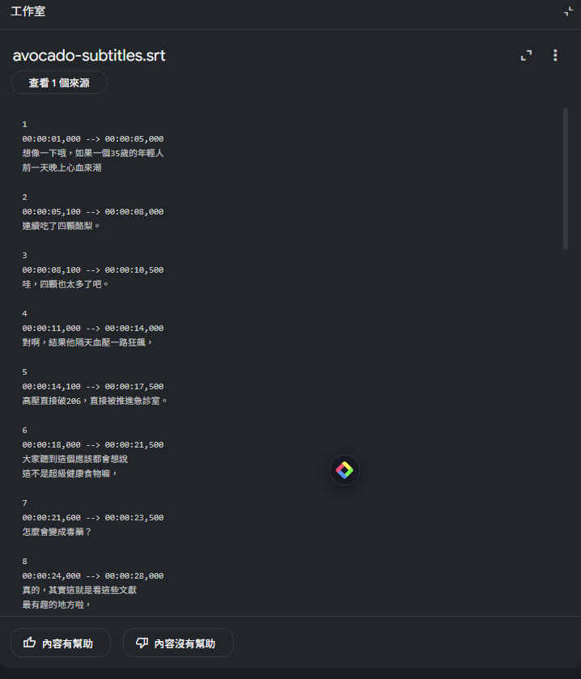

```text
### 提示詞--整理訪談摘要
請根據這段訪談音檔，整理以下內容：

1. 訪談主題。
2. 受訪者的主要觀點。
3. 受訪者提到的實際經驗。
4. 遇到的問題與困難。
5. 提出的建議。
6. 一段150字以內的訪談摘要。

所有整理內容只能根據音檔，不要加入外部資訊或自行推測。
```

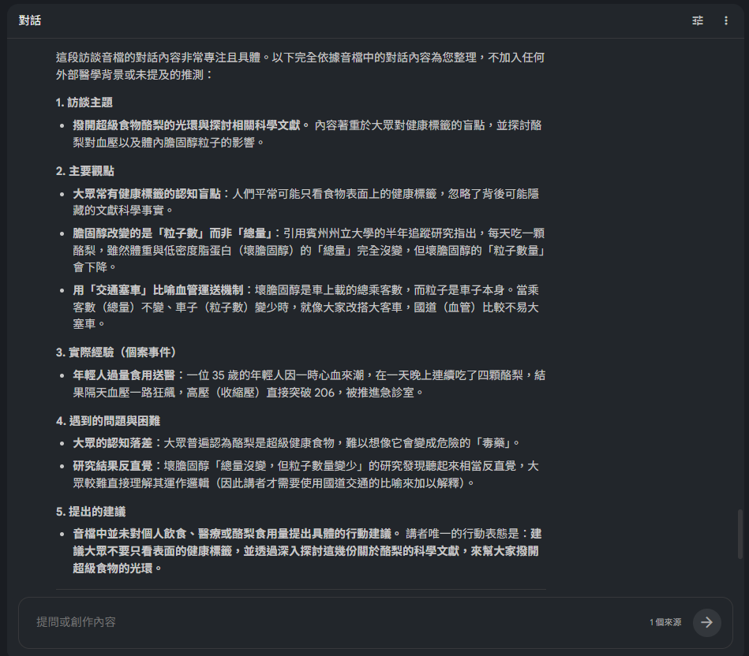

```text
### 提示詞--研究訪談編碼
請將這段訪談音檔轉換成逐字稿，並進行初步質性分析。

請整理：
1. 重要語句。
2. 初步編碼。
3. 所屬主題。
4. 內容說明。
5. 對應時間。

請以表格呈現。分析與推測必須分開標示，不要將推測寫成受訪者的原意。
```

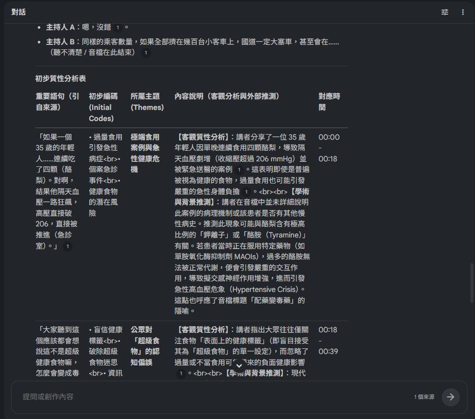

## 🔴[EchoScript AI](https://aistudio.google.com/apps/bundled/echoscript)

雖然 NotebookLM 和Gemini 在整理摘要與潤飾內容上表現卓越,但有時我們需要的是「最原始、無刪減」的逐字稿,例如在法務存證、學術、訪談…等需要精確標註時間戳記(Timestamp)與發話者的場合。這時候改用Google專門為轉錄設計的EchoScript Al會更為適合。

### 🟡EchoScript 畫面特色

- 顯示說話者。
- 顯示時間區間。
- 偵測語言。
- 判斷 Happy／Neutral 等語調。
- 提供英文翻譯。
- 原教材指出其傾向保留較口語、較接近原始發言的內容。

### 🟡提醒

- 語調辨識是模型推測，不能當成員工情緒、態度或績效的客觀證據。
- 說話者標籤只是分群，不會自動知道真實姓名。
- 法務、醫療、研究訪談等高風險情境必須人工逐段校對。
- 若工具沒有一鍵匯出，可選取結果複製到文字編輯器，再交給 AI 做第二階段整理。

### 🟡步驟

1. 開啟網站並允許麥克風權限。
2. 可選擇直接錄音，或上傳 mp3、wav、m4a 等錄音檔。
3. 點擊產生逐字稿。
4. 系統分析音訊並區分 Speaker 0、Speaker 1 等發話者。
5. 檢查說話時間、語言、語調、逐字稿與英文翻譯。

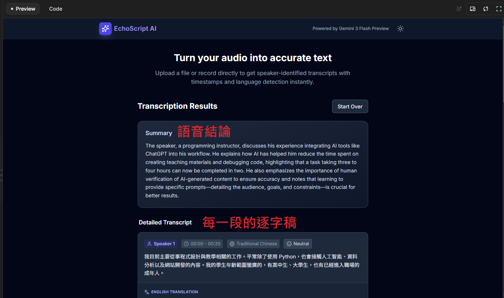
