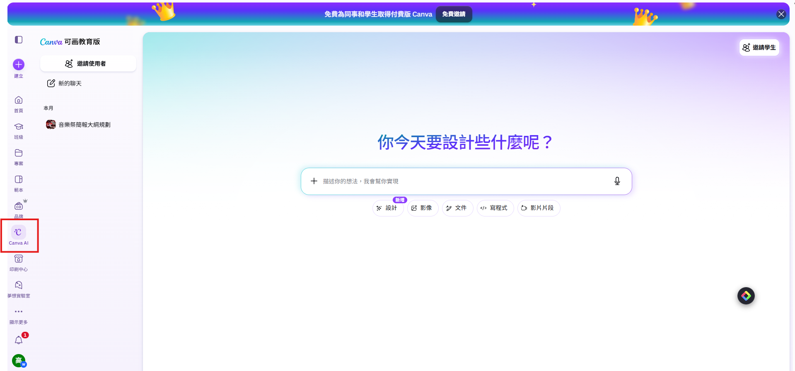
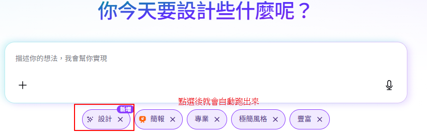
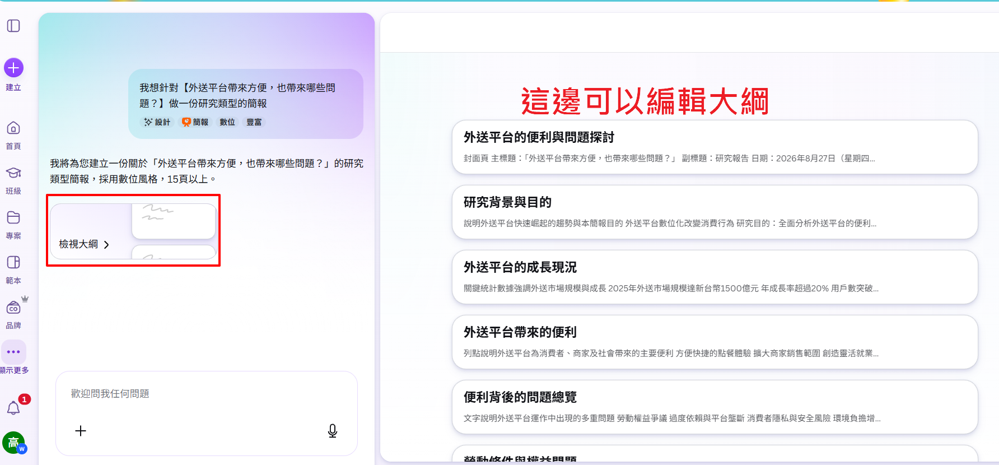
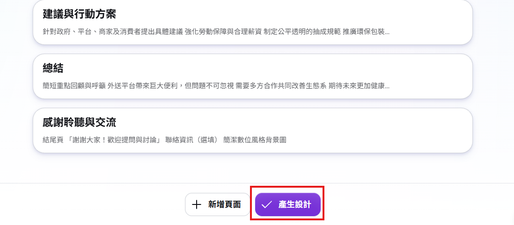
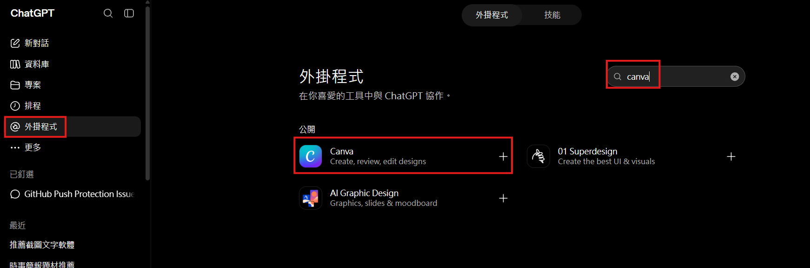
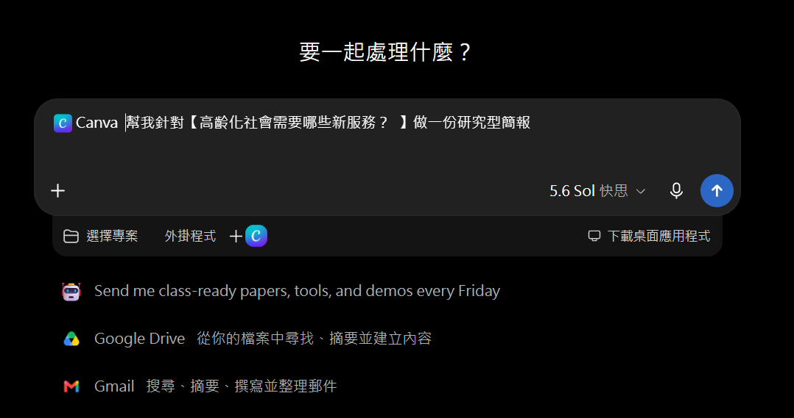
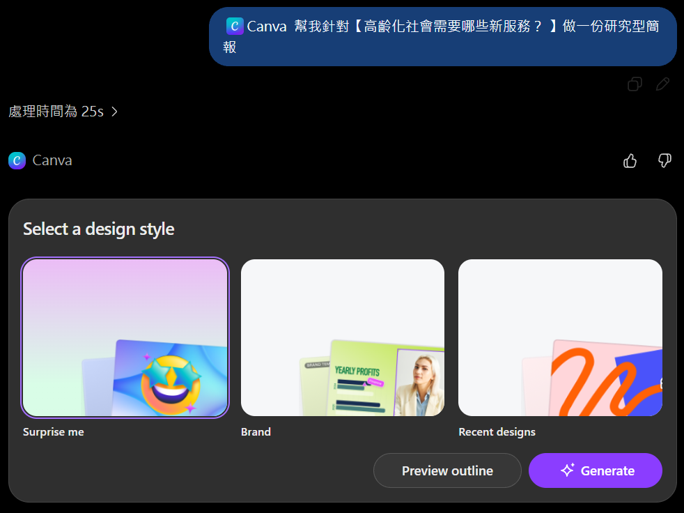
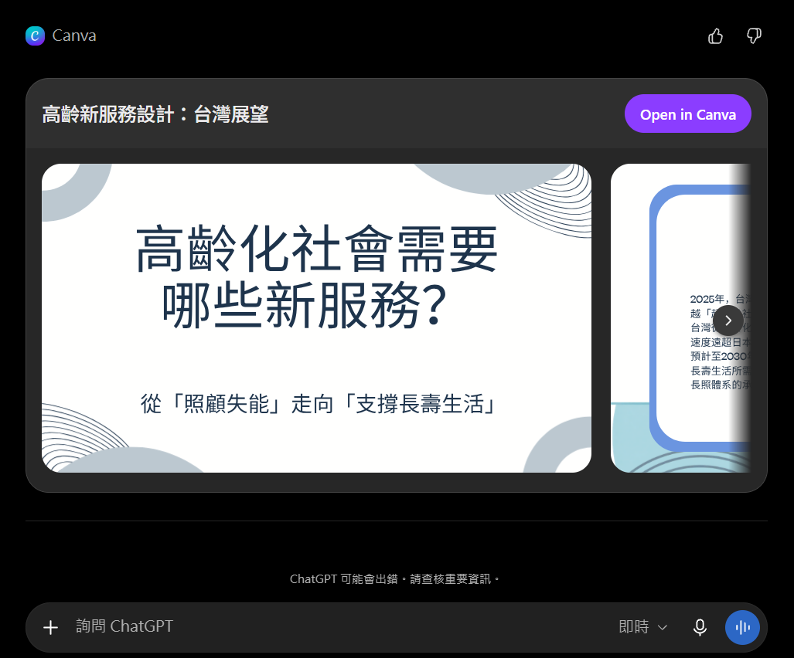

# AI簡報生成術

## 🔴一張投影片只解決一個溝通問題

投影片不是講義。講義可以讓讀者停下來慢慢看；簡報通常在數秒內就會換頁。每一頁最好只有一個核心訊息，例如：

- 市場不是正在變大，而是「某一類需求正在快速增加」。
- 我們不是功能最多，而是「最能解決某一個痛點」。
- 這張圖不是展示五個數字，而是證明「星期五表現最好」。

> 看完這一頁，我希望觀眾只記得＿＿＿＿＿＿。
> 如果一句話填不出來，代表這一頁還沒有中心。

### 簡報的三層結構

可以把簡報想成一棟房子：

- 故事線是骨架：為什麼要聽、發生什麼問題、如何解決、下一步是什麼。
- 每頁訊息是房間：每個房間有單一用途，不能廚房、浴室與臥室全塞一起。
- 視覺設計是裝潢：能幫助理解，但不能挽救錯誤的結構。

## 🔴Gemini製作簡報

**可以下載，進一步在PPT編輯**

- [GPT：中聯毒油風波事件數據彙整](https://share.gemini.google/nBJqIrbjAs3b)
  - [GPT：簡報內容補充建議](https://share.gemini.google/HJCwyeeEPfOL)
  - [簡報：2026年中聯毒油風波專案研析簡報](https://share.gemini.google/Ba3jAkoLlzuE)
- [GPT：深偽技術如何影響我們判斷真假？](https://share.gemini.google/LIKl435arh4i)
  - [簡報：深偽技術如何重塑真假界線？](https://share.gemini.google/Wu2pZzG78JIj)

### 🔵 Problem. 一場食安危機，是如何爆發與擴大的？

請針對2026年食安苯駢芘事件，使用 Gemini 蒐集相關新聞、政府資料與數據，製作一份 8–12頁事件研析簡報。內容需包含事件時間軸、事件原因、受影響範圍、政府或企業的處理方式，以及你認為可以如何避免類似事件再次發生。

### 🔵 Problem. 極端天氣離我們有多近？

請使用 Gemini 蒐集近年臺灣或全球的一項極端天氣事件，例如高溫、暴雨、颱風、乾旱或野火，製作一份 8–12頁數據型簡報。簡報至少使用 2 組數據或圖表，說明事件的規模、可能成因、造成的影響，以及未來可以採取哪些因應措施。

### 🔵 Problem. GLP-1 減重藥物熱潮：醫療突破還是過度使用？

請使用 Gemini 製作一份簡報，整理 GLP-1 類藥物在糖尿病、肥胖治療及其他適應症的最新發展。比較不同藥物的療效、安全性與重要研究結果，並探討減重藥物普及後可能產生的醫療、社會及倫理問題，最後提出醫師在臨床使用上的注意事項。

## 🔴NotebookLM製作簡報

**無法在PPT編輯，但可以轉到canvas魔法圖曾去編輯**

- [GPT：Caffeine Genetics and Liver Health: Metabolism, Risks, and Safety](https://notebook.google.com/notebook/9a5a2a7d-f450-4c05-a619-eeb5f606b64d)
  - [簡報：規律飲用咖啡對人體健康的雙向生理效應](https://notebook.google.com/notebook/9a5a2a7d-f450-4c05-a619-eeb5f606b64d/artifact/665f1478-964e-4a19-98ed-33cf11a573d7?utm_source=nlm_web_share&utm_medium=google_oo&utm_campaign=art_share_1&utm_content=&utm_smc=nlm_web_share_google_oo_art_share_1_)
- [GPT：社群平台該不該限制兒少使用](https://notebook.google.com/notebook/11a56ccb-9991-477f-acb8-14b0df55bb6a)
  - [簡報：社群平台兒少限制之治理辯證簡報](https://notebook.google.com/notebook/11a56ccb-9991-477f-acb8-14b0df55bb6a/artifact/31ea5086-2657-4ac8-978c-3ef0db4d3746?utm_source=nlm_web_share&utm_medium=google_oo&utm_campaign=art_share_1&utm_content=&utm_smc=nlm_web_share_google_oo_art_share_1_)

### 🔵 Problem. 外科醫師一定要等病人禁食滿 8 小時才能開刀嗎？

請利用 NotebookLM 整理不同年代或不同醫學會的術前禁食（preoperative fasting）指引，比較固體食物、清澈液體及特殊病人的建議，並整理 aspiration risk 相關研究證據。製作一份簡報，說明傳統「NPO after midnight」觀念是否仍符合目前實證，以及外科團隊應如何調整臨床流程。

### 🔵 Problem. 手術後到底需不需要常規使用抗生素？

請選擇一種常見外科手術，蒐集相關的手術部位感染（SSI）預防指引、RCT、meta-analysis 或大型研究並匯入 NotebookLM。比較不同抗生素使用策略，分析給藥時機、使用時間與感染風險，最後提出「何時應停用預防性抗生素」的實證建議。

### 🔵 Problem. ERAS 真能讓病人恢復得更快嗎？

請將 ERAS（Enhanced Recovery After Surgery）相關 guideline、systematic review 與臨床研究匯入 NotebookLM，整理術前、術中與術後的重要措施，並分析 ERAS 對住院天數、術後併發症、再住院率、疼痛控制及醫療成本的影響。最後製作簡報，提出如果要在醫院導入 ERAS，最值得優先執行的 3–5 項措施。

## 🔴Canva製作簡報--使用Canva AI

Canva AI 強項放在視覺敘事、衛教、圖像化與懶人包式簡報，會比較偏向，教育/幼教等風格

- [簡報：外送平台帶來方便，也帶來哪些問題？](https://canva.link/afs2x3jhor4378n)

### 🔵 Problem. 手術前，病人到底在怕什麼？

請使用 Canva AI 製作一份「給即將接受手術病人的術前衛教簡報」。以病人的角度整理手術前最常見的疑問與焦慮，例如禁食、麻醉、疼痛、手術風險與術後恢復，並運用圖像、流程圖與簡短文字，將專業醫療資訊轉化成一般民眾容易理解的內容。

### 🔵 Problem. 手術後越早下床越好嗎？

請使用 Canva AI 製作一份「術後早期活動衛教簡報」。向病人及家屬說明長時間臥床可能造成的問題，以及早期下床對肺部併發症、血栓、腸胃功能與恢復速度的影響。請設計一套容易理解的「術後恢復行動指南」，告訴病人手術後可以如何循序漸進恢復活動。

### 🔵 Problem. 傷口出現這些狀況，要不要回醫院？

請使用 Canva AI 製作一份「術後傷口照護與警訊辨識簡報」。透過圖像化方式呈現正常傷口恢復過程，並比較紅、腫、熱、痛、滲液、出血等不同狀況。最後設計「可以觀察／需要聯絡醫療人員／應立即就醫」三級判斷指引，協助病人返家後辨識異常警訊。

### 🔵 Problem. 一場手術，開刀房裡到底有哪些人在照顧你？

請使用 Canva AI 製作一份「手術室團隊大解密」簡報，以一般民眾為對象，介紹外科醫師、麻醉醫師、護理師及其他手術團隊成員的角色，並以流程圖呈現病人從進入手術室、麻醉、手術到恢復室的完整歷程，降低民眾對手術環境的陌生與焦慮。

## 🔴Canva製作簡報--ChatGPT串接Canva

- [簡報：高齡化社會需要哪些新服務？](https://canva.link/7vuly2bq232ob0v)

### 🔵 Problem. 抗生素不是消炎藥：破解民眾常見用藥迷思

請先與 ChatGPT 討論一般民眾對抗生素最常見的錯誤觀念，挑選其中 5 個迷思，再串接 Canva 製作「迷思 vs. 事實」形式的衛教簡報。簡報需要讓沒有醫療背景的民眾理解抗生素何時有效、何時無效、為什麼不能自行停藥或使用他人的藥物，以及抗生素抗藥性的概念。

### 🔵 Problem. 急診還是門診？身體出現警訊時該去哪裡？

請使用 ChatGPT 整理民眾常見的就醫情境，再串接 Canva 製作一份「就醫判斷指南」。選擇數個常見症狀，例如胸痛、腹痛、發燒、頭痛、呼吸困難等，利用情境案例、紅黃綠分級或決策流程圖呈現哪些狀況可以觀察、哪些應安排門診，以及哪些警訊應立即尋求緊急醫療協助。

### 🔵 Problem. 如果只有 5 分鐘，你要怎麼向病人解釋一項治療？

請自行選擇一項你熟悉的疾病、檢查、手術或治療方式，設定一位「第一次接觸這項治療的病人」。先透過 ChatGPT 將專業醫療內容轉化成病人容易理解的說法，規劃一份 5 分鐘、約 6–8 頁的簡報，再串接 Canva 完成視覺設計。簡報至少需要回答：「為什麼需要做？怎麼做？有什麼好處與風險？做完之後要注意什麼？」
