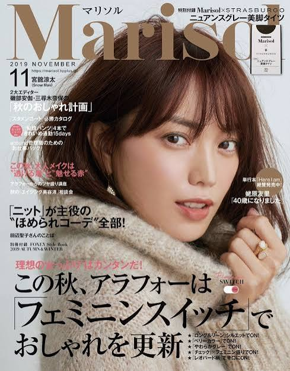
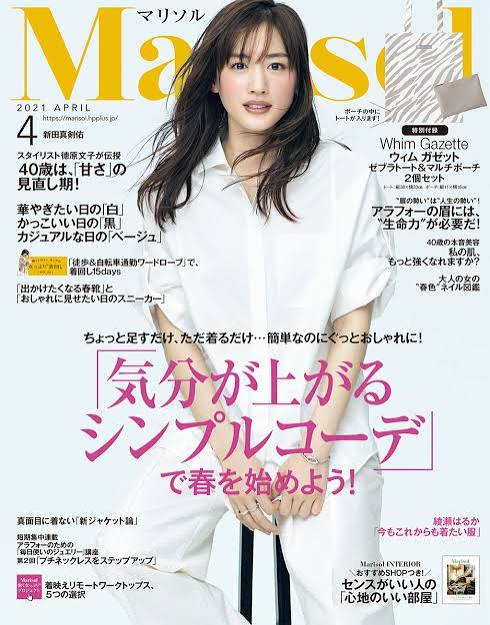
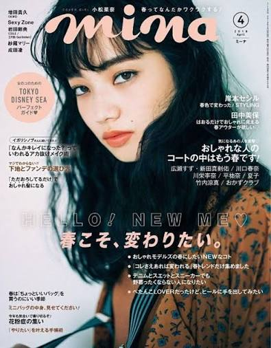
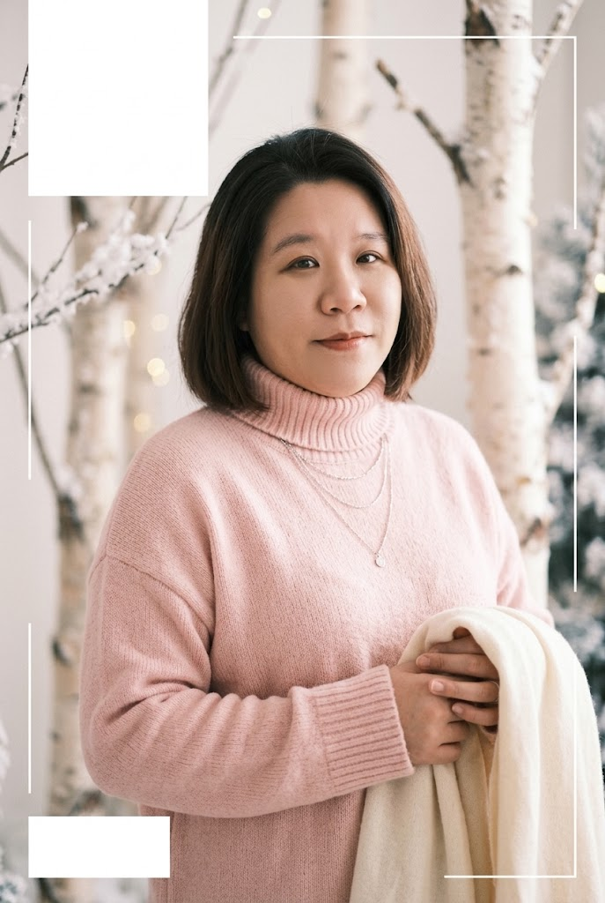

# AI 設計生成術：廣宣海報、社群圖片、影像編修與商品合成

## 先學會指揮 AI

### 一張圖的八格需求

提示詞可以拆成八格：

| 欄位 | 要回答的問題     | 例子                             |
| ---- | ---------------- | -------------------------------- |
| 用途 | 圖片要放哪裡？   | 文具展海報、IG 貼文、官網 Banner |
| 受眾 | 誰會看到？       | 學生、親子、上班族、登山愛好者   |
| 主體 | 最重要的是什麼？ | 耳機、蛋糕、鞋子、展覽標題       |
| 場景 | 主體在哪裡？     | 攝影棚、雪地、咖啡館、純色背景   |
| 構圖 | 怎麼安排？       | 中央主體、三分法、上方留標題區   |
| 風格 | 視覺語言         | 曼菲斯、極簡、手繪、水彩、棚拍   |
| 光色 | 光線與配色       | 柔光、暖色、藍粉高彩度           |
| 規格 | 比例、文字、限制 | 4:5、繁中、不得改商品外觀        |

```
### 低品質提示詞：
幫我做耳機廣告。

### 較完整提示詞：
以我上傳的白色耳罩式耳機為唯一商品主體，製作 4:5 的社群新品廣宣概念圖。極簡棚拍、淺灰到白色漸層背景、柔和高調光、耳機以 45 度角懸浮，右上方保留約 30% 空白供後續排字。不得改變耳罩形狀、頭帶結構、按鍵位置與商品顏色；不生成品牌 Logo、價格或不存在的功能文字。先生成無字版。
```

### 為什麼先做無字版

影像模型雖然愈來愈能處理文字，正式廣告仍應將活動日期、價格、法規說明、品牌名稱等關鍵內容，放到 Canva、PowerPoint、Figma 或影像軟體中用真正的文字層排版。原因包括：

- 生成文字可能錯字、漏字或自行改寫。
- 無法保證字型授權、行距與對齊。
- 修改日期時不應重生整張圖。
- 文字層才容易符合無障礙、印刷與品牌規範。

課堂可以允許 AI 生成「概念文字」，但交付版必須人工核對。

### 不知道風格名稱怎麼辦

- [GPT：介紹視覺風格](https://chatgpt.com/share/6a8afe80-692c-83e8-81f0-365526ff107f)

## 文具展廣宣海報

要製作「2026 台北文具展」概念海報，元素包含鉛筆、膠帶、筆記本、尺等文具，氣氛熱鬧，採藍色與粉紅色的曼菲斯風格。

課堂使用虛構活動資料，避免學生誤以為是真實展覽：

```text
活動名稱：2026 台北文具創意展（課堂虛構案例）
日期：08.01–08.10
地點：台北世貿一館（僅作排版示範）
標語：融合生活風格・創意文具設計
```

```text
### 提示詞
建立一張 4:5 直式活動海報的無字視覺底圖
主題為文具創意展，採曼菲斯設計語言：
明亮藍色與粉紅色、大膽幾何形狀、點線與波浪、鉛筆、橡皮擦、紙膠帶、尺與筆記本的精細插畫。
畫面熱鬧但需保留清楚資訊區：上方 25% 放活動標題，中段放主視覺，下方 20% 放日期地點。

### 活動資訊
活動名稱：2026 台北文具創意展（課堂虛構案例）
日期：08.01–08.10
地點：台北世貿一館（僅作排版示範）
標語：融合生活風格・創意文具設計
```

- [GPT：文具創意展曼菲斯海報底圖設計](https://share.gemini.google/NSEbQ0Hv4mrd)

<!-- 兩張 -->
<div style="display: flex; flex-wrap: wrap; gap: 20px;">
    
    
</div>

## 實例二——日系雜誌封面

教材保留「日系雜誌封面」這個案例，但課堂應使用本人、授權模特、圖庫授權或合成人像，不能任意上傳他人照片。

<!-- 三張 -->
<div style="display: flex; flex-wrap: wrap; gap: 20px;">
    
    
    
</div>

```text
### 提示詞--無字版
我上傳的已授權成人肖像為主體，維持人物可辨識特徵與姿勢，製作 2:3 直式日系流行雜誌封面的無字視覺稿。粉紅與奶油白配色、柔光、細緻顆粒、略帶夢幻的冬季時尚氛圍。
保留左上主標題區、左右兩側小標區與底部條碼區的空間，但不要生成任何文字、雜誌名稱、條碼或 Logo。人物不得被過度美化或改變年齡、族裔與身形。
```

```text
### 提示詞--給圖片模仿
我上傳的已授權成人肖像為主體，維持人物可辨識特徵與姿勢，製作 2:3 直式日系流行雜誌封面的無字視覺稿。
圖片風格與感覺參照我給你的參考圖
保留左上主標題區、左右兩側小標區與底部條碼區的空間，但不要生成任何文字、雜誌名稱、條碼或 Logo。人物不得被過度美化或改變年齡、族裔與身形。
```

- [GPT：日系冬季時尚雜誌封面生成](https://share.gemini.google/fvVoKjiVq9BI)



### 不會寫提示詞，就請 AI 拆解

```text
請分析這張參考圖的抽象設計語言，不要辨識或複製品牌。請用表格列出構圖、視覺層級、色彩、光線、留白、資訊密度、裝飾元素與情緒，再寫一段不含品牌名稱、不複製人物的原創提示詞。
請把需求拆成核心風格、人物特徵、色彩與光線、版面元素、禁止事項五區。每區列出我可以替換的關鍵字。
```

### 文字修正的現實策略

若 AI 生成錯字，不要反覆要求重生整張圖。正式流程：

1. 生成無字底圖。
2. 在 Canva、PowerPoint、Figma 等工具建立文字層。

# 第四部分：參考圖改版與電商廣宣

## 11. 實例三——提供參考圖，重新設計書籍封面

這個案例不是叫 AI 抄封面，而是讓它理解方向後創作新版本。

### 提示詞

> 圖一是我有權使用的舊版封面，只作為內容層級參考。請設計全新的 A5 直式書籍封面視覺，書名區、副標區、賣點區與作者區的資訊層級需清楚；使用藍色、黃色與粉紅色，活潑幾何插畫風。不要複製原圖的插畫、Logo、字體、構圖位置或裝飾。先生成無字底圖，並解釋新版本與參考圖的差異。

加入文字後可要求：

> 請只檢查版面：書名是否最醒目、副標是否次要、賣點是否過多、底部資訊是否擁擠。不要重新生成圖片，先提出三個排版修改方案。

## 12. 實例四——隨手拍耳機變廣宣圖

### 情境

電商小編只有一張桌上隨手拍耳機照：背景雜亂、光線普通、角度不一致。AI 可以生成棚拍概念，但必須保存商品真實細節。

### 先分析商品

> 請先分析上傳商品照，只列出可客觀確認的外觀：顏色、形狀、材質感、耳罩、頭帶、按鍵與拍攝角度。不要猜品牌、型號、音質、續航、價格或功能。列出在後續生成時必須保持不變的商品辨識特徵。

### 再生成無字廣宣

> 你是電商商品攝影與視覺設計師。以此耳機為唯一商品主體，保持外觀、比例、顏色、耳罩、頭帶與按鍵位置一致。建立極簡高級的 4:5 棚拍廣宣底圖：淺灰白漸層背景、柔和高調光、自然落影、45 度產品角度、畫面上方保留標題空間。不得生成 Logo、價格、規格、文案或不存在的商品細節。

### 社群文案提示詞

> 根據我提供的已確認賣點【貼上品牌核准資料】，寫 3 組繁體中文社群文案，每組包含 12 字內標題、40–60 字內文、行動呼籲與 5 個 Hashtag。不得自行新增音質、降噪、續航、保固或折扣數字；未提供的資訊請標記「需品牌確認」。語氣分為極簡、溫暖、潮流。

### 生成後檢查

- 左右耳是否被 AI 改成不同形狀？
- 按鍵、接縫、Logo、孔位是否憑空增加？
- 商品顏色是否偏離真品？
- 是否生成不存在的包裝或配件？
- 文案是否捏造性能？

---

# 第五部分：實例五——手繪草圖變商品照片

## 13. 草莓蛋糕案例

產品仍在開發，只有手繪草圖，卻需要提案視覺。AI 可快速產生概念照，但必須標示「概念示意」，不得用來假裝已上市實品。

### 第一步：忠實轉成實物概念照

> 依照我上傳且具有使用權的草莓蛋糕手繪草圖，生成一張寫實商品概念照。蛋糕為長方形草莓切片蛋糕，上方三顆完整草莓與奶油花，剖面為海綿蛋糕、草莓切片與鮮奶油交疊。保持草圖的層數、裝飾位置與比例；放在簡潔白瓷盤上，以自然柔光拍攝。不要生成文字、標籤、店家 Logo 或未畫在草圖中的裝飾。圖片僅供產品開發示意。

### 第二步：刪掉生成的說明文字

> 保留蛋糕、盤子、光線、角度與背景，只刪除畫面上的箭頭、手寫說明和所有文字；以自然背景紋理補齊，不增加其他物件。

### 第三步：做成草莓季廣宣底圖

> 以這張蛋糕概念照為主體，製作 2:3 直式草莓季廣宣底圖。柔和粉紅與奶油白、淡雅草莓葉片邊框、自然甜點攝影風；上方保留標題區，下方保留活動日期與門市資訊區。不要生成任何文字、價格或店家 Logo。

### 驗收問題

1. AI 是否改變蛋糕層數與草莓數量？
2. 切面食材是否符合開發配方？
3. 是否出現無法製作的結構？
4. 圖片是否清楚標記為概念示意？
5. 最終實品與示意差距是否可能誤導消費者？

### 練習題

請將手繪「珍珠奶茶可麗露」轉成商品概念照。學生先寫產品結構表，再寫提示詞。

提示：外殼、內餡、珍珠位置、數量、切面、盤子、光線、禁止增加物都要交代。

---

# 第六部分：AI 生成式修圖

## 14. 生成式修圖與傳統修圖不同

傳統修圖是直接操作像素、選取範圍、遮罩與圖層，結果更可控。生成式修圖會根據整體情境重新推測畫面，速度快，但可能連鄰近細節一起改掉。

因此應遵守三句話：

1. 說清楚要改什麼。
2. 說清楚什麼不能改。
3. 修改後放大比對原圖。

通用局部修改提示詞：

> 只修改【範圍／物件】：【修改內容】。保留【主體、姿勢、商品結構、鏡頭角度、光線、陰影、色彩與其他背景】完全不變。自然補齊遮住區域，不增加新物件。輸出前自行檢查邊緣、手指、文字、反射與重複紋理。

## 15. 實例六——一秒清除雜物

蛋糕照片左下有手機、右下有叉子。

### 精準提示詞

> 只移除蛋糕照片左下角的黑色手機與右下角的銀色叉子。保留蛋糕、草莓、蠟燭、杯子、盤子、桌面、景深、光線與構圖不變。以符合桌面材質、透視與散景的自然內容補齊，不增加任何新物件。

若工具提供塗抹／圈選，可粗略圈住物件，不需要精細到每個像素；但圈太大可能讓 AI 改到蛋糕或盤子。

### 驗收

- 被移除物件是否仍有影子或反光？
- 桌面紋理是否重複、扭曲？
- 蛋糕邊緣是否被吃掉？
- 杯子或蠟燭是否被意外改變？

## 16. 實例七——增加景物

貓咪照片要在頭上加入小皇冠：

> 只在貓咪頭頂中央增加一頂精緻的小型金色皇冠，大小符合頭部比例，遵循頭部角度與透視，產生自然接觸陰影。保留貓咪臉部、毛色、耳朵、眼睛、姿勢、背景與光線不變。皇冠不得遮住眼睛或耳朵。

學生常寫「加皇冠」就結束，AI 可能生成巨大皇冠、懸浮或遮臉。尺寸、位置、透視、接觸與不可遮擋物都要寫。

### 課堂題 3

想在咖啡杯旁增加一本書，提示詞至少需交代哪五項？

答案方向：書的位置、尺寸、角度、封面是否有字、光線與影子、不可遮擋咖啡杯、其他畫面不變。

## 17. 實例八——一鍵換背景

### 攝影棚版本

> 保持登山鞋商品本體、鞋帶、縫線、鞋底紋路、角度與比例完全一致，只將背景替換為專業攝影棚：深灰無縫背景、柔和側光、自然落影、電商商品攝影。不得增加 Logo、道具、泥土或改變鞋子顏色。

### 官網白底版本

> 保持商品本體完全一致，背景改為純白色 `#FFFFFF`，商品置中並保留自然淡影，四周留 10% 安全邊界。不得裁切鞋尖或鞋跟，不增加文字與標誌。

### 雪地情境版本

> 保持鞋子本體、角度與比例一致，將背景改為有遠方雪山的冬季雪地。鞋底與雪面需有合理接觸和淺腳印，冷色自然光，背景略微景深模糊。不得讓雪覆蓋商品關鍵細節。

### 重要提醒：不一定是真透明背景

畫面出現灰白棋盤格，不保證 PNG 真的有 Alpha Channel。可能只是模型畫了一張棋盤格。驗收方式：

1. 下載檔案。
2. 在支援透明度的軟體開啟。
3. 換成紅色或藍色底測試邊緣。
4. 確認背景真的穿透，而不是棋盤格像素。

正式電商去背仍應用專用工具或人工遮罩確認商品邊緣。

---

# 第七部分：多平台比例與一致性

## 18. 實例九——一次產生多比例

常見比例：

| 比例 | 常見用途                | 構圖注意                   |
| ---- | ----------------------- | -------------------------- |
| 1:1  | 商品縮圖、社群方形貼文  | 主體置中、四周安全邊界     |
| 4:5  | IG 直式貼文             | 上下資訊空間充足           |
| 9:16 | 限時動態、短影音封面    | 避開上下介面遮擋區         |
| 16:9 | YouTube、簡報、網站橫幅 | 左右延伸場景、主體不宜太大 |
| 4:3  | 傳統簡報與部分商品情境  | 保留水平敘事空間           |

### 提示詞

> 以我上傳的漢堡商品照為唯一基準，分別建立 16:9、1:1、4:5 三個版本。保持漢堡尺寸比例、配料層次、色彩、光線、角度與品牌辨識完全一致；只以向外補景方式調整畫布，不裁切、拉伸或重畫商品。背景延續黑色棚拍、煙霧與香料粒子。每個版本保留安全邊界，不生成文字。

### 為什麼 AI 版本可能仍不一致

生成式工具可能重新繪製漢堡，導致芝麻、番茄與配料改變。若商品真實性重要，更可靠流程是：

1. 先去背並鎖定同一商品圖層。
2. 使用生成式擴圖只補背景。
3. 在排版工具建立不同尺寸畫布。
4. 同一商品圖層置入各畫布，不讓 AI 重畫商品。

### 練習題

替耳機案例建立官網 16:9、IG 4:5、限時動態 9:16 規格，分別寫出安全留白位置。

答案方向：官網可右側留文案；IG 上方留標題；限動上下避開介面，中間保留商品與 CTA。

---

# 第八部分：商品與模特兒合成

## 19. 實例十——模特兒穿戴商品展示

教材保留「耳機＋模特兒」案例，但課堂必須先說清楚授權：

- 模特兒必須本人同意、已授權圖庫或合成人像。
- 不拿名人、網紅、同事或陌生人照片製造未同意代言。
- 商品細節不得被 AI 改造後仍宣稱是真實產品。
- 合成圖應依用途標示為示意，不能誤導尺碼、佩戴效果或功能。

### 多圖合成提示詞

> 圖一是已授權的成人模特兒照片，圖二是耳機商品照。將圖二耳機自然佩戴在圖一模特兒頭上。保持人物臉部、髮型、膚色、表情、身形、服裝與背景不變；保持耳機的顏色、耳罩形狀、頭帶寬度、按鍵與 Logo 位置不變。依頭部尺寸調整比例，耳罩需對準雙耳，頭帶遵循頭頂曲線，頭髮與耳機要有合理前後遮擋與接觸陰影。不得新增飾品、改妝或改變商品設計。輸出 4:5 電商展示概念圖。

### 合成驗收清單

- 耳罩是否真的對準雙耳？
- 頭帶是否穿過頭髮或頭部？
- 左右耳機尺寸是否一致？
- 商品按鍵、Logo、顏色是否正確？
- 人物臉部、手指、耳朵是否變形？
- 光線、色溫、銳利度是否一致？
- 是否有授權與必要的 AI 合成標示？

### 延伸練習

將耳機改為帽子、眼鏡或包包時，各有哪些新風險？

答案方向：眼鏡要對準鼻樑與耳朵；帽子涉及頭圍和頭髮遮擋；包包涉及肩帶受力、手部與身體遮擋。服飾還涉及材質垂墜與真實尺寸。

## [Threads：第一屆《threads ChatGPT指令》大賽](https://www.threads.com/share/JF-zijvz1/)
