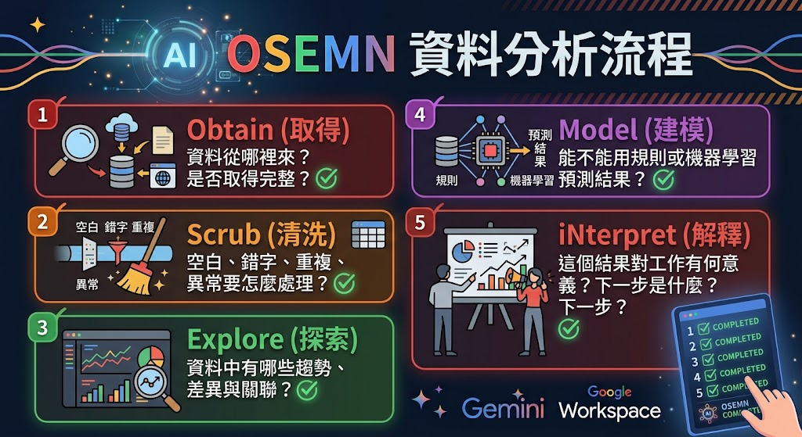

# AI資料分析術：從資料清洗、流失預測到互動儀表板

各位今天不是來背統計公式，也不是要在一堂課內變成資料科學家。我們要學的是一套能在工作上立即使用的分析流程：拿到資料後，先確認資料代表什麼，再清理錯誤、觀察規律、建立預測，最後把結果講成主管聽得懂、同事做得到的建議。

AI 可以幫我們加速，但它不是「按一下就永遠正確」的魔法。資料如果錯，AI 只會更快地產生錯誤結論。今天最重要的一句話就是：先驗證資料，再相信圖表；先理解問題，再要求模型。

1. 公司有一萬筆會員資料時，你會從哪裡開始看？
2. 空白欄位應該刪掉、填 0，還是保留？三種做法會有何差異？
3. 「年長客戶流失率較高」能不能直接推論「年齡造成流失」？
4. 主管真正想聽的是演算法名稱，還是下一步該做什麼？

## 先懂 OSEMN，不要一拿到資料就畫圖

OSEMN 是一套資料分析流程，可記成：

1. **Obtain（取得）**：資料從哪裡來？是否取得完整？
2. **Scrub（清洗）**：空白、錯字、重複、異常要怎麼處理？
3. **Explore（探索）**：資料中有哪些趨勢、差異與關聯？
4. **Model（建模）**：能不能用規則或機器學習預測結果？
5. **iNterpret（解釋）**：這個結果對工作有何意義？下一步是什麼？

以高中程度比喻：

- Obtain：收齊報名表。
- Scrub：補齊姓名、移除重複報名、修正錯誤電話。
- Explore：看看大家偏好哪個地點、哪個年級參加最多。
- Model：預估需要幾台遊覽車、哪些人可能臨時取消。
- iNterpret：把結果整理成老師能決策的行程與預算。



生成式 AI 能協助每一步，但不會替你承擔資料正確性與決策責任。

## CRM 案例：先認識每一欄在說什麼

原教材使用 `crm.csv` 作為客戶管理資料。欄位如下：

### Obtain（取得）

```text
### Obtain
我會上傳一份 CRM CSV。請先不要建立模型。
請依序完成：
1. 列出每個欄位的資料型態、商業意義、合法範圍與可能問題。
2. 指出哪些欄位是識別碼、特徵、目標欄位或衍生欄位。
3. 提出至少 8 個可回答的商業問題。
4. 列出分析前需要向資料擁有者確認的事項。
5. 將推測與資料中可直接確認的事實分開標示。
```

- [GPT：CRM--Obtain](https://chatgpt.com/share/6a89d7ea-6ef8-83ee-9e0a-2c4024b23205)

### Scrub：資料清洗與 GIGO

Garbage In, Garbage Out（垃圾進，垃圾出）：輸入資料若錯誤，畫面再漂亮、模型再複雜也不可信。

五種常見問題

| 問題                 | 高中程度解釋       | CRM 例子                           |
| -------------------- | ------------------ | ---------------------------------- |
| 缺失值 Missing Value | 格子沒有資料       | `Age` 空白、`Gender` 為 NaN        |
| 異常值 Outlier       | 和大多數資料差太遠 | 年齡 300、消費金額突然高百倍       |
| 無效值 Invalid Value | 不符合規則         | 性別填 `X123`、日期為 `2023-02-30` |
| 重複值 Duplicate     | 同一筆被輸入多次   | 同一 CustomerID 重複               |
| 不一致 Inconsistent  | 同一概念有多種寫法 | M、Male、male；NT$、TWD、$         |

```text
### Scrub：確認資料
請協助進行資料清洗，但先不要改資料。
請先列出這份資料可能有哪些問題、如何偵測、預計怎麼處理、處理風險與替代方案。
請將結果整理成「欄位、問題、判定規則、建議處理、理由、需人工確認」六欄表格。
```

```text
### Scrub：執行清洗
請幫我做資料清洗，檢查並處理缺失值和不合理值。
規則如下：
- 重複 CustomerID：保留最後更新日期較新的紀錄，但先列出被刪除的資料。
- Gender：M/Male/male 統一為 Male；F/Female/female 統一為 Female；無法判斷則 Unknown。
- Age：空值使用中位數僅作示範，並新增 AgeWasImputed 欄位；小於 15 或大於 100 先標記，不自行刪除。
- 日期：統一為 YYYY-MM-DD，無效日期列入錯誤清單。
- TotalOrders、TotalSpent：不得為負數；除以 0 時 AvgOrderValue 留空並標記。
請輸出：清洗摘要、變更筆數、例外清單、清洗後資料預覽，以及人工覆核事項。
```

- [GPT：CRM--Scrub](https://chatgpt.com/share/6a89db0f-53e0-83e8-888a-9b6ad0987b27)

### Explore：從資料找模式

探索的目的不是證明原本的猜測，而是找出值得進一步查證的現象。

```text
### 提示詞：流失率預測圖表
請以清洗後的 CRM 資料進行探索分析，暫時不要下因果結論。
請分析：
1. 不同年齡層的客戶數與流失率。
2. TotalSpent、TotalOrders、AvgOrderValue、DaysSinceLastPurchase 與 Churn 的關係。
3. 高消費客戶的流失情形與離群值。
4. 使用 RFM 概念找出高價值、沉睡、可能流失客戶。
5. 為每一項提供合適圖表、觀察、限制與下一步驗證方法。
請明確標示「資料事實」「合理推測」「不可由資料判斷」。
```

- [GPT：CRM--Explore](https://chatgpt.com/share/6a89dfb8-e1e8-83e8-8353-98b76743dd3b)

### Model：建立流失預測模型

想像班上有很多位同學，各自根據不同線索投票判斷某人是否會缺席：有人看過去出席率，有人看遲到次數，有人看請假紀錄。單一同學可能誤判，但許多人用不同線索投票，通常更穩定。

Random Forest 就像很多棵「決策樹」共同投票。

```text
### 提示詞：建立模型
請用這份清洗後的 CRM 資料建立「流失風險」模型。
先檢查樣本數、類別比例、資料洩漏與日期切分問題，再決定是否適合 Random Forest。
請說明：
1. 特徵與目標欄位。
2. 類別編碼及衍生欄位。
3. 訓練／測試切分方式及理由。
4. Accuracy、Precision、Recall、F1、混淆矩陣。
5. 特徵重要性，但不得解釋為因果。
6. 高風險名單及可執行行動。
7. 模型限制、偏誤與人工覆核流程。
如果資料不足，請停止建模並說明還缺什麼。
```

- [GPT：CRM--Model](https://chatgpt.com/share/6a89e1b3-001c-83ee-ae8a-4a5f6a801a04)

### iNterpret：把模型翻譯成商業語言

- **Recall（召回率）**：真正會流失的 100 人中，抓到幾人。像漁網網眼夠不夠密。
- **Precision（精確率）**：被模型警示的 100 人中，真的會流失的有幾人。像撈上來的有多少真的是目標魚。
- **F1-score**：在 Precision 和 Recall 間取得平衡。

```text
### 提示詞：解釋結果
我要向不懂機器學習的主管說明結果。
請不要從演算法開始，而要依序說明：商業問題、資料範圍、主要發現、可信程度、風險限制、建議行動、驗證指標。
把 Precision、Recall 與 F1 各用一個生活比喻解釋。
所有百分比都標示分母與樣本數；推測不得寫成事實。
最後提供 60 秒口頭版與一頁主管摘要版。
```

- [GPT：CRM--iNterpret](https://chatgpt.com/share/6a89e273-8ee0-83e8-93db-32905dfdbdb9)

## NotebookLM幫你完成專業又深入的資料分析報告

Deep Research 適合需要蒐集多個來源、比較資料、產生有來源報告的任務。它不是「真相按鈕」；研究範圍若沒寫清楚，結果可能偏題。

操作示範

1. 在 NotebookLM 建立新筆記本，例如「CRM 客戶流失研究」。
2. 匯入剛才的 Google 文件、CSV 說明、政策或研究資料。
3. 只勾選本次報告需要的來源。
4. 先請它產出摘要與來源對照，再建立報告。
5. 點擊引用回到來源核對，不能只看摘要。

```text
### 提示詞CRM 深度研究
請針對附件 CRM 資料建立一份管理決策研究報告。
研究問題：哪些客戶最可能流失？哪些特徵最有行動價值？
限制：
不得搜尋或推測個人身分；不得把相關性寫成因果；不得虛構缺失資料。
只根據目前勾選的來源，製作「CRM 客戶流失案例分析」。
每項數字與關鍵結論都附來源標記。
若來源沒有答案，請寫「來源未提供」，不得自行補寫。

請先提出研究計畫，經我確認後再執行。
報告需包含資料品質、描述統計、分群、流失模型、模型評估、商業建議、限制、後續實驗與引用來源。
結構：問題背景、資料範圍、清洗方法、主要發現、模型結果、建議、限制、待補資料。
```

- [GPT：CRM 客戶流失研究](https://notebook.google.com/notebook/c39ac500-6b8d-4192-ab4e-725cd7fcaab0)
