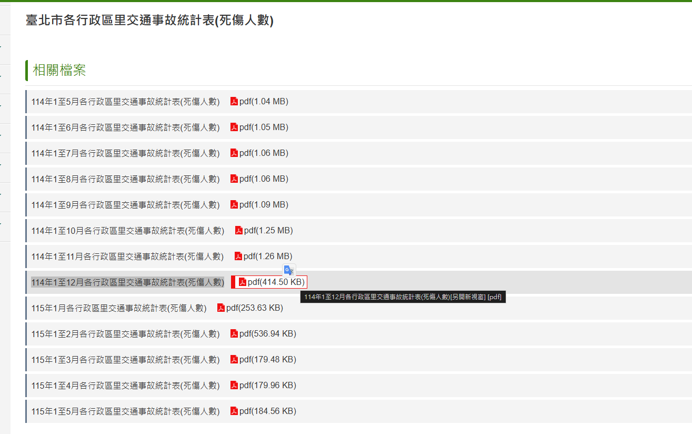

# AI 資料整理術

## 🔴用 AI 處理複雜的表格資料

傳統做法可能要使用篩選、樞紐分析、SUMIFS 或 Excel 函數；這邊使用 Gemini 快速整理，再把結果貼回 Excel 或匯出到 Google Sheets。

AI 的價值不是代替我們理解數據，而是先做第一輪彙整。

### 範例：

這邊有一份銷售紀錄.csv，我需要統計每項商品的總銷售數量與總銷售金額，並分別指出「銷售數量最高」及「銷售金額最高」的商品。

- [檔案：三個月銷售紀錄.csv](./三個月銷售紀錄.csv)

1. 開啟 Gemini。
2. 將 Excel 檔拖曳至對話框。
3. 輸入提示詞
4. 使用結果旁的複製功能貼回 Excel，或匯出至 Google Sheets。

```text
### 基礎版提示詞
你是一位資料分析助理。請僅根據我上傳的銷售明細檔進行分析：

1. 統計每個月份的總銷售額。
2. 統計每項商品的總銷售數量與總銷售金額。
3. 分別指出「銷售數量最高」及「銷售金額最高」的商品。
4. 製作 Markdown 表格，金額加上千分位。
5. 說明你的分組欄位與計算方式。
6. 若資料有空白、重複列或格式異常，請先列出，不要自行猜測或補值。
所有觀察都要附對應數字；資料未提供的原因不可寫成事實。
```

- [GPT：銷售統計分析](https://chatgpt.com/share/6a8f037e-c658-83e8-ac20-60f19d851eb5)

### 🔵 Problem. 電商商品銷售分析

你收到一份電商平台近三個月的銷售紀錄，共 100 筆交易資料。

請將 CSV 上傳至 AI，分析：

- 每個月份的總銷售金額。
- 每項商品的總銷售數量與總銷售金額。
- 找出銷售數量最高的商品。
- 找出銷售金額最高的商品。
- 檢查資料是否存在空白、重複或格式異常。

- [檔案：電商銷售紀錄](./電商銷售紀錄.csv)

### 🔵 Problem. 咖啡店門市營運分析

你是連鎖咖啡品牌的營運助理，收到 100 筆門市銷售紀錄，希望利用 AI 快速了解不同門市與商品的營運表現。

請分析：

- 每間門市的總營業額。
- 每間門市的平均每筆消費金額。
- 各商品的銷售數量。
- 找出營業額最高的門市。
- 找出最暢銷的商品。
- 比較「平日」與「假日」的總營業額。
- 將重要發現整理成表格與 3 點摘要。

### 🔵 Problem. 線上課程學習成效分析

你收到一份線上課程平台的 100 筆學生學習紀錄，希望了解不同課程的學習狀況。

請使用 AI：

- 統計每門課程的學生人數。
- 計算每門課程的平均完成率。
- 計算每門課程的平均測驗分數。
- 找出平均完成率最高的課程。
- 找出平均測驗成績最高的課程。
- 統計完成率低於 50% 的學生人數。
- 找出「完成率低於 50%，但測驗成績高於 80 分」的學生。

- [檔案：咖啡店營運紀錄.csv](./咖啡店營運紀錄.csv)

### 🔵 Problem. 客服案件資料分析

你收到公司近一段時間的 100 筆客服案件紀錄，主管希望快速了解目前最常發生的問題，以及客服處理效率。

請利用 AI：

- 統計不同問題類型的案件數量。
- 計算不同問題類型的平均處理時間。
- 找出案件數量最多的問題類型。
- 找出平均處理時間最長的問題類型。
- 比較不同客服人員的平均處理時間。
- 統計「未解決」案件數量。
- 找出處理時間超過 60 分鐘的案件。
- 將結果整理成表格，並提出 3 個值得主管進一步關注的數據現象。

- [檔案：客服案件紀錄.csv](./客服案件紀錄.csv)

## 🔴NotebookLM 從複雜 PDF 抓數據、彙整成表格

資料常分散在多份 PDF 的不同頁面與表格中。原教材以台北市道路交通事故統計為例，將三份不同年度的 PDF 匯入 NotebookLM，請 AI 單獨抓出台北市資料並製成表格。

### 為什麼使用 NotebookLM？

- 回答可限定於匯入來源。
- 適合跨多份文件比較。
- 可追溯引用來源，較方便人工核查。
- 比一般聊天機器人更不容易混入未提供的外部資料，**但仍非絕對正確**。

### 範例：製作「台北市車禍案件」表格

- [檔案：臺北市道路交通事故時間數列統計資料](https://tsis.dbas.gov.taipei/statis/webMain.aspx?sys=220&ymf=5700&kind=21&type=0&funid=a05029601&cycle=4&outmode=12&compmode=0&outkind=1&deflst=2&nzo=1)
- [連結：臺北市各行政區里交通事故統計表(死傷人數)](https://www.roadsafety.taipei/News_Content.aspx?n=4F733E48A5ADF724&sms=9B0165E4E41434FF&s=C911309E2C57319E)



1. 進入 NotebookLM：https://notebooklm.google/
2. 建立新筆記本。
3. 在「新增來源」選擇上傳檔案。
4. 在對話框貼上提示詞並送出。
5. 檢查表格內每個數字的引用標記。
6. 將結果儲存為記事，方便後續使用。


```text
### 提示詞
你是一位政府統計資料整理員。請分別抓出「台北市」資料，不要混入新北市或全國統計。

請按年度製作表格，欄位包含：
1. 肇事件數
2. 死亡人數
3. 受傷人數
4. 主要肇事原因及件數
5. 資料來源檔名與頁碼

規則：
- 保留原始單位與定義。
- 若不同年度定義不同，請不要硬合併，另加「口徑差異」說明。
- 找不到的欄位填「來源未提供」，不可自行推估。
- 表格後列出 3 點趨勢，但每點必須附數據依據。
```

- [GPT：Taipei City District and Village Traffic Accident Statistics](https://notebook.google.com/notebook/6a9e2ab2-6c6a-4d43-9219-d8d0876d84c0)

### 🔵 Problem. 臺南市各行政區人口變化比較

請前往「臺南市政府資料開放平台」，利用以下資料：

- [114年6月現住人口統計表](https://data.tainan.gov.tw/Resource/de9506ea-13be-40af-acce-ff8f58155524?utm_source=chatgpt.com)
- [114年12月現住人口統計表](https://data.tainan.gov.tw/Resource/e51c63c7-08fc-4bcf-b8b0-6aeae6678144?utm_source=chatgpt.com)
- [115年6月現住人口統計表](https://data.tainan.gov.tw/Resource/dcd755ae-bf2a-4ef1-a9a4-f26222f586bf?utm_source=chatgpt.com)

將三份資料加入 NotebookLM，請 AI 跨資料來源比較 臺南市各行政區人口變化。

最後製作表格，至少包含：行政區、114年6月人口、114年12月人口、115年6月人口、期間人口增減數、男女人口。

並找出：

- 期間人口增加最多的行政區。
- 期間人口減少最多的行政區。
- 115 年 6 月人口最多的前 5 個行政區。

每項結果都必須能回到原始資料核對，不可以自行推估原因。

<!--
```text
你是一位政府人口統計資料整理員。

我提供了不同月份的「臺南市現住人口統計表」，請僅根據我提供的資料進行跨來源比較。

請製作一張表格，欄位包含：
1. 行政區
2. 114年6月人口數
3. 114年12月人口數
4. 115年6月人口數
5. 114年6月至115年6月人口增減數
6. 115年6月男性人口
7. 115年6月女性人口
8. 資料來源

接著回答：
- 哪個行政區人口增加最多？
- 哪個行政區人口減少最多？
- 115年6月人口最多的前5個行政區為何？
- 根據數字整理3點值得注意的變化。

規則：
- 「臺南市」總計列不要當成行政區參與排名。
- 數字使用千分位。
- 所有數字都必須來自提供的資料。
- 若不同資料的欄位或定義不同，請先指出。
- 不可自行推測人口增加或減少的原因。
- 每項重要結果都要標示對應來源，方便人工核查。
```
-->

### 🔵 Problem. 找出人口最多、最密集的行政區

請從臺南市政府資料開放平台取得：

- [115年6月現住人口統計表](https://data.tainan.gov.tw/Resource/dcd755ae-bf2a-4ef1-a9a4-f26222f586bf?utm_source=chatgpt.com)
- [臺南市所轄面積暨行政區里鄰數](https://data.tainan.gov.tw/Resource/b8f20a27-c24f-4076-a6d0-29ff0b90c0cb?handler=GoJson&utm_source=chatgpt.com)

要求 AI 依照「行政區」合併資料，並製作表格。欄位如下：

```
[行政區｜人口數｜面積｜人口密度｜戶數｜平均每戶人口]

其中：
- 人口密度 = 人口數 ÷ 面積（平方公里）
- 平均每戶人口 = 人口數 ÷ 戶數

接著找出人口最多、面積最大、人口密度最高、人口密度最低的行政區。
```

### 🔵 Problem. 半年內，臺南人口怎麼變？

請在臺南市政府資料開放平台找出 115 年不同月份的現住人口統計表。

- [115年3月現住人口統計表](https://data.tainan.gov.tw/Resource/2a00f028-6c8f-4421-8d1c-323b46fb6d62?utm_source=chatgpt.com)
- [115年4月現住人口統計表](https://data.tainan.gov.tw/Resource/7507f1b9-d7a0-4c99-9900-bce0b2e22e81?utm_source=chatgpt.com)
- [115年6月現住人口統計表](https://data.tainan.gov.tw/Resource/dcd755ae-bf2a-4ef1-a9a4-f26222f586bf?utm_source=chatgpt.com)

將資料加入 NotebookLM 後，選擇 新營區、永康區、安南區、中西區、善化區等行政區，製作人口時間序列表格。欄位如下：

```text
[行政區｜3月人口｜4月人口｜6月人口｜3→6月增減｜增減率]
```

並回答：「哪些行政區呈現增加？哪些呈現減少？」

限制：只能描述資料呈現的趨勢，不能看到人口增加就自行寫成『因為科技業發展帶動人口移入』。如果來源沒有提供原因，就必須明確寫成無法由本資料判斷。

### 🔵 Problem. 實際人口 VS 未來人口推估

臺南市政府資料開放平台另外有「臺南市人口推估」，資料包含 age、total、male、female、area、scope、year，目前平台列有 2025–2070 的推估資料。

- [臺南市人口推估資料](https://data.tainan.gov.tw/DataSet/Detail/6c303a79-f784-4594-84ec-0fd644017e18?utm_source=chatgpt.com)

請學生把「實際現住人口資料」與「人口推估資料」一起交給 NotebookLM，分析：2025／2026 實際人口 → 2030 → 2040 → 2050 → 2070 推估人口。並回答：

- 哪些行政區未來人口下降較明顯？
- 哪些行政區相對穩定？
- 男女人口結構如何改變？
- 2025–2070 的人口變化幅度是多少？
- 哪些數字是「實際統計」，哪些是「人口推估」？

## 🔴全自動抓網頁資料並即時找出洞見

這邊以網路書店暢銷榜為例：把多個來源網址貼入 NotebookLM，請 AI 比較榜單、找閱讀趨勢或整理排名。

1. 新建 NotebookLM 筆記本。
2. 選擇「網站」來源。
3. 貼入書店暢銷榜網址；多個網址通常以空格或換行分隔。
4. 查看 AI 自動摘要，但不要把摘要當作唯一答案。

```text
### 書店暢銷榜
博客來-暢銷榜：https://www.books.com.tw/web/sys_saletopb/books/?gad_source=1&gad_campaignid=24030455903&gbraid=0AAAAAD4DKPxCmLso3quUK9N6uoUKSRWbp&gclid=CjwKCAjwvsvTBhBaEiwAmf-3nrUOysTQQlm92lhNqruIuPRcjxys_hvDg3fnNxyR0TG43STViGVfnBoCNAsQAvD_BwE
成品線上-暢銷榜：https://www.eslite.com/best-sellers/bookstore?srsltid=AfmBOopP7bBt0iZiqkVl-OG4L1TyxrpZZy4xs_2X8p6L-7kAIBfkgRRW
金石堂－網路門市暢銷榜：https://www.kingstone.com.tw/bestseller/shop/book/?srsltid=AfmBOopS8pxLAJGBZsZRXk5X4APHfnDBDBSqI1995QdE2LH-Qn72lI19
```


```text
### 提示詞--趨勢分析
請只根據已加入的三個中文書暢銷榜來源，分析目前閱讀趨勢。

請輸出：
1. 各榜單前 10 名（書名、作者、名次、來源）。
2. 跨榜重複出現的書籍，依出現次數排序。
3. 可由榜單支持的 3 項閱讀趨勢。
4. 各來源的資料缺漏或擷取限制。

書名請做最小幅度標準化，但套書、續集、限定版不得擅自視為同一本。
找不到第 9、10 名時填「來源未擷取」，不可臆測。
```

```text
### 提示詞--暢銷榜做成表格
請將博客來與金玉堂的榜單並排比較。並整理成表格。每列為排名 1～10，
欄位為「排名、博客來書名／作者、金玉堂書名／作者」。
請移除網頁中的 <br> 等標記。資料缺漏要寫「來源未提供」。
表格後另列：
- 兩榜皆出現的作品
- 系列作與不同版本的判定說明
- 資料擷取時間與限制
```

- [GPT：網路書店暢銷榜](https://notebook.google.com/notebook/9ae37c46-b499-451f-81b4-157168db17ae)

### Problem. 比較三家超商的最新活動

請蒐集 7-ELEVEN、全家便利商店、萊爾富官方網站或官方社群所公布的近期促銷活動，針對三家便利商店的促銷策略進行整理與比較

- 各選擇 3 項目前仍在活動期間內的促銷活動，記錄活動名稱、活動期間、適用商品與優惠內容。
- 將優惠方式分類，例如「直接折扣」、「第二件優惠」、「多件組合價」、「會員限定」、「點數回饋」等。
- 比較三家便利商店採用的優惠方式，找出共同使用的促銷類型以及各品牌較具特色的促銷方式。
- 將蒐集結果整理成比較表格，所有活動皆須註明資料來源與查詢日期。
- 根據整理結果，以實際活動資料為依據，提出 2～3 點觀察；若資料無法支持原因或成效判斷，不可自行推測。

### Problem. 比較三家航空公司的行李規定

請查詢長榮航空、中華航空與星宇航空的官方網站，比較三家航空公司目前公布的免費行李規定。

請完成以下任務：

- 分別整理三家航空公司的手提行李與託運行李規定。
- 比較手提行李的件數、重量與尺寸限制。
- 比較經濟艙託運行李的免費件數、單件重量與尺寸限制。
- 若不同航線、票價產品或會員身分會影響行李額度，請在表格中特別註明，不可將不- 同條件的規定直接比較。
- 將結果整理成比較表格，並標示資料來源與查詢日期。
- 根據整理結果，歸納三家航空公司行李規定的共同點與主要差異。

### Problem. 比較三家銀行的數位帳戶

請閱讀指定的三家銀行數位帳戶官方介紹資料，針對 王道銀行數位帳戶、臺灣企銀 Hokii 數位帳戶、永豐銀行 DAWHO 數位帳戶進行權益比較。

```text
王道數位帳戶：https://myppt.cc/zLwJYo
台企Hokii數位帳戶：https://www.tbb.com.tw/zh-tw/digital/hokii/digital-account/intro
永豐DAWHO：https://myppt.cc/Bjb0Ub
```

請完成以下任務：

- 整理各數位帳戶的活期存款利率，並同時記錄適用期間、額度上限及利率適用條件。
- 比較各帳戶的跨行提款優惠，包含每月免費次數及取得優惠的資格條件。
- 比較各帳戶的跨行轉帳優惠，包含每月免費次數及相關限制。
- 將上述資訊製作成比較表格，欄位至少包含「銀行／帳戶名稱、活存利率、利率適用條件、跨行提款優惠、跨行轉帳優惠、優惠期間」。
- 根據官方資料，分別說明三種帳戶在不同需求情境下的差異，例如「重視活存利率」、「經常跨行轉帳」或「經常跨行提款」。
- 所有資訊皆須標示資料來源與查詢日期；若指定來源未提供相關資訊，請標示「來源未提供」，不得自行補充或推測。
- 資料判讀原則：若優惠具有新戶限定、指定任務、存款金額上限、會員等級或活動期間等條件，必須與優惠數字一併呈現，不可只擷取最高利率或最高優惠次數進行比較。
