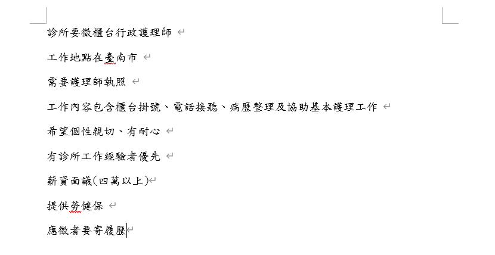
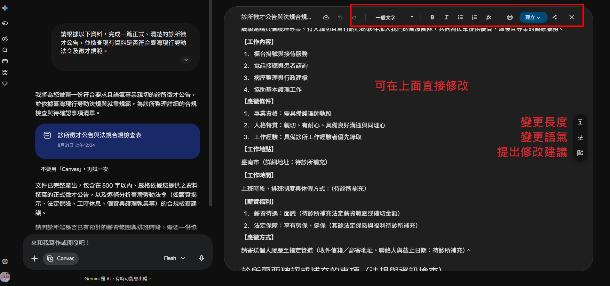
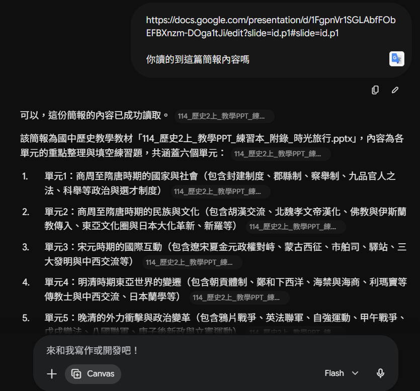
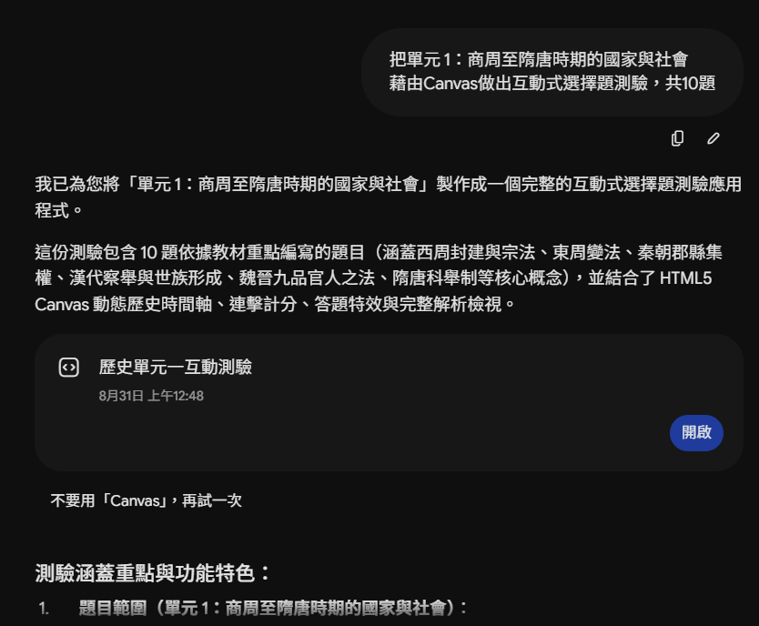
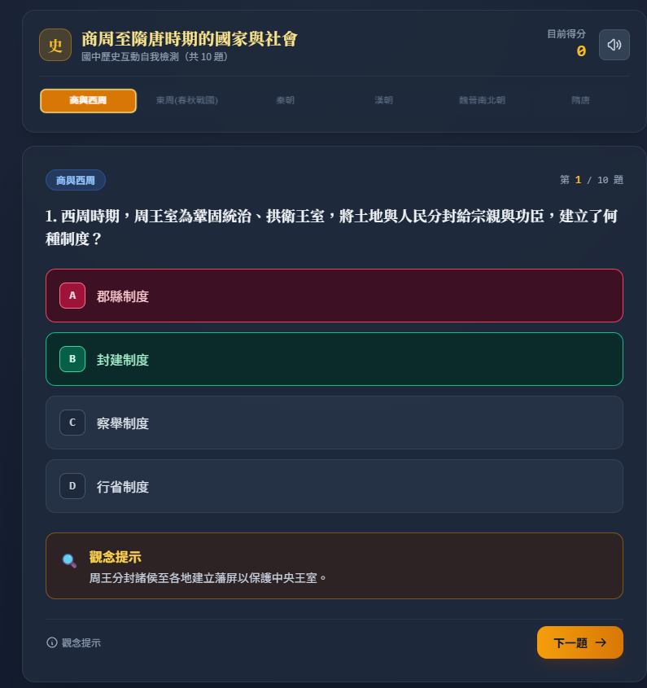
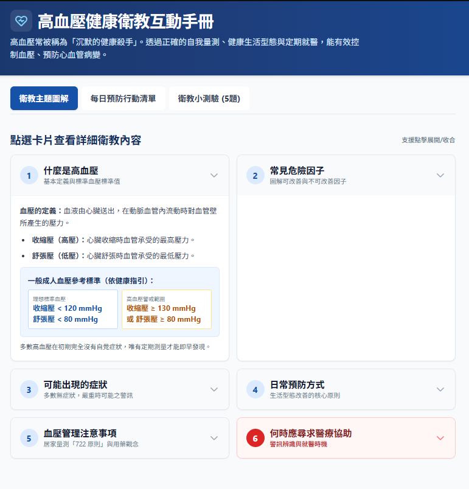
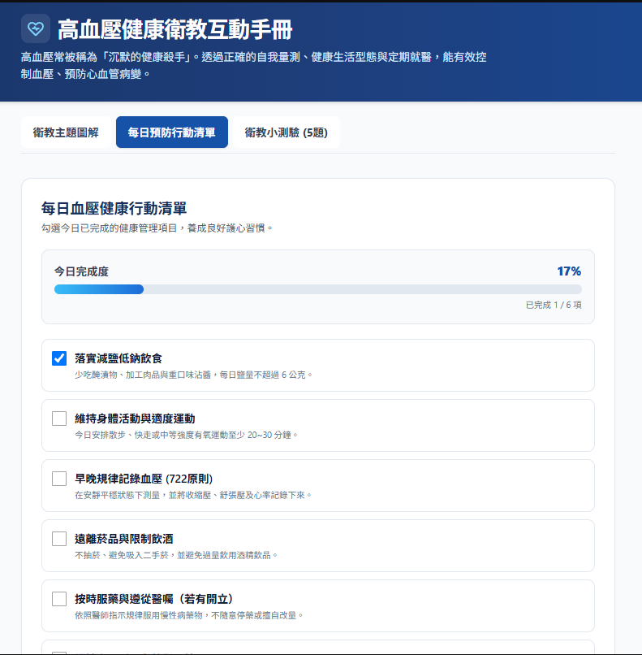
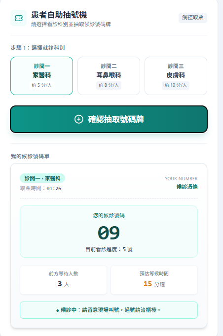
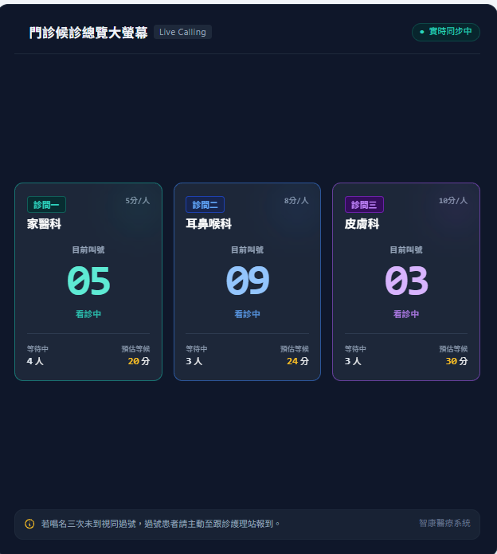

# Gemini Canvas 完整應用

## Gemini Canvas 是什麼？

Gemini Canvas 是 Gemini 內建的內容創作與程式開發工作區。

一般使用 Gemini 時，我們會在對話區提出問題，再取得一次性的回答；Canvas 則會在畫面旁邊開啟一塊獨立工作區，讓使用者直接閱讀、修改與預覽 Gemini 產生的內容。

你可以把它想像成「AI 對話區＋內容編輯器」。使用者負責描述需求，Gemini 負責產生初稿；若內容不符合期待，可以繼續要求它修改，不需要每次都從頭製作。


Canvas 適合處理較完整、需要反覆調整的作品，例如：

- 撰寫文章與課程教材
- 製作簡報
- 建立互動式測驗
- 將文件轉成語音內容
- 使用自然語言開發網頁與小型應用程式

## Gemini Canvas 的五大應用

| 類別              | 主要產出       | 例子                                |
| ----------------- | -------------- | ----------------------------------- |
| 1. 寫作協作       | 文件內容       | 文章、教材、企畫書、報告            |
| 2. 簡報生成       | 視覺簡報       | Google Slides、提案簡報、課程投影片 |
| 3. Vibe Coding    | 可操作的程式   | 網頁、小遊戲、動畫、訂單系統        |
| 4. 互動式學習     | 測驗與學習工具 | 測驗、單字卡、模擬考、學習指南      |
| 5. 多媒體內容轉換 | 聲音與互動視覺 | Audio Overview、資訊圖表、互動網頁  |

## 寫作協作

Canvas 可以協助撰寫及修改較長的內容。使用者不必一次提供完整指令，可以先讓 Gemini 產生初稿，再針對特定段落逐步調整。

### 範例：撰寫診所徵才公告

- [GPT：Canvas：撰寫診所徵才公告](https://share.gemini.google/95Ka6Yz52L9s)

假設診所準備聘請一位櫃台行政護理師，目前只有以下零散資訊：



可以在 Gemini Canvas 輸入：

```text
請根據以下資料，完成一篇正式、清楚的診所徵才公告，並檢查現有資料是否符合臺灣現行勞動法令及徵才規範。

### 寫作要求
* 使用繁體中文。
* 職缺名稱為「櫃台行政護理師」。
* 語氣專業、親切，不要使用過度活潑或誇大的徵才用語。
* 依序整理「職缺介紹、工作內容、應徵條件、工作地點、工作時間、薪資福利及應徵方式」。
* 不要自行增加診所未提供的工作條件、薪資或福利。
* 缺少的資料請標示「待診所補充」，不要自行猜測。
* 徵才公告正文控制在500字以內。

### 職缺資料
* 職缺名稱：櫃台行政護理師
* 工作地點：臺南市
* 專業資格：需具備護理師執照
* 工作內容：櫃台掛號、電話接聽、病歷整理及協助基本護理工作
* 人格特質：親切、有耐心
* 工作經驗：具備診所工作經驗者優先
* 薪資：目前暫定面議
* 福利：提供勞保、健保
* 應徵方式：寄送履歷

### 法規與資訊檢查
完成公告後，請另外建立「診所需要確認或補充的事項」，不要將此部分計入500字限制。
請依據臺灣目前有效的官方法規與勞動部資料，檢查以下項目：
1. 「薪資面議」是否符合《就業服務法》的薪資揭示規定；若不符合，請說明應如何修改。
2. 是否需要補充明確的月薪、時薪或薪資範圍。
3. 是否缺少聘僱類型，例如全職、兼職、定期契約或不定期契約。
4. 是否缺少上班時段、每日與每週工時、休息時間、排班方式及休假制度。
5. 若涉及輪班、假日出勤或加班，應注意哪些工時、休息、休假與加班費規定。
6. 除勞保、健保外，是否還需要確認就業保險、勞工職業災害保險及勞工退休金提繳。
7. 應徵條件是否可能涉及就業歧視、個人資料蒐集或其他不適當限制。
8. 「協助基本護理工作」的內容是否需要再明確說明，避免職責範圍不清。
9. 是否缺少診所名稱、詳細工作地址、聯絡方式、履歷收件方式及截止日期。
10. 其他依法應確認，但目前資料未提供的聘僱事項。

若無法確認某項規定，請清楚標示「建議向臺南市勞工局或專業人士確認」，不要自行推測。法規內容以臺灣政府及勞動部的最新官方資料為準。
```



```text
[放上修改好的徵才資訊]
請直接幫我做成圖，讓我可以在threads、FB上直接發
```


## 簡報生成

只要提供主題、資料或簡報大綱，Canvas 就能協助規劃投影片結構，並將內容轉換成簡報。

**可以下載，進一步在PPT編輯**

- [GPT：中聯毒油風波事件數據彙整](https://share.gemini.google/nBJqIrbjAs3b)
  - [GPT：簡報內容補充建議](https://share.gemini.google/HJCwyeeEPfOL)
  - [簡報：2026年中聯毒油風波專案研析簡報](https://share.gemini.google/Ba3jAkoLlzuE)
- [GPT：深偽技術如何影響我們判斷真假？](https://share.gemini.google/LIKl435arh4i)
  - [簡報：深偽技術如何重塑真假界線？](https://share.gemini.google/Wu2pZzG78JIj)

## 互動式學習

Canvas 能將教材或指定主題轉換成可以實際操作的學習工具，讓學員不只閱讀內容，還能透過答題、翻牌與即時回饋進行練習。

常見產出包含：選擇題測驗、單字卡、模擬考、練習題、學習指南、即時答案解析、計時測驗、成績統計

### 範例：互動式測驗\_商周至隋唐時期的國家與社會

- [來源：箴愛歷史學習部落](https://sites.google.com/a/scjh.tc.edu.tw/history/%E6%96%B0%E8%AA%B2%E7%A8%8B%E5%85%A7%E5%AE%B9/%E5%85%AB%E5%B9%B4%E7%B4%9A%E4%B8%8A-%E8%AA%B2%E7%A8%8B#h.g0m2258qe4cc)
- [GPT：互動式測驗\_商周至隋唐時期的國家與社會](https://share.gemini.google/rhBJJ6xCq7Xp)
- [Canvas：互動式測驗\_商周至隋唐時期的國家與社會](https://share.gemini.google/coYrzHhXKtqK)

<!-- 兩張圖片 + 提示詞 -->
<div style="display: flex; flex-wrap: wrap; gap: 20px;">
    <!-- 第一張 -->
    <div style="width: calc(50% - 10px);">
        
        <p style="margin-top: 8px;">
            <strong>提示詞：</strong>
            https://docs.google.com/presentation/d/1FgpnVr1SGLAbfFObEFBXnzm-DOga1tJi/edit?slide=id.p1#slide=id.p1
            你讀的到這篇簡報內容嗎
        </p>
    </div>
    <!-- 第二張 -->
    <div style="width: calc(50% - 10px);">
        
        <p style="margin-top: 8px;">
            <strong>提示詞：(開啟canvas)</strong>
            把單元 1：商周至隋唐時期的國家與社會
            藉由Canvas做出互動式選擇題測驗，共10題
        </p>
    </div>
</div>

<!-- 兩張圖片 + 提示詞 -->
<div style="display: flex; flex-wrap: wrap; gap: 20px;">
    <!-- 第一張 -->
    <div style="width: calc(50% - 10px);">
        
    </div>
    <!-- 第二張 -->
    <div style="width: calc(50% - 10px);">
        
    </div>
</div>

## 多媒體內容轉換

Canvas 可以將既有的文件內容轉換成其他媒體形式，讓同一份資料不只停留在文字頁面。

常見產出包含：

- Audio Overview
- 互動式資訊圖表
- 視覺化網頁
- 圖文式內容

### 範例：高血壓健康衛教互動手冊

- [GPT：高血壓健康衛教互動手冊](https://share.gemini.google/hfjb95t30U6k)
- [Canvas：高血壓健康衛教互動手冊](https://share.gemini.google/E6QxIeSiHMW1)

```text
### 提示詞
請將我提供的「高血壓衛教文章」製作成一個可操作的互動式資訊圖表。

### 內容要求
請僅根據我提供的文章整理內容，不要自行補充文章未提及的醫療資訊，也不要虛構數據、症狀或治療建議。
將內容分成以下區塊：
1. 什麼是高血壓
2. 常見危險因子
3. 可能出現的症狀
4. 日常預防方式
5. 血壓管理注意事項
6. 何時應尋求醫療協助
如果原文沒有提供某項內容，請標示「原文未提供」，不要自行推測。

### 互動功能
* 首頁顯示「高血壓健康衛教」主標題及簡短說明。
* 將各主題設計成可點選的資訊卡片。
* 點擊卡片後，展開對應的衛教內容。
* 危險因子使用圖示與簡短文字呈現。
* 日常預防方式製作成可勾選的健康行動清單。
* 加入「今日完成度」進度條，依照使用者勾選的項目計算完成比例。
* 加入5題衛教小測驗，每題提供3個選項。
* 作答後立即顯示正確答案及簡短解析。
* 完成測驗後顯示總分，但不要根據分數判斷使用者是否患有高血壓。
* 加入「重新測驗」及「清除勾選紀錄」按鈕。

### 視覺設計
* 使用乾淨、專業且容易閱讀的醫療衛教風格。
* 主色使用深藍色、淺藍色與白色，警示資訊可以使用適量紅色。
* 文字與背景需要有足夠對比。
* 字體大小適合中高齡使用者閱讀。
* 按鈕尺寸要容易點選。
* 使用響應式設計，手機與電腦都能正常操作。
* 不要使用容易造成恐慌的圖片或文字。

### 醫療資訊提醒
請在頁面底部固定顯示以下提醒：「本工具僅供健康衛教與自我學習使用，不能取代醫師診斷或治療。如有身體不適、血壓異常或緊急症狀，請立即尋求專業醫療協助。」
不得提供個人化診斷、藥物劑量調整或停藥建議。
```

<!-- 兩張圖片 + 提示詞 -->
<div style="display: flex; flex-wrap: wrap; gap: 20px;">
    <!-- 第一張 -->
    <div style="width: calc(50% - 10px);">
        
    </div>
    <!-- 第二張 -->
    <div style="width: calc(50% - 10px);">
        
    </div>
</div>

## Vibe Coding

Vibe Coding 是用自然語言描述程式需求，讓 AI 協助產生程式碼及可操作畫面的開發方式。

使用者不需要先寫出 HTML、CSS 或 JavaScript，只要說明想製作的功能、介面及操作流程，Gemini 就能建立初步版本。

### 範例：診所候診號碼查詢系統

- [GPT：診所候診號碼查詢系統](https://share.gemini.google/JqNvtmzTCbBN)
- [Canvas：診所候診號碼查詢系統](https://share.gemini.google/1x4dQaj3rtH8)

```text
### 提示詞
請使用 HTML、CSS 與 JavaScript，建立一個可直接操作的「診所候診號碼查詢系統」。這是一個 Vibe Coding 教學 Demo，請優先確保畫面完整、按鈕真的能操作，並讓學員可以清楚看見資料如何隨操作即時更新。

系統情境
診所共有三個診間：

診間一：家醫科
診間二：耳鼻喉科
診間三：皮膚科
患者到診所後，可以選擇診間並抽取候診號碼。工作人員則能在各診間的控制區按下「叫下一號」，更新目前看診進度。候診大螢幕要同步顯示三個診間目前叫到的號碼。
所有資料只需要儲存在瀏覽器中，不需要登入、資料庫或後端伺服器。

畫面配置
請將畫面分成三個主要區域。

1. 患者抽號區
放在頁面左上方。
包含：

診間選擇按鈕或下拉式選單
顯示診間名稱與科別
「抽取號碼牌」按鈕
抽號成功後，以醒目的候診單呈現：
選擇的診間
患者候診號碼
該診間目前看診號碼
前方等待人數
預估等候時間
每位患者不能抽到重複號碼
三個診間分別從 1 號開始累加
抽號後顯示簡短提示，例如「請留意叫號，過號請洽櫃檯」
2. 候診大螢幕
放在頁面右上方，模擬診所現場的大型叫號螢幕。
以三張大型資訊卡顯示：

診間名稱
科別
「目前叫號」
目前正在看診的號碼
等待人數
預估等候時間
目前叫號的數字要非常醒目，讓候診患者從遠處也能看清楚。
當工作人員按下「叫下一號」時：

對應診間的號碼立即更新
數字出現短暫的放大或閃爍動畫
顯示「請○號至診間二報到」之類的叫號訊息
可使用瀏覽器的語音朗讀功能播報，但必須提供「開啟／關閉語音播報」按鈕
其他診間的資料不能受到影響
3. 工作人員控制區
放在畫面下半部，並排顯示三張診間管理卡片。
每張卡片分別代表一個診間，包含：

診間名稱與科別
目前看診號碼
已抽取的候診號碼
尚未叫號的等待號碼
等待人數
「上一號」按鈕
「叫下一號」按鈕
「重新叫號」按鈕
操作規則：

「叫下一號」只能前進到已經抽出的號碼，不能超過目前最大的抽號號碼
沒有患者等待時，按鈕應停用並顯示「目前無候診患者」
「上一號」可以退回前一個號碼，方便工作人員修正誤操作
「重新叫號」不改變號碼，只重新顯示與播報目前號碼
每個診間獨立操作，不能互相影響
每次操作後，患者抽號區、候診大螢幕及工作人員控制區都要同步更新
等候時間計算
不同診間設定不同的平均看診時間：

診間一：每位患者約 5 分鐘
診間二：每位患者約 8 分鐘
診間三：每位患者約 10 分鐘
預估等候時間計算方式：
前方等待人數 × 該診間平均看診時間
例如患者抽到診間二的 8 號，目前叫到 5 號，前方還有 2 位患者，預估等候時間顯示為 16 分鐘。
若已輪到該號碼，顯示「請前往診間報到」；若號碼已經過號，顯示「已過號，請洽櫃檯」。

Demo 初始資料
為了打開網頁後可以立刻示範，請預先設定：

診間一已抽到 8 號，目前叫到 5 號
診間二已抽到 12 號，目前叫到 9 號
診間三已抽到 6 號，目前叫到 3 號
新增一個「重設 Demo」按鈕，按下後恢復以上初始資料。

視覺設計
整體風格請參考現代診所或醫療中心的候診系統：

使用白色、淺灰色及醫療藍綠色
介面乾淨、明亮、專業
使用圓角資訊卡與柔和陰影
目前號碼使用大型粗體字
三個診間使用不同的輔助色，方便快速辨認
「叫下一號」使用醒目的主要按鈕
「上一號」使用次要按鈕
「重設 Demo」使用警示色，避免誤觸
按鈕、文字與數字要夠大，適合診所櫃檯與候診區使用
桌面版以左右分區呈現，手機版改為由上往下排列
不要讓文字、按鈕或資訊卡互相重疊
畫面在 1366 × 768 的電腦螢幕中要能完整操作
技術要求
將 HTML、CSS、JavaScript 全部整合在同一個 HTML 檔案
不使用 React、Vue、Node.js、外部資料庫或需要安裝的套件
不依賴外部圖片
使用繁體中文介面
使用 localStorage 保存三個診間的抽號與叫號進度
重新整理頁面後仍保留目前資料
程式碼加入清楚的繁體中文註解
所有按鈕都必須具備實際功能
請自行檢查抽號、上一號、下一號、重新叫號、等待人數及預估時間是否正確
完成後提供可直接下載及開啟的單一 HTML 檔案
```

<!-- 兩張圖片 + 提示詞 -->
<div style="display: flex; flex-wrap: wrap; gap: 20px;">
    <!-- 第一張 -->
    <div style="width: calc(50% - 10px);">
        
        <p style="margin-top: 8px;">
            抽取號碼牌畫面
        </p>
    </div>
    <!-- 第二張 -->
    <div style="width: calc(50% - 10px);">
        
        <p style="margin-top: 8px;">
            顯示器畫面
        </p>
    </div>
</div>


各診間叫號
